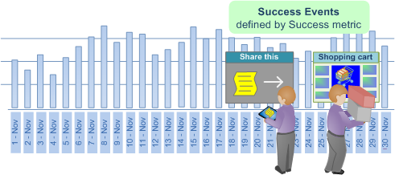

# Attribuzione adattamento ottimale{#best-fit-attribution}

{{eol}}

Attribuzione adattamento ottimale è un approccio di apprendimento automatico che consente di assegnare valori di attribuzione tra i diversi canali di un evento di conversione riuscito. Data Workbench valuta automaticamente i contributi al successo in una finestra di tempo per canale, quindi crea un modello di attribuzione basato sui pattern di interazione effettivi dei clienti.

**[!UICONTROL Best Fit Attribution]** ti consente di confrontare le interazioni, o i contatti, che hanno contribuito a una vendita con successo, l’iscrizione e-mail o altri indicatori di prestazioni. L’analisi di attribuzione assegna automaticamente importanza ai punti più importanti e fornisce un modello di attribuzione per canale basato sui dati e reattivo al mercato e ai protocolli interni.

Ad esempio, se un cliente visita il tuo sito tramite una ricerca organica, si impegna con una campagna e poi si iscrive a un’e-mail, [Attribuzione basata su regole](/help/home/c-get-started/c-attribution-profiles/c-rules-attrib/c-rules-attrib.md) identificherebbe il primo o l’ultimo contatto o distribuirebbe uniformemente l’attribuzione di successo su tutti i punti di contatto utilizzando modelli di attribuzione preimpostati. Laddove l’attribuzione basata su regole viene definita dall’utente, gli attributi Best Fit impostano i valori attraverso un algoritmo calcolando la probabilità di una conversione in funzione dei punti di contatto osservati.

>[!NOTE]
>
>Per eseguire **Attribuzione adattamento ottimale** in Data Workbench, devi aggiornare il certificato del server ( [!DNL .pem file]) per supportare Adobe Analytics Premium. È inoltre necessario aggiungere **Premium** su misura [!DNL Profile.cfg] per il client e ricevere nuovi certificati da Adobe ClientCare per Server e Report Server.

## Configurazione di base {#section-db597eaee462412ea7280d1426366c61}

Vedi [Creare un’attribuzione adattamento ottimale](../../../../home/c-get-started/c-attribution-profiles/c-attrib-algorithmic/c-attrib-building.md#concept-fede6fc4f592475fa8b351b1765a522d) istruzioni dettagliate.

**Impostare la metrica di successo**
Definisci una metrica che rappresenta un evento di successo.

La metrica di successo è spesso *Ordini*, anche se puoi sfruttare la Data Workbench per definire una metrica di successo molto complicata insieme alla finestra di successo.

**Impostare la metrica Touch** (facoltativo)

Identifica le interazioni per tracciare che hanno portato a una conversione di successo, quindi imposta la metrica Touch su cui verrà calcolata l’attribuzione.

>[!NOTE]
>
>L’impostazione di una metrica Touch è necessaria solo se la utilizzi per derivare le metriche del canale dal trascinamento degli elementi del Dimension invece di utilizzare le metriche del canale esistenti.

Se non hai una metrica definita per campagne o canali, ma hai dimensioni che rappresentano canali, l’attribuzione adattamento ottimale può generarle automaticamente in base alla metrica Touch.

Ad esempio, con la metrica Touch impostata come *Hit* e a una dimensione denominata *Tipo di supporto* con elementi che includono *E-mail*, *Comunicato stampa*, *Stampa annuncio* e *Social media*, la visualizzazione genererà le metriche Canale del modulo [!DNL Hits where Media Type = Email] quando trascini e rilascia gli elementi sulla visualizzazione.

La metrica Touch determina quindi l’allocazione dei punteggi di attribuzione per identificare le interazioni di marketing considerate influenti per il successo, consentendoti di qualificare i contatti di marketing per la popolazione identificata nella finestra Successo . Puoi impostare metriche quali *Visualizzazioni pagina* o *Hit* oppure utilizza metriche di contatto personalizzate, specifiche per le tue esigenze.

In molti casi, la finestra Touch deve includere la finestra Success per valutare un lead time lungo nel ciclo di vendita.

**Imposta la metrica Revenue (Entrate).**

Puoi scegliere di identificare i ricavi tra i diversi punti di contatto impostando una metrica di ricavo appropriata. Se specificato, il modello visualizza la distribuzione dei ricavi sui canali di input. 

Puoi impostare una metrica ricavi con tipi di dati valuta per allocare il successo tra tutti i punti di contatto principali definiti e analizzati. Questa metrica suddivide i ricavi di vendita finali e li assegna in base alla ponderazione assegnata dall&#39;algoritmo.

**Imposta le finestre di dialogo di successo e touch.**

La finestra Successo definisce la popolazione da esaminare e il periodo per gli eventi di successo, consentendoti di indicare le finestre di tempo e l’ampiezza di popolazione da considerare per l’analisi tramite una selezione dell’area di lavoro. La **Completato** La finestra definisce il periodo e la popolazione da esaminare per gli eventi di successo. La **Touch** window specifica il periodo di tempo storico da esaminare per le interazioni dei canali che precedono gli eventi di successo.

>[!NOTE]
>
>L’impostazione di una metrica di contatto è necessaria solo se si tenta di generare automaticamente le metriche di successo trascinando gli elementi dimensionali nella visualizzazione.

Puoi impostare un giorno, un mese, un anno o qualsiasi intervallo di tempo disponibile per limitare la valutazione degli eventi di successo e di contatto durante il ciclo di vendita o per tipi di pubblico specifici che accedono al sito. La creazione di finestre per limitare l’attribuzione consente di concentrare l’analisi sui periodi di tempo rilevanti per le esigenze specifiche.

In molti casi, desideri che la finestra Touch includa la finestra Successo per estendere l’analisi su un lungo periodo di lead in base alla finestra vendite. Oppure puoi tenere traccia e analizzare i contatti separatamente dall’evento di successo.

**Seleziona i canali.**

Quando si immettono i canali, è possibile scegliere tra due opzioni.

**Aggiungi la metrica di contatto e aggiungi elementi di Dimension ai canali**

In molti casi, è utile suddividere i punti di contatto principali per elementi dimensionali per definire canali specifici. In base ai valori degli elementi, Attribuzione adattamento ottimale selezionerà automaticamente i primi esecutori e li classificherà in base alla percentuale, per poi visualizzarli in una visualizzazione grafico.

Un modello di attribuzione verrà creato disegnando i visitatori che hanno interagito durante la finestra Successo ed esaminando i contatti del canale durante la finestra Touch che hanno prodotto o meno un evento di successo.

## Suddivisione per canali {#section-a30592b84bc84f57bd2b988824e852d4}

Quando si immettono i canali, sono disponibili due opzioni:

* Aggiungi un **Metrica touch** e quindi aggiungere **Elementi Dimension** per i canali.

   **oppure**

* Crea metriche che filtrano gli elementi del canale che desideri valutare.

**Opzione 1: Aggiungi una metrica di contatto e aggiungi elementi di Dimension per i canali**.

Questo è l&#39;approccio più semplice. Attribuzione adattamento ottimale crea automaticamente le metriche da valutare per l’attribuzione. Nell’esempio sotto la metrica touch è ***Hit*** e i canali sono: ***Visualizza campagne***, ***Campagne e-mail*** e ***Campagne SEM***.

Utilizzando questo metodo, Best Fit Attribution crea una metrica in background per la valutazione dell’attribuzione tra i canali (ma la metrica generata automaticamente non viene mai visualizzata e non viene salvata). Nell’esempio seguente, vengono create tre metriche in cui gli hit vengono filtrati per ciascuno dei tre canali (ad esempio *Visualizza campagne*, *Campagne e-mail* e *Campagne SEM*). Questa è la più semplice perché hai permesso alla funzione Attribuzione adattamento ottimale di creare le metriche al tuo posto.

**Opzione 2: Creare una metrica**.

Nella seconda opzione, puoi creare e salvare le metriche per i canali da valutare filtrando un canale specifico. Di seguito è riportato un esempio di tale metrica.

Quindi, invece di inserire una metrica di contatto e gli elementi di Dimension per i canali, puoi fare clic sulla barra dei menu nella visualizzazione e selezionare **Ingressi** > **Aggiungi canale** quindi seleziona le metriche create.

Vedi l&#39;esempio del secondo metodo qui sotto. I risultati di entrambe le opzioni sono identici.
