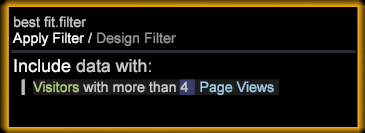

# Creare un modello di attribuzione adattamento ottimale{#build-a-best-fit-attribution-model}

{{eol}}

Apri Attribuzione adattamento ottimale dal menu Premium e segui questi passaggi per creare un modello di attribuzione adattamento ottimale.

Vedi una panoramica di [Attribuzione adattamento ottimale](../../../../home/c-get-started/c-attribution-profiles/c-attrib-algorithmic/c-attrib-algorithmic.md#concept-237feb6e9c4d49efaf75399297dcb9d1).

1. Apri **Attribuzione adattamento ottimale**.

   Apri un’area di lavoro e fai clic su **[!UICONTROL Premium]** > **[!UICONTROL Best Fit Attribution]**.

   

   >[!NOTE]
   >
   >Attribuzione adattamento ottimale è una funzione di Adobe Analytics Premium che richiede l’abilitazione di Premium nel profilo. Richiede l’aggiornamento del certificato e l’aggiunta del profilo Premium al file profile.cfg. Vedi [Aggiornamento del server DWB: da 6.2 a 6.3](/help/home/c-inst-svr/c-upgrd-uninst-sftwr/c-upgrd-sftwr/c-6-2-to-6-3-upgrade.md) per DWB 6.3.

1. Imposta la **[!UICONTROL Success]** metrica.

   >[!NOTE]
   >
   >Puoi trascinare una metrica da un **[!UICONTROL Finder]** nel riquadro a sinistra della visualizzazione Attribuzione, oppure seleziona dalla **Ingressi** menu.

   Fai clic su **[!UICONTROL Inputs]** > **[!UICONTROL Set Success]**. Viene aperto il menu della metrica. 

   Seleziona una metrica che identifica una conversione riuscita.

1. (facoltativo) Imposta il **Entrate** metrica.

   Imposta una metrica per valutare i ricavi durante il processo di conversione.

1. Imposta la **Touch** metrica.

   >[!NOTE]
   >
   >L’impostazione di una metrica di contatto è necessaria solo se si tenta di generare automaticamente le metriche di successo trascinando gli elementi dimensionali nella visualizzazione.

   Fai clic sul pulsante **[!UICONTROL Inputs]** menu e seleziona **Imposta Touch** oppure trascina una metrica dal Finder. 

   Viene utilizzato per derivare le metriche dei canali quando gli elementi dimensionali vengono utilizzati come input.

1. Imposta un **Completato** finestra.

   Fai clic su [!DNL Inputs > Success Window]. Selezionare un intervallo di date da una tabella, quindi assegnare un nome alla finestra Completato. Fai clic su **[!UICONTROL Workspace Selection]** e le date selezionate saranno assegnate come intervallo di tempo per la metrica di successo.

   

   >[!NOTE]
   >
   >Poiché la finestra di successo è una selezione di workstation, puoi includere qualsiasi dimensione nella finestra di successo.

1. Imposta un **[!UICONTROL Touch Window]**.

   Fai clic su [!DNL Inputs > Touch Window]. Seleziona un intervallo di date da una tabella, quindi assegna un nome alla finestra Touch. Fai clic su **[!UICONTROL Workspace Selection]** e le date selezionate saranno assegnate come intervallo di tempo per la metrica di successo.

   

   Per impostazione predefinita, la **Touch** la finestra viene impostata sullo stesso periodo di tempo della **[!UICONTROL Success]** finestra.

1. (facoltativo) Imposta un filtro di formazione.

   Puoi inoltre specificare un **Filtro di formazione** nell’area di lavoro per filtrare i dati dei visitatori.

   >[!NOTE]
   >
   >Per limitare ulteriormente i dati, è possibile applicare il filtro Formazione alle selezioni dell&#39;area di lavoro corrente impostando sia le finestre Completato che Tocca.

   

   >[!NOTE]
   >
   >Il set di formazione è sempre tratto dai visitatori che soddisfano la finestra Successo . Filtrando utilizzando l’Editor filtri, puoi creare un sottoinsieme di visitatori segnalati nella finestra Successo.

1. Specifica le metriche del canale che rappresentano i touch.

   Puoi trascinare le metriche sulla visualizzazione oppure sceglierle dalla [!DNL Inputs] > [!DNL Add Channel] menu. Se non disponi già di metriche definite per campagne o canali, ma le dimensioni rappresentano i canali, la visualizzazione può generarle automaticamente con le specifiche di una metrica Touch.

   Ad esempio, con la metrica Touch impostata su [!DNL Hits]e le [!DNL dimension] chiamato [!DNL Media Type] con elementi che includono elementi come [!DNL Email], [!DNL Press Release], [!DNL Print Ad]e [!DNL Social Media], la visualizzazione genererà le metriche Canale del modulo [!DNL Hits where Media Type = Email] quando trascini e rilascia gli elementi sulla visualizzazione.

1. Press **Vai**.

   Viene eseguito il processo di analisi dell’adattamento ottimale e viene visualizzato un grafico con le attribuzioni per canale in base agli input selezionati.

   >[!NOTE]
   >
   >Fai clic con il pulsante destro del mouse **Modello completo** sull’analisi completata per visualizzare le statistiche per il modello di attribuzione.

   

Una volta completato, un grafico visualizza un modello di attribuzione calcolato per canale e una distribuzione del *Entrate* metrica (se impostata). Il modello può essere salvato internamente o esportato in altri sistemi.

>[!NOTE]
>
>**[!UICONTROL Streaming]**, **[!UICONTROL Online]** e **[!UICONTROL Offline]** le modalità producono effetti diversi durante la creazione di un modello di attribuzione in base alla latenza dei dati in fase di valutazione. In modalità Streaming, i dettagli **[!UICONTROL Model Complete]** verrà visualizzato il messaggio. In modalità online e offline, il dettaglio **[!UICONTROL Local Model Complete]** verrà visualizzato.

## Menu Opzioni {#section-22288867f6c8483a8a38410f4b948346}

La **Opzioni** Il menu fornisce funzioni avanzate per impostare e visualizzare l’analisi Best Fit Attribution.

<table id="table_8F6F517B7DBF4259814BEC6D07A72EAC">
 <thead>
  <tr>
   <th colname="col1" class="entry"> Menu Opzioni </th>
   <th colname="col2" class="entry"> Descrizione </th>
  </tr>
 </thead>
 <tbody>
  <tr>
   <td colname="col1"> Imposta filtro di formazione  </td>
   <td colname="col2"> Il filtro di formazione viene utilizzato con la finestra di successo per filtrare la popolazione durante la creazione del modello di attribuzione. Questo fornirà un sottoinsieme di dati che include solo i visitatori che desideri analizzare. 
Nota: Gli utenti esperti possono inoltre sfruttare la flessibilità dei filtri per concentrarsi oltre la linea temporale delle finestre di successo e touch. Ad esempio, oltre a selezionare un intervallo di tempo, puoi selezionare un set di <i>Domini di riferimento</i> per esaminare solo l’attribuzione per gli utenti di tali domini. 
 </td>
  </tr>
  <tr>
   <td colname="col1"> Mostra descrizione filtro complesso  </td>
   <td colname="col2"> Visualizza il codice del filtro per il filtro di formazione, la finestra di successo e la finestra di contatto. </td>
  </tr>
  <tr>
   <td colname="col1"> Salva modello  </td>
   <td colname="col2"> Salva il modello di attribuzione corrente per un utilizzo futuro. </td>
  </tr>
  <tr>
   <td colname="col1"> Modello di caricamento  </td>
   <td colname="col2"> Apre un modello di attribuzione salvato in precedenza. </td>
  </tr>
  <tr>
   <td colname="col1"> Visualizzazione presentazione  </td>
   <td colname="col2"> Nasconde la barra dei menu superiore per la presentazione. </td>
  </tr>
  <tr>
   <td colname="col1"> 
<b>Opzioni &gt; Avanzate</b> include funzionalità per impostare le dimensioni del set di addestramento e specificare l'approccio da adottare in caso di squilibrio di classe. 
 </td>
   <td colname="col2"> </td>
  </tr>
  <tr>
   <td colname="col1"> Advanced &gt; Training Set Size  </td>
   <td colname="col2"> 
Imposta la dimensione del set di addestramento. 
 
Nota: La dimensione predefinita del training è Grande per 250.000 visitatori. 

    <ul id="ul_5F17C60227C34A85A2C476A32F2B5DCD">
     <li id="li_A076FC2AD0214ADDBFCFD82AEA5F0880">Piccolo = 50.000 </li>
     <li id="li_17E77E01D5374068BEBC80B3AD4CCD41">Piccolo = 75.000 </li>
     <li id="li_7F6B4834742A4BFCBC3DB214425B88C3">Normale = 100.000 </li>
     <li id="li_0BB7F791603745028CFC661EBC94D8B4">Grande = 250,00 </li>
     <li id="li_34B60233C84F48F1BCB8040C5195411A">Enorme = 500.000 </li>
    </ul> </td>
  </tr>
  <tr>
   <td colname="col1"><b>Avanzate &gt; Bilanciamento classe </b> </td>
   <td colname="col2"> 
Identifica e definisce il numero di record di input da generare per un problema di squilibrio di classe in base alle dimensioni del set di dati. 
 </td>
  </tr>
 </tbody>
</table>

| Opzioni Ripristina e Rimuovi | Descrizione |
|---|---|
| **[!UICONTROL Reset Model]** | Da **[!UICONTROL Reset]** menu, seleziona **[!UICONTROL Reset Model]** per cancellare la visualizzazione ma mantenere le metriche di input. |
| **[!UICONTROL Reset All]** | Da **[!UICONTROL Reset]** menu, seleziona **[!UICONTROL Reset All]** per cancellare la visualizzazione e le metriche di input. |
| **[!UICONTROL Remove]** | Fai clic con il pulsante destro del mouse su un input e seleziona **[!UICONTROL Remove]** per cancellare la metrica dall’input selezionato. |
| **[!UICONTROL Remove All]** | Fai clic con il pulsante destro del mouse su *Canali* e seleziona **[!UICONTROL Remove All]** per cancellare tutte le metriche di input. |
