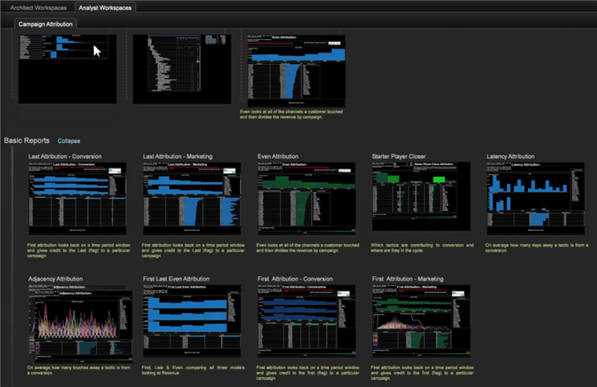

# Profilo attribuzione{#attribution-profile}

Utilizzando il nuovo profilo Attribuzione basato su regole in Workbench dati, è possibile analizzare rapidamente gli eventi di attribuzione e assegnare le responsabilità fino alla conversione corretta definita dall&#39;utente. Il profilo Attribuzione contiene le informazioni necessarie per l&#39;impostazione e l&#39;estensione delle funzioni dell&#39;architetto dati e include aree di lavoro preconfigurate per consentire all&#39;analista di iniziare subito l&#39;analisi.

Il profilo Attribuzione ti permette di avere una nuova prospettiva sulle relazioni tra le tue attività di marketing e una generazione di lead di successo dei clienti o una conversione delle vendite. Il profilo Attribuzione consente di qualificare le interazioni che devono ricevere l&#39;allocazione di credito per le entrate realizzate o la partecipazione a valle del percorso del cliente. Consente di identificare l&#39;impatto delle attività di marketing e dei costi consentendo di analizzare rapidamente gli eventi di attribuzione e quindi di assegnare la responsabilità per i primi o gli ultimi eventi o altri eventi che portano a una vendita di successo.

<!--  -->

>[!IMPORTANT]
>
>Il profilo Attribuzione è configurato per l&#39;uso immediato da parte degli utenti che hanno implementato il profilo Adobe SC che utilizza il feed di dati di Analytics (SC/Insight). Per impostazione predefinita, gli eventi Marketing e Conversion vengono utilizzati come tipi predefiniti di interazioni valutate nei modelli basati su regole forniti.

Per ulteriori informazioni, consulta [Distribuzione di profili](../../../../home/c-get-started/c-attribution-profiles/c-rules-attrib/c-attrib-profile-deploy.md#concept-fbcb5800cd6a40cc901e61f3882988c0) di attribuzione e modelli [di](../../../../home/c-get-started/c-attribution-profiles/c-rules-attrib/c-attrib-models.md#concept-e209c7e86a5c4008ad6d78fdf4ea032d) attribuzione.

## Architettura e aree di lavoro di analisi {#section-27c6aff70ba147cca6e11451e127afb4}

All&#39;interno del profilo Attribuzione, le aree di lavoro Architetto e Analista sono definite in schede separate nel workbench.

**Workspaces di architettura**

Nella scheda **Attribuzione** , fare clic sulla **[!UICONTROL Architect Workspace]** scheda per aprire le aree di lavoro progettate specificamente per impostare i file di configurazione per la modellazione di attribuzione di base.

La scheda Architettura include aree di lavoro che consentono di esaminare tutti i file di configurazione presenti nella cartella dei set di dati del profilo. Ad esempio, **[!UICONTROL Attribution Configuration - Step 1]** consente di identificare i valori di attribuzione nella sezione Trasformazione del [!DNL profile.cfg] file.

**Aree di lavoro** analisti Fare clic sulla **[!UICONTROL Analyst]** **[!UICONTROL Workspaces]** scheda per aprire l&#39;analisi pregenerata delle aree di lavoro utilizzando le dimensioni e le metriche fornite con il profilo Attribuzione.

Tali aree di lavoro sono organizzate in quattro categorie:

1. **Rapporti** di base per l&#39;esposizione di un singolo modello all&#39;interno di un&#39;area di lavoro.
1. **Report** comparativi ha ampliato le analisi presentando più modelli all&#39;interno di una singola vista.
1. **I report** di indagine consentono di espandere i modelli di reporting per presentare i modelli di attribuzione in diversi formati. Questa sezione introduce ed espone anche i rapporti di ponderazione basati sulla posizione.
1. **Report** percorsi offre visibilità al percorso di marketing del cliente con visualizzazioni di percorsi multipli per esplorare ed esprimere appieno i flussi di processo e i percorsi di interazione

La scheda Analisi include aree di lavoro preconfigurate con i rapporti. Ad esempio, **[!UICONTROL First Attribution]** consente di selezionare dalla **[!UICONTROL Campaign]** tabella per visualizzare l&#39; **[!UICONTROL Revenue]** attribuzione in base a **[!UICONTROL Time]**.

