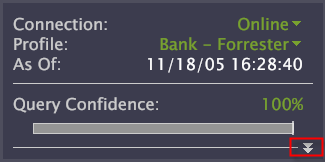

# Configurare la barra laterale{#configure-the-sidebar}

La barra laterale consente di accedere a funzioni utilizzate regolarmente e conserva le visualizzazioni mentre ci si sposta tra le aree di lavoro.

Gli amministratori possono personalizzare una barra laterale per renderla appropriata per diversi gruppi di utenti, quindi distribuire la barra laterale con un profilo.

La barra laterale è ideale per tenere traccia dei filtri e delle sostituzioni locali. Se preferisci non utilizzare la barra laterale, puoi nasconderla.

## Aggiungere visualizzazioni alla barra laterale {#section-666f70a405db4f8d8eaffa567ffcac06}

1. Data Workbench Launch.
1. Nella barra laterale fate clic su **[!UICONTROL Add]** > *&lt;**[!UICONTROL item]**>*. Ad esempio, [!DNL Selections Panel], [!DNL Filters Panel] o [!DNL Table].

   Nell’installazione standard di Data Workbench sono disponibili i seguenti pannelli a barre laterali. Altri elementi potrebbero essere disponibili nel profilo specifico:

   * **Pannello Selezioni:** consente di comprendere le selezioni attive nell’area di lavoro corrente. L’ [!DNL Selections Panel] viene aggiornato ogni volta che effettui una nuova selezione. Per cancellare le selezioni, fai clic su **[!UICONTROL x]**. Per informazioni su come selezionare i dati, consulta [Effettuare selezioni in Visualizations](../../home/c-get-started/c-vis/c-sel-vis/c-sel-vis.md#concept-012870ec22c7476e9afbf3b8b2515746) .
   * **Pannello Filtri:** consente di caricare e applicare facilmente i filtri salvati. Puoi caricare più filtri e attivarli o disattivarli in modo indipendente facendo clic sulla casella di controllo accanto. Consulta [Editor filtri](../../home/c-get-started/c-analysis-vis/c-filter-editors/c-filter-editors.md#concept-2f343ecbed8240f18b0c1f1eccef11e3).
   * **Pannello Override locale:** questo pannello mostra le metriche, le dimensioni e i filtri presenti nel profilo che sono stati modificati nella copia personale del profilo. Questo ti aiuta a segnalare eventuali differenze tra il modo in cui i dati vengono visualizzati nel tuo client e quello di altri utenti. Quando salvi le modifiche in una metrica, una dimensione o un filtro sul server, l’override viene rimosso dalla sezione [!DNL Local Overrides panel]. Se fai clic su un override e poi su **[!UICONTROL Revert to Server]**, l&#39;override locale viene rimosso e l&#39;elemento viene ripristinato alla versione condivisa.
   * **Metric Legend (Legenda metrica):**  aggiunge una legenda metrica. [!DNL Metric legends] consente di visualizzare le metriche della linea di base correlate al profilo e alle statistiche relative al set di dati (o alla selezione corrente, se è stata effettuata). Consulta [Legende della metrica](../../home/c-get-started/c-analysis-vis/c-legends/c-metric-leg.md#concept-e7195bc8f7844ae295bda3a88b028d5b).
   * **Color Legend (Legenda colore):**  aggiunge una legenda colore. Puoi colorare le visualizzazioni del codice per metriche, ad esempio Conversione e Mantenimento, e utilizzarle in quasi ogni [!DNL Workspace]. Il collegamento delle metriche aziendali al colore facilita l’individuazione di anomalie, eccezioni e tendenze. Vedere [Color Legends](../../home/c-get-started/c-analysis-vis/c-legends/c-color-leg.md#concept-f84d51dc0d6547f981d0642fc2d01358).
   * **Annotazione testo:** aggiunge un pannello note. [!DNL Text annotations] sono finestre in cui è possibile immettere testo arbitrario per aggiungere informazioni o commenti descrittivi a un  [!DNL Workspace]. Vedere [Uso delle annotazioni di testo](../../home/c-get-started/c-analysis-vis/c-annots/c-text-annots.md#concept-55b4aa3e0c58470b8e3c9d452e12a777).
   * **Tabella:** aggiunge una tabella. Una tabella può visualizzare una o più metriche in una o più dimensioni di dati. Consultare [Tabelle](../../home/c-get-started/c-analysis-vis/c-tables/c-tables.md#concept-c632cb8ad9724f90ac5c294d52ae667f).
   * **Apri:** apre un file salvato.

## Aprire un pannello a barre laterale {#section-cbc8e57491854274a577d47a48c306b8}

Puoi aprire un file di visualizzazione della barra laterale da una posizione salvata o dagli Appunti.

1. Nella barra laterale fate clic su **[!UICONTROL Add]** > **[!UICONTROL Open]**.
1. Fai clic su **[!UICONTROL File]** per individuare il file [!DNL .vw] del pannello che desideri aggiungere, oppure fai clic su **[!UICONTROL Last Closed Window]** per estrarre la visualizzazione dagli Appunti.

   Inoltre, puoi fare clic su **[!UICONTROL From Clipboard]** per incollare una visualizzazione copiata negli Appunti. Vedere [Copia di un pannello Sidebar](../../home/c-get-started/c-config-sidebar.md#section-720ae057632a4b8dbb94412e06a370b1).

## Copia di un pannello Sidebar {#section-720ae057632a4b8dbb94412e06a370b1}

1. Fai clic con il pulsante destro del mouse sul bordo superiore del pannello, quindi fai clic su **[!UICONTROL Copy]** > **[!UICONTROL Window]**.
1. Per incollare il pannello, fai clic su **[!UICONTROL Add]** > **[!UICONTROL Open]** > **[!UICONTROL From Clipboard]**.

## Salvataggio di un pannello della barra laterale {#section-fb19936b12704fb0a4c592abb579db1d}

In un pannello laterale fate clic con il pulsante destro del mouse sulla barra del titolo e fate clic su **[!UICONTROL Save]**.

Allo stesso modo, puoi aprire una visualizzazione a barre laterali salvata. Data Workbench salva la visualizzazione come file [!DNL .vw] nel percorso specificato.

## Ripristina la barra laterale predefinita {#section-4d14b8771ad747bba799876267f24831}

Nella barra laterale fate clic su **[!UICONTROL Options]** > **[!UICONTROL Revert]**.

Quando chiudi Data Workbench, il sistema salva la configurazione della barra laterale corrente nel file [!DNL sidebar.vw] nel profilo utente. Quando apri Data Workbench, il sistema carica il file [!DNL sidebar.vw] dal profilo utente, anziché da un profilo principale.

È possibile ripristinare una barra laterale predefinita o salvata in precedenza, che elimina la barra laterale dal profilo utente e ricarica la barra laterale dal profilo padre. Gli amministratori possono sostituire la barra laterale predefinita (principale) con una barra laterale locale caricandola da [!DNL Profile Manager].

## Personalizzare il file del pannello di stato Altro {#section-8d502f3b59cc4331966edec05e896ce1}

Gli amministratori di sistema possono creare formule in [!DNL More Status Panel.vw]. In questo modo si posizionano parole contestuali intorno ai valori di metrica e dimensione e vengono visualizzati i risultati nella barra laterale [!DNL More Status panel].

Per visualizzare il [!DNL More Status panel] nella barra laterale, fai clic sulle frecce mostrate nell’esempio seguente.

La procedura seguente mostra un semplice esempio di come creare uno stato personalizzato che indica quanti giorni ci sono in un set di dati:

1. In [!DNL Profile Manager], fai clic su **[!UICONTROL Sidebar\]**.

1. Nella colonna [!DNL Base_5_3*] , crea una copia locale del file [!DNL More Status Panel.vw].

   A questo scopo, fai clic con il pulsante destro del mouse sul segno di spunta del file e fai clic su **[!UICONTROL Make Local]**.

1. Apri il file [!DNL More Status Panel.vw] nel [!DNL .vw] [!DNL Editor] o nel Blocco note.

   

1. Compila i campi [!DNL Context] e [!DNL Items] in [!DNL Editor]. Per informazioni sulla sintassi, consulta [Sintassi della lingua query](../../home/c-get-started/c-qry-lang-syntx/c-qry-lang-syntx.md#concept-15d1d3f5164a47d49468c5acb7299d9f) .

1. Salvate il file.

   I valori nell&#39;esempio precedente generano una formula di stato visualizzata come segue:

   
