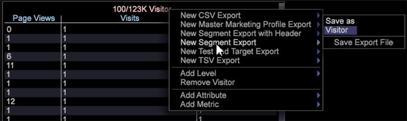

# Esportazione segmento con intestazioni personalizzate{#segment-export-with-custom-headers}

{{eol}}

Crea intestazioni di esportazione colonna personalizzate per i file di esportazione dei segmenti per aggiungere descrizioni facilmente comprensibili per i segmenti esportati. Questa funzione di esportazione consente inoltre di generare come file TSV e CSV.

È stata aggiunta una nuova funzionalità all’esportazione dei segmenti, che include la possibilità di esportare con un’intestazione, o nei formati CSV e TSV.

Puoi creare intestazioni di colonna per i file di esportazione.

## Creazione di una nuova esportazione di segmenti {#section-cffff55855f8467ea468b71393ab7676}

1. Apri un’area di lavoro e fai clic con il pulsante destro del mouse **[!UICONTROL Tools]** > **[!UICONTROL Detail Table]**.

1. Fai clic con il pulsante destro del mouse e seleziona **[!UICONTROL Add Level > Extended]** > Scegli un elemento.
1. Fare clic con il pulsante destro del mouse sul titolo e selezionare **[!UICONTROL Add Attribute.]** Seleziona una dimensione dal menu .

1. Fare clic con il pulsante destro del mouse sul titolo e selezionare **[!UICONTROL Add Metric.]** Seleziona una metrica dal menu .

1. Fare clic con il pulsante destro del mouse sul titolo e selezionare **[!UICONTROL New Segment Export]**.

   

   **[!UICONTROL New Segment Export with Header]** compila automaticamente il Nome colonna con il nome della metrica. **[!UICONTROL New Segment Export]** richiede di impostare un nome personalizzato. 

   >[!NOTE]
   >
   >Il campo Nome colonna non può essere lasciato vuoto oppure l’intestazione non sarà presente.

1. Fai clic con il pulsante destro del mouse e assegna un nome al segmento, quindi fai clic su **[!UICONTROL Save Export File]**.

   Viene aperta una finestra di esportazione.

1. Fai clic con il pulsante destro del mouse sul nome dell’esportazione e fai clic su **Salva con nome`<export filename>`**.

   

1. Fai clic con il pulsante destro del mouse [!DNL Admin] > [!DNL Profile Manager] > [!DNL Expand Export]. Trova il file di esportazione appena creato e salvalo su un profilo esistente.

   
