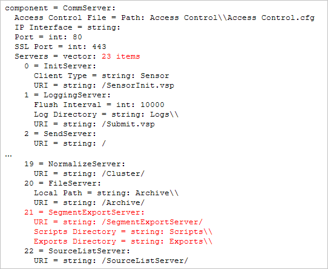

# Esportazione del segmento{#segment-export}

Puoi creare facilmente una definizione di esportazione del segmento dalla visualizzazione Tabella dettagli nel client Data Workbench.

Inoltre, [!DNL Segment Exports] combina automaticamente i risultati a un singolo server, anziché produrre risultati parziali su ogni DPU che è necessario combinare utilizzando un processo esterno. Puoi creare un file di esportazione del segmento, salvarlo nel [!DNL Profile Manager] e caricare il file di output su un server di tua scelta.

**Per configurare il server di esportazione dei segmenti**

La funzione [!DNL Segment Export] crea un singolo file di output sul server di esportazione dei segmenti, anziché file di output separati creati su ogni DPU. Il server di esportazione del segmento è in genere configurato per l’esecuzione sulla FSU.

Nella directory Dataset\ in [!DNL Profile Manager], apri [!DNL Segment Export.cfg] in Workstation e specifica l’indirizzo del server. (Il tuo indirizzo potrebbe essere un IP o un nome di dominio completo):


Si tratta dell’IP del server Data Workbench che riceve i risultati dell’esportazione del segmento. Questa è una configurazione unica. Se il [!DNL Segment Export.cfg] non è presente, le esportazioni non vengono eseguite.

**Per configurare le directory di esportazione**

A scopo di sicurezza, i file eseguibili o batch che vengono eseguiti dopo un’esportazione di segmenti devono trovarsi nella directory configurabile Scripts\ del server di esportazione dei segmenti.

L’ [!DNL .part] e l’output finale devono trovarsi nella directory delle esportazioni configurabile. Il comando da eseguire esiste in Argomenti comando e comando. Le istanze del %file% negli argomenti dei comandi verranno sostituite con il percorso del file di output.

>[!NOTE]
>
>A partire dalla versione 5.4 di Data Workbench, la cartella \Exports viene creata automaticamente. Le directory di esportazione precedenti configurate prima della versione 5.4 richiedevano un prefisso Exports\ prima del nome del file per ogni esportazione di segmenti. L&#39;aggiunta di questo prefisso è ora ridondante.

1. In [!DNL Communications.cfg] sul server di destinazione per [!DNL Segment Exports], aggiungi un SegmentExportServer all&#39;elenco dei server. (Esempio mostrato in rosso).

   

   Directory di esportazione: Specifica dove inserire i file [!DNL .part] e i file di output. Può essere una directory condivisa.

   Directory degli script: Specifica la directory da cui vengono eseguiti tutti i file eseguibili o batch.

1. [!DNL Access Control.cfg], sullo stesso server, aggiungere l&#39;accesso in lettura e scrittura all&#39;URI /SegmentExportServer/ al Gruppo di accesso ai server cluster:

   

1. Modifica i file [!DNL .export]:

   

1. Per ciascun profilo, il percorso [!DNL Segment Export.cfg] si trova nella directory Dataset\, con il seguente contenuto:

   ```
   Segment Export = SegmentExport:
   Segment Export Server = serverInfo:
   Port = int: 80
   Address = string: 192.168.5.128 (for example) Use SSL = bool: false
   ```

1. Assicurati che siano presenti le directory a cui si fa riferimento in Directory esportazioni e Directory script.

   Solo i file eseguibili e batch nella directory Script possono essere eseguiti come comando di un’esportazione di segmenti.

**Creazione di un file di esportazione del segmento**

1. In un’area di lavoro, crea una tabella dettagli che mostra i sottoinsiemi di dati (Visualizzazione > Tabella dettagli) e aggiungi gli attributi.
1. Se necessario, effettua le selezioni nell’area di lavoro. Tutte le selezioni o i filtri vengono applicati all’esportazione.

   

1. Nell’intestazione Tabella dettagli fare clic con il pulsante destro del mouse e selezionare **[!UICONTROL Create Segment Export File]**.
1. In [!DNL Save as], digita un nome per il file [!DNL .export].
1. Nel file [!DNL .export], configura i parametri in base alle esigenze.

   Tutte le selezioni o i filtri nell’area di lavoro sono incorporati nel file di esportazione.

1. Salva il file [!DNL .export].

   Il file salvato viene visualizzato in [!DNL Profile Manager] per consentirti di salvare sul server. Quando salvi il file sul server, inizia l’esportazione.
