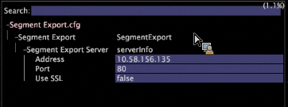

# Esportazione segmento{#segment-export}

È possibile creare facilmente una definizione di esportazione dei segmenti dalla visualizzazione Tabella dettagli nel client Workbench dati.

Inoltre, combinano [!DNL Segment Exports] automaticamente i risultati a un singolo server, anziché produrre risultati parziali su ogni unità di elaborazione dati da combinare utilizzando un processo esterno. Puoi creare un file di esportazione del segmento, salvarlo nel [!DNL Profile Manager]e caricare il file di output su un server di tua scelta.

**Per configurare il server di esportazione dei segmenti**

La [!DNL Segment Export] funzione crea un singolo file di output sul server di esportazione dei segmenti, anziché file di output separati creati su ciascuna unità di elaborazione dati. Il server di esportazione dei segmenti è in genere configurato per essere eseguito sull’FSU.

Nella directory Dataset\ in [!DNL Profile Manager], aprire il file [!DNL Segment Export.cfg] in Workstation e specificare l&#39;indirizzo del server. (Il vostro indirizzo potrebbe essere un IP o un nome di dominio completo):



Si tratta dell&#39;IP del server Workbench dati che riceve i risultati dell&#39;esportazione del segmento. Questa è una configurazione una tantum. Se il [!DNL Segment Export.cfg] campo non è presente, le esportazioni non vengono eseguite.

**Per configurare le directory di esportazione**

Per motivi di sicurezza, i file eseguibili o batch che vengono eseguiti dopo l’esportazione di un segmento devono risiedere nella directory Script configurabile del server di esportazione del segmento.

L&#39;output [!DNL .part] e finale devono risiedere nella directory delle esportazioni configurabile. Il comando da eseguire esiste negli argomenti Comando e Comando. Le istanze del %file% negli argomenti comando verranno sostituite con il percorso del file di output.

>[!NOTE]
>
>A differenza di Workbench dati 5.4, la cartella \Exports viene creata automaticamente. Le directory di esportazione precedenti impostate prima della versione 5.4 richiedevano un prefisso Exports\ prima del nome del file per l’esportazione di ciascun segmento. L&#39;aggiunta di questo prefisso è ora ridondante.

1. Nel server [!DNL Communications.cfg] di destinazione per [!DNL Segment Exports], aggiungi SegmentExportServer all’elenco dei server. (Esempio mostrato in rosso).

   

   Directory di esportazione: Specifica dove inserire [!DNL .part] e generare i file. Può trattarsi di una directory condivisa.

   Directory script: Specifica la directory da cui vengono eseguiti tutti i file eseguibili o batch.

1. [!DNL Access Control.cfg], sullo stesso server, aggiungere l&#39;accesso in lettura/scrittura all&#39;URI /SegmentExportServer/ al Gruppo di accesso ai server cluster:

   

1. Modificate [!DNL .export] i file:

   

1. Per ciascun profilo, [!DNL Segment Export.cfg] si trova nella directory Dataset\, con i seguenti contenuti:

   ```
   Segment Export = SegmentExport:
   Segment Export Server = serverInfo:
   Port = int: 80
   Address = string: 192.168.5.128 (for example) Use SSL = bool: false
   ```

1. Assicurarsi che le directory a cui si fa riferimento in Directory di esportazione e Directory di script siano presenti.

   Solo i file eseguibili e batch nella directory Scripts possono essere eseguiti come comando di un&#39;esportazione di segmenti.

**Per creare un file di esportazione di segmenti**

1. In un’area di lavoro, create una tabella Dettagli con sottoinsiemi di dati (Visualizzazione > Tabella dettagli) e aggiungete attributi.
1. Se necessario, effettuate le selezioni nell’area di lavoro. Qualsiasi selezione o filtro viene applicato all’esportazione.

   

1. Nell’intestazione Tabella dettagli, fate clic con il pulsante destro del mouse e selezionate **[!UICONTROL Create Segment Export File]**.
1. In [!DNL Save as], digitate un nome per il [!DNL .export] file.
1. Sul [!DNL .export] file, configurate i parametri come necessario.

   Qualsiasi selezione o filtro nell’area di lavoro è incorporato nel file di esportazione.

1. Save the [!DNL .export] file.

   Il file salvato viene visualizzato in [!DNL Profile Manager] per consentirvi di salvarlo sul server. Quando salvate il file sul server, viene avviata l&#39;esportazione.

