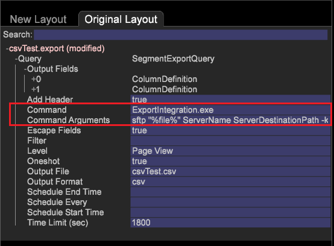

# Esportazione di un segmento mediante la distribuzione S/FTP{#export-a-segment-using-s-ftp-delivery}

{{eol}}

Ora puoi utilizzare CSV, TSV, Esportazione segmento ed Esportazione segmento con intestazione utilizzando i protocolli FTP e SFTP per esportare i file dei segmenti dal client (workstation) al server.

**Configurazione dei file di configurazione dell’esportazione S/FTP**

Per impostare la configurazione di esportazione, sono stati aggiunti due nuovi file di configurazione di esportazione per impostare una connessione FTP o SFTP, che consentono di selezionare i dettagli del server dal *FTPServerInfo.cfg* e le credenziali verranno prelevate da *FTPUserCredentials* cartella (corrispondente al Nome server specificato negli argomenti del comando).

* Imposta la **FTPServerInfo.cfg** file.

   Immetti le informazioni sul server FTP e imposta i tentativi di connessione consentiti dalla workstation. Modifica dalla workstation o dal server all&#39;indirizzo  [!DNL Server\Addresses\Export\] **[!DNL FTPServerInfo.cfg]**file.

   ```
   FTP Servers = vector: 1 items 
     0 = ftpServerInfo:  
       Address = string:  
       Name = string:  
       Port = int: 21 
   Connect Retries = vector: 1 items 
     0 = connectServerRetries:  
       Retries = int: 0 
       Server Name = string:
   ```

* Imposta la **FTPUserCredentials.cfg** file.

   Immetti le credenziali utente per la connessione ai server tramite  [!DNL Server\Admin\Export\] **[!DNL FTPUserCredentials.cfg]**file. Questo file contiene le credenziali utente necessarie per la connessione ai server e può essere modificato solo dal server e non dalla workstation (client).

   ```
   FTP User Credentials = vector: 1 items 
     0 = ftpUserCredInfo: 
       User Name = string:  
       User Password = EncryptedString:  
       Server Name = string:  
       Public Key Path = string:  
       Private Key Path = string:  
       Passphrase = EncryptedString:
   ```

   >[!NOTE]
   >
   >Assicurati che le chiavi SSH generate per l’autenticazione siano nel formato identico a quelle generate quando utilizzi il comando SSH Keygen.
   >
   >Esempio per la generazione di chiavi SSH utilizzando keygen:
   >
   >
   ```
   >ssh-keygen -t rsa -b 4096 -C "<label>"
   >```

   Sono presenti sei parametri nel **FTPUserCredentials.cfg** file necessario per vari trasferimenti FTP o SFTP.

   1. *Nome utente*
   1. *Password utente*
   1. *Nome server*
   1. *Percorso chiave pubblica*
   1. *Percorso chiave privata*
   1. *Passphrase*

   <table id="table_4EB416DC770D4D1AA4FAD9676C0D680C"> 
    <thead> 
      <tr> 
      <th colname="col1" class="entry"> Protocol </th> 
      <th colname="col2" class="entry"> Parametri </th> 
      </tr> 
    </thead>
    <tbody> 
      <tr> 
      <td colname="col1"> <p>FTP </p> </td> 
      <td colname="col2"> <p>Impostare i parametri 1, 2, 3. </p> </td> 
      </tr> 
      <tr> 
      <td colname="col1"> <p>SFTP tramite autenticazione tramite password </p> </td> 
      <td colname="col2"> <p>Impostare i parametri 1, 2, 3 quando il trasferimento utilizza l'autenticazione tramite password (-p negli argomenti del comando). </p> </td> 
      </tr> 
      <tr> 
      <td colname="col1"> <p>SFTP tramite autenticazione chiave </p> </td> 
      <td colname="col2"> <p>Imposta i parametri 1, 2, 3, 4, 5, 6 quando il trasferimento utilizza l'autenticazione chiave (-k negli argomenti del comando). </p> </td> 
      </tr> 
    </tbody> 
    </table>

**Impostazione dei comandi di esportazione FTP e SFTP**

1. Apri una tabella di esportazione.

   Dalla workstation, fai clic con il pulsante destro del mouse su un *Tabella dei dettagli* e scegli uno dei tipi di esportazione: CSV , TSV, Esportazione segmento o Esportazione segmento con intestazione. Oppure apri la [!DNL .export] file da un prompt dei comandi e modifica (vedere [Configurazione dei segmenti per l’esportazione](../../../home/c-get-started/c-exp-data-seg-exp/t-config-sgts-expt.md#task-8857f221fa66463990ec9b60db6db372)).

1. In *Comando* imposta il campo in modo che punti all&#39;eseguibile di esportazione:

   ```
   ExportIntegration.exe
   ```

1. Imposta la *Argomenti comando* campi come mostrato di seguito per il protocollo e l&#39;autenticazione richiesti:

   **FTP**

   ```
   <Command Arguments> set to  
   <ftp "%file%" ServerName ServerDestinationPath>
   ```

   

   **SFTP** (se si utilizza la password per l&#39;autenticazione)

   ```
   <Command Arguments> set to  
   <sftp "%file%" ServerName ServerDestinationPath -p>
   ```

   **SFTP** (se utilizzi le chiavi per l’autenticazione)

   ```
   <Command Arguments> set to  
   <sftp "%file%" ServerName ServerDestinationPath -k>
   ```

   

Tutti gli argomenti dei comandi sono obbligatori e devono essere immessi come mostrato.

## Esportazione S/FTP utilizzando chiavi private/pubbliche {#section-0534424d79a54a47b82594cfa7b3c17f}

Per implementare l’esportazione FTP e SFTP utilizzando chiavi private e pubbliche, inserisci i file di configurazione nelle seguenti cartelle:

* Luogo **FTPServerInfo.cfg** in [!DNL Server/Addresses/Export/] cartella.
* Luogo **FTPUserCredentials.cfg** in [!DNL Server/Admin/Export/] cartella.

Sei parametri sono inclusi nella variabile **FTPServerInfo.cfg** file:

1. *Nome utente*
1. *Password utente*
1. *Nome server*
1. *Percorso chiave pubblica*
1. *Percorso chiave privata —* Posiziona il percorso della chiave privata nel file di configurazione senza l’estensione, ad esempio:

[!DNL Private Key Path = string: E:\\Server\\campaign\\campaignprivatekey]

1. *Passphrase*

L&#39;FTP utilizza i parametri 1, 2 e 3.

SFTP utilizza i parametri 1, 2 e 3 quando il trasferimento utilizza l’autenticazione tramite password.

SFTP utilizza tutti e sei i parametri quando il trasferimento viene eseguito utilizzando l’autenticazione chiave. Ad esempio, se utilizzi le chiavi per l’autenticazione:

[!DNL 'Command Arguments' = sftp "%file%" ServerName ServerDestinationPath -k]

I file di configurazione devono trovarsi nella posizione corretta.

>[!NOTE]
>
>Le chiavi pubbliche devono puntare a un **.pem** e non in una posizione cartella. Puoi creare chiavi utilizzando una funzione di generazione di chiavi SSH da applicazioni come Cygwin. (Il pulsante genera le chiavi in un formato .ppk non supportato.)
