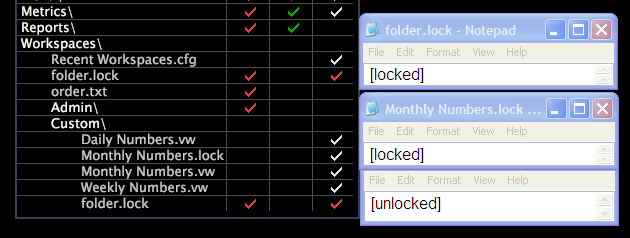

# Folder.lock e workspace.lock, file{#folder-lock-and-workspace-lock-files}

All&#39;interno della cartella Workspaces della directory di installazione di Workbench dati, un file folder.lock specifica se le aree di lavoro in quella particolare cartella sono bloccate, mentre un file name.lock dell&#39;area di lavoro specifica se una particolare area di lavoro è bloccata.

Quando bloccate intere cartelle, potete bloccarle a livello di cartella Workspaces o di sottocartella (scheda). È inoltre possibile bloccare o sbloccare tutte le cartelle (a livello di cartella Workspaces), quindi specificare le eccezioni per sottocartelle particolari (utilizzando [!DNL folder.lock] i file) o aree di lavoro particolari (utilizzando i file *workspace name*.lock).

L&#39;esempio seguente [!DNL Profile Manager] evidenzia tre elementi:

* Un [!DNL folder.lock] file per la cartella Workspaces principale
* Un [!DNL Monthly Numbers.lock] file per il file dell’ [!DNL Monthly Numbers.vw] area di lavoro

* Un [!DNL folder.lock] file per la sottocartella Workspaces\Custom

In questo esempio, il [!DNL Workspaces folder.lock] file è impostato su bloccato, che blocca tutte le aree di lavoro in questa istanza di Workbench dati. Il [!DNL folder.lock] file della sottocartella Workspaces\Custom è impostato su sbloccato e consente di sbloccare tutte le aree di lavoro della [!DNL Custom] scheda. Infine, il [!DNL Monthly Numbers.lock] file è impostato su bloccato, che blocca l’area di lavoro Numeri mensili.

## Creazione di file .lock {#section-c4f78b4b43c347368a376904effb41d2}

È possibile creare un [!DNL new folder.lock] file utilizzando l&#39; [!DNL Create menu] opzione in [!DNL Profile Manager] o [!DNL Workspaces Manager]. Potete anche creare un file nome [!DNL folder.lock] .blocco per un’area di lavoro *o per un’* area di lavoro copiando e incollando un [!DNL .lock] file esistente nella cartella appropriata, modificando il nome del file (solo per i file nome **.blocco dell’area di lavoro) e modificando, se necessario, l’impostazione nel file.

**Per creare un nuovo file folder.lock**

1. In Workbench dati, aprire il modulo facendo clic con il pulsante destro del mouse all&#39;interno di un&#39;area di lavoro e scegliendo [!DNL Workspaces Manager] > **[!UICONTROL Manage]** > **[!UICONTROL Profile]** **[!UICONTROL Workspaces Manager]**.
1. Fate clic sulla cartella per la quale desiderate creare un [!DNL folder.lock] file.
1. Nella [!DNL User] colonna relativa alla cartella, fare clic con il pulsante destro del mouse nella cella e scegliere **[!UICONTROL Create]** > **[!UICONTROL folder.lock]**. Viene visualizzato un [!DNL new folder.lock] file. [!DNL New folder.lock] per impostazione predefinita, i file sono impostati su [sbloccato] .
1. (Facoltativo) Per modificare l&#39;impostazione nel file:

   1. Fare clic con il pulsante destro del mouse sul segno di spunta del file.
   1. Fai clic su **[!UICONTROL Open]** > **[!UICONTROL in Notepad]**. Si apre il [!DNL folder.lock] file.

   1. Cambia l’impostazione in [bloccata].
   1. Salvate e chiudete il file.

1. Per impostare questa impostazione per tutti gli utenti che utilizzano lo stesso profilo di lavoro, fare clic con il pulsante destro del mouse sul segno di spunta del file e scegliere **[!UICONTROL Save to]** > *&lt;**[!UICONTROL working profile name]**>*.

Le aree di lavoro in questa cartella ora vengono bloccate o sbloccate in base all&#39;impostazione nel nuovo file.

**Per creare un file .lock da un file esistente**

1. In [!DNL Profile Manager] o [!DNL Workspaces Manager], fare clic con il pulsante destro del mouse sul segno di spunta per un [!DNL .lock] file esistente e fare clic su **[!UICONTROL Copy]**.
1. Nella [!DNL User] colonna relativa alla cartella in cui si desidera incollare il [!DNL .lock] file, fare clic con il pulsante destro del mouse nella cella e fare clic **[!UICONTROL Paste]**.
1. Se il file viene utilizzato per bloccare una singola area di lavoro, fare clic con il pulsante destro del mouse sul [!DNL .lock] file nella [!DNL User] colonna e modificarne il nome nel [!DNL File] campo in modo che corrisponda al nome dell’area di lavoro da bloccare.

   Ad esempio, per bloccare l’ [!DNL Monthly Numbers.vw] area di lavoro occorre assegnare al file il nome &quot; [!DNL Monthly Numbers.lock]&quot;.Se il file viene utilizzato per bloccare una singola area di lavoro, fare clic con il pulsante destro del mouse sul [!DNL .lock] file nella [!DNL User] colonna e modificarne il nome nel [!DNL File] campo in modo che corrisponda al nome dell’area di lavoro da bloccare. Ad esempio, per bloccare l’ [!DNL Monthly Numbers.vw] area di lavoro occorre assegnare al file il nome &quot; [!DNL Monthly Numbers.lock]&quot;.

1. Per modificare l&#39;impostazione nel file:

   1. Fare clic con il pulsante destro del mouse sul segno di spunta del file.
   1. Fai clic su **[!UICONTROL Open]** > **[!UICONTROL in Notepad]**. Si apre il [!DNL .lock] file.

   1. Modificate l&#39;impostazione su [bloccato] o [sbloccato].
   1. Salvate e chiudete il file.

1. Per impostare questa impostazione per tutti gli utenti che utilizzano lo stesso profilo di lavoro, fare clic con il pulsante destro del mouse sul segno di spunta del file e scegliere **[!UICONTROL Save to]** > *&lt;**[!UICONTROL working profile name]**>*.

Le aree di lavoro selezionate ora sono bloccate o sbloccate in base all&#39;impostazione nel nuovo file.
