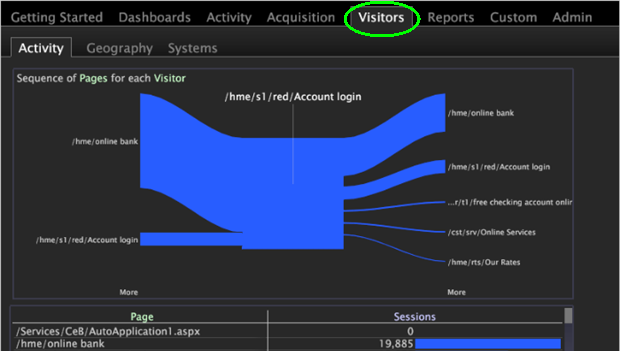

# Aggiungere una scheda al Worktop (piano di lavoro){#add-a-tab-to-the-worktop}

{{eol}}

Aggiungi una scheda al Worktop per accedere rapidamente a un’area di lavoro.

È possibile aggiungere un&#39;area di lavoro come scheda nel Worktop (piano di lavoro). Ad esempio, puoi aggiungere una **Visitatori** per accedere rapidamente a una panoramica del traffico.

**Aggiungi una cartella in Gestione profili**

1. Apri l’area di lavoro che desideri associare alla nuova scheda, quindi fai clic con il pulsante destro del mouse **Amministratore** > **Profile Manager**.
1. In [!DNL Profile Manager], fai clic su **[!UICONTROL Workspaces]** per visualizzarne il contenuto.
1. Fai clic con il pulsante destro del mouse nel [!DNL User] colonna per [!DNL Workspaces] e seleziona **[!UICONTROL Create]** > **[!UICONTROL Folder]**.

   

   Viene creata una nuova sottocartella contenente i file che si desidera rendere disponibili tramite la nuova scheda. Viene visualizzata una nuova cartella denominata Nuova cartella.
1. Per rinominare, fai clic con il pulsante destro del mouse nel [!DNL User] per la nuova cartella e digitare un nome nel parametro Dir.

   

   Il nome della cartella verrà visualizzato nel Worktop come scheda.

   

1. (Facoltativo) Per rendere le modifiche disponibili a tutti gli utenti del profilo di lavoro, fai clic con il pulsante destro del mouse sul segno di spunta per [!DNL .vw] nel [!DNL User] e fai clic su **[!UICONTROL Save to]** > *&lt;**[!UICONTROL working profile name]**>*.

   Per visualizzare solo la versione completa dell’area di lavoro delle descrizioni e non la miniatura dell’area di lavoro, è necessario salvare l’area di lavoro nel profilo di lavoro. Per farlo, nella [!DNL Profile Manager], fai clic con il pulsante destro del mouse sul segno di spunta bianco per la [!DNL description.vw] nel [!DNL User] , quindi fai clic su **[!UICONTROL Save to]** > *&lt;**[!UICONTROL working profile name]**>*.
