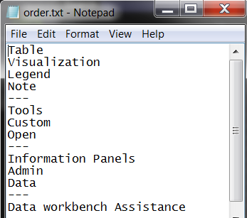

# Personalizzare un menu utilizzando i file order.txt{#customize-a-menu-using-order-txt-files}

È possibile personalizzare l&#39;aspetto di qualsiasi menu modificando il file order.txt associato a tale menu.

I passaggi di questa sezione si applicano a tutti i tipi di menu.

**Per modificare il file order.txt e personalizzare un menu**

1. Nella colonna [!DNL Profile Manager], nella colonna *nome profilo*, fare clic con il pulsante destro del mouse sul segno di spunta relativo al file [!DNL order.txt] e fare clic su **[!UICONTROL Make Local]**.
1. Fai clic con il pulsante destro del mouse sul segno di spunta per il file [!DNL order.txt] nella colonna [!DNL User] e fai clic su **[!UICONTROL Open]** > **[!UICONTROL in Notepad]**. Viene visualizzato il file [!DNL order.txt] .

   

1. (Facoltativo) Aggiungi o modifica l&#39;impostazione [Inclusive] o [Exclusive] nella parte superiore del file, se necessario. Questa impostazione controlla se gli elementi non elencati nel file [!DNL order.txt] ma presenti nel [!DNL Profile Manager] sono elencati nel menu. Le opzioni includono:

   * **[Inclusivo]:** questa è l’impostazione predefinita. Questa impostazione consente di elencare in ordine alfabetico le voci di menu non specificate nel file [!DNL order.txt]nella parte inferiore del menu. Ad esempio, se il [!DNL Profile Manager] conteneva un elemento Profilo oltre a quelli elencati nel [!DNL order.txt] precedente, il profilo verrebbe visualizzato sotto Dati.

   * **[Esclusivo]:** questa impostazione esclude dal menu le voci di menu non specificate nel  [!DNL order.txt] file. Ad esempio, se il [!DNL Profile Manager] conteneva un elemento Profilo oltre a quelli elencati nel [!DNL order.txt] precedente, il profilo non veniva visualizzato in alcun punto del menu.

   * **Vuoto:** Se nella parte superiore del file non viene visualizzata alcuna voce  [] Inclusivo o  [] Esclusivo, in Data Workbench le voci di menu vengono visualizzate come se l’impostazione fosse  [Inclusiva].

1. Completa uno o più dei seguenti passaggi:

   <table id="table_C5D5313DF5E4470499B0B285BA2690F0"> 
    <thead> 
    <tr> 
    <th colname="col1" class="entry"> Per eseguire questa operazione.. </th> 
    <th colname="col2" class="entry"> Effettua le seguenti operazioni... </th> 
    </tr> 
    </thead>
    <tbody> 
    <tr> 
    <td colname="col1"> 
Riordina voci di menu 
 </td> 
    <td colname="col2"> 
Digitare i nomi degli elementi nell'ordine in cui si desidera che vengano visualizzati nella Data Workbench. 
 
Ad esempio, se il nome di ogni voce di menu corrisponde al nome di file o cartella corrispondente, quanto segue determina la prima visualizzazione di<b> Aggiungi tabella</b>, quindi <b>Aggiungi visualizzazione</b>, <b>Aggiungi legenda</b> e <b>Aggiungi nota</b> appare per ultima. 
 
<b>Aggiungi tabella  </b> 
 
<b>Aggiungi visualizzazione  </b> 
 
<b>Aggiungi legenda  </b> 
 
<b>Aggiungi nota  </b> 
 </td> 
    </tr> 
    <tr> 
    <td colname="col1"> 
Rinomina una voce di menu 
 </td> 
    <td colname="col2"> 
Rinomina il file o la cartella corrispondente nel  Profile Manager, quindi modifica il nome dell'elemento nel file  order.txt. 
 
Ad esempio, per rinominare Aggiungi annotazione in Nuova annotazione, rinominare la cartella Aggiungi annotazione in  Profile Manager in Nuova annotazione, quindi modificare il nome dell'elemento Aggiungi annotazione nel file  order.txt in Nuova annotazione. 
 </td> 
    </tr> 
    <tr> 
    <td colname="col1"> 
Nascondere una voce di menu 
 </td> 
    <td colname="col2"> 
Per nascondere la voce di menu ma non eliminarla, digitare un segno meno (-) all'inizio del nome. 
 
Ad esempio, i seguenti risultati in  Aggiungi annotazione non vengono visualizzati nel menu. 
 
Aggiungi legenda 
 
-Aggiungi annotazione 
 
Per mostrare di nuovo la voce di menu nascosta, rimuovi semplicemente il segno meno (-) o utilizza il parametro Mostra tutto nel file  Insight.cfg, vedi <a href="../../../../home/c-get-started/c-insght-config-param.md#concept-14da97d0756348e885c08ca9e866074b"> Parametri di configurazione di Insight</a>. 
 
È inoltre possibile nascondere le voci di menu utilizzando i seguenti metodi: 
    <ul id="ul_CC9A82AFCE784CA49CC912C9256BAC1A"> 
    <li id="li_28C28CA0DE4B4A8F9C2C2C2B3BDD0557"> 
Il parametro Show in un file  .filter,  .metric o  .dim nasconde filtri, metriche e dimensioni derivate e dimensioni estese dai rispettivi menu. Quando utilizzi questa opzione, la voce non è elencata nel menu, ma è ancora nel profilo e può essere utilizzata. 
 
Per utilizzare questo parametro per nascondere filtri e metriche e dimensioni derivate, aggiungi la seguente riga alla fine del file  .metric,  .dim o  .filter : 
 
 show = bool: false 
 
Per utilizzare questo parametro per nascondere le dimensioni estese, consulta il capitolo 10 della <i>Guida alla configurazione del set di dati</i> per le istruzioni. 
 
È possibile visualizzare temporaneamente gli elementi nascosti utilizzando questo metodo impostando il parametro Mostra tutto nel file  Insight.cfg . Per ulteriori informazioni su questo parametro, consulta <a href="../../../../home/c-get-started/c-insght-config-param.md#concept-14da97d0756348e885c08ca9e866074b"> Parametri di configurazione di Insight</a>. 
 </li> 
    <li id="li_2CB65D594DD04C59A8D27A17DBF278FA">Il parametro Hidden nel file  Transformation.cfg o in qualsiasi set di dati include file nasconde dimensioni estese dal menu di dimensioni. Quando utilizzi questa opzione, la voce non è elencata nel menu, ma è ancora nel profilo e può essere utilizzata. 
 
Nota:  Quando nascondi dimensioni estese utilizzando questo metodo, devi trasformare nuovamente il set di dati per nascondere le dimensioni. 
 
 
È possibile visualizzare temporaneamente gli elementi nascosti utilizzando questo metodo impostando il parametro Mostra tutto nel file  Insight.cfg . Per ulteriori informazioni su questo parametro, consulta <a href="../../../../home/c-get-started/c-insght-config-param.md#concept-14da97d0756348e885c08ca9e866074b"> Parametri di configurazione di Insight</a>. 
 </li> 
    <li id="li_6E161953FEA44EC18237D88D7173DC60"> 
I file a byte zero nascondono qualsiasi tipo di elemento in qualsiasi menu. Quando si utilizza questa opzione, un file vuoto (zero byte) nasconde la presenza di un file con lo stesso nome che contiene i dati. Data Workbench considera i file a byte zero come se non esistessero. Per ulteriori informazioni, vedere <a href="../../../../home/c-get-started/c-admin-intrf/c-prof-mgr/c-empty-files.md#concept-e776fac9e5904bed8c13b9d5eb17c491"> Nascondere i file utilizzando file vuoti (a byte zero)</a>. 
 </li> 
    </ul> 
 </td> 
    </tr> 
    <tr> 
    <td colname="col1"> 
Eliminare una voce di menu 
 </td> 
    <td colname="col2"> 
Se questo file è impostato per utilizzare l'opzione [Esclusivo], è sufficiente eliminare la voce di menu da questo file. L’elemento stesso è ancora nel profilo, ma non è elencato nel menu . 
 
Se questo file è impostato per utilizzare l'opzione [Inclusive], è necessario rimuovere il nome della voce di menu da questo file e eliminare o zero byte il file corrispondente per rimuovere la voce dal menu. 
 
Per informazioni sull'eliminazione dei file, vedere <a href="../../../../home/c-get-started/c-admin-intrf/c-prof-mgr/t-del-files-wkg-prof.md#task-1e29c25e6c824cc9b51cb651e835856b"> Eliminazione dei file dal profilo di lavoro</a>. Per informazioni sui file a byte zero, vedere <a href="../../../../home/c-get-started/c-admin-intrf/c-prof-mgr/c-empty-files.md#concept-e776fac9e5904bed8c13b9d5eb17c491"> Nascondere i file utilizzando file vuoti (a byte zero)</a>. 
 </td> 
    </tr> 
    <tr> 
    <td colname="col1"> 
Aggiungi un’intestazione di gruppo 
 </td> 
    <td colname="col2"> 
Digitare tre trattini prima e dopo il testo di intestazione che si desidera visualizzare. 
 
Ad esempio, quanto segue genera un'intestazione di gruppo Gestisci per un set di voci di menu correlate. 
 
---Gestire i--- 
 
Profilo 
 
Set di dati 
 
  </img> 
 </td> 
    </tr> 
    <tr> 
    <td colname="col1"> 
Aggiungi una riga a sezioni separate di un menu 
 </td> 
    <td colname="col2"> 
Digitare tre trattini in cui si desidera visualizzare una linea. 
 
Ad esempio, la seguente riga separa Aggiungi annotazione e Aggiungi personalizzato. 
 
Aggiungi annotazione 
 
— 
 
Aggiungi personalizzato 
 </td> 
    </tr> 
    </tbody> 
    </table>

1. Salva e chiudi il file.
1. (Facoltativo) Per rendere le modifiche disponibili a tutti gli utenti del profilo di lavoro, fai clic con il pulsante destro del mouse sul segno di spunta bianco per il file [!DNL order.txt] nella colonna [!DNL User] e fai clic su **[!UICONTROL Save to]** > * **[!UICONTROL working profile name]**.
