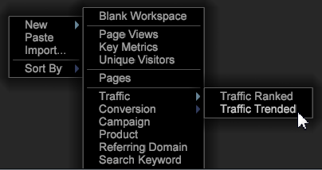

# Rapporti di Analytics{#analytics-reports}

Vengono forniti rapporti analitici per gli utenti del profilo Adobe SC. Questi rapporti di Data Workbench (Visualizzazioni pagina, Traffico, Visitatori unici, Dominio di riferimento e altri tipi di rapporti significativi) sono rapporti standard in Adobe Analytics.

Per gli utenti di Adobe Analytics, questi modelli consentono agli utenti che utilizzano il profilo Adobe SC (che utilizza il feed di dati SC/Insight) di visualizzare i rapporti generati dalla Data Workbench utilizzando modelli simili alla funzionalità Adobe [Marketing Reports &amp; Analytics](http://www.adobe.com/solutions/digital-analytics/marketing-reports-analytics.html?promoid=KAUCM) . Gli utenti possono accedere a questi rapporti preconfigurati utilizzando i modelli di Data Workbench.

>[!NOTE]
>
>Questo menu verrà visualizzato solo per gli utenti che hanno implementato il profilo Adobe SC.

**Per aprire i report**

Sul Worktop, fai clic con il pulsante destro del mouse e seleziona **[!UICONTROL New]** per visualizzare e aprire i modelli di report.

