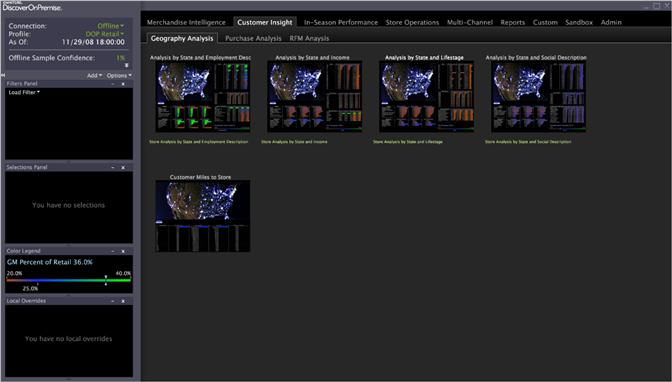

# Worktop (Piani di lavoro){#worktops}

Il Worktop è il luogo in cui organizzare e accedere a tutte le aree di lavoro e ai rapporti.

Nella maggior parte dei casi, il simbolo [!DNL Worktop] viene visualizzato immediatamente dopo l’apertura della Data Workbench. Le funzioni di [!DNL Worktop] includono la barra laterale e l&#39;interfaccia a schede. Inoltre, la barra laterale consente di aggiungere visualizzazioni e accedere a funzioni utilizzate regolarmente.

**Worktop (Piano di lavoro)**

Il [!DNL Worktop] consente inoltre di creare e salvare aree di lavoro e rapporti nuovi e aggiornati, nonché di pubblicare aree di lavoro e rapporti sul server Data Workbench per consentire ad altri utenti di accedervi.

La tabella degli elementi [!DNL Worktop] riportata di seguito descrive ogni elemento del [!DNL Worktop].

<table id="table_CB1DBB7DE8E2450A8C57601531BBD689"> 
 <tbody> 
  <tr> 
   <td colname="col1"> Barra laterale </td> 
   <td colname="col2"> 
La barra laterale fornisce contesto e controllo per le aree di lavoro, nonché consapevolezza dello stato corrente di un’area di lavoro e accesso alle funzioni utilizzate regolarmente. Nella barra laterale sono disponibili le seguenti funzioni: 
 
 <b>Connessione:</b> un indicatore di stato che mostra lo stato online. Fare clic sullo stato della connessione per abilitare o disabilitare  Work Online. Consulta <a href="../../home/c-get-started/c-off-on.md#concept-cef8758ede044b18b3558376c5eb9f54"> Modalità di funzionamento offline e online</a>. 
 
 <b>Profilo: </b> un indicatore del profilo corrente in uso. 
 
 <b>A partire da:  </b>Un indicatore di stato che mostra l’aggiornamento dei dati nel set di dati del profilo. Questi dati vengono scaricati ed elaborati dal server DPU, che può verificarsi solo quando si lavora online. 
 
 <b>Affidabilità query/campione:</b> un indicatore del completamento della query. Quando lo stato richiede il 100%, tutti i dati sono stati interrogati. 
 
 <b>Aggiungi: </b> consente di aggiungere visualizzazioni quali pannelli, legende e tabelle alla barra laterale. Consulta <a href="../../home/c-get-started/c-config-sidebar.md#section-666f70a405db4f8d8eaffa567ffcac06"> Aggiunta di visualizzazioni alla barra laterale</a>. 
 
 <b>Opzioni:</b> consente di ripristinare un’impostazione precedente della barra laterale e di nascondere automaticamente la barra laterale. 
 
Le impostazioni della barra laterale vengono salvate nel file  sidebar.vw al termine della Data Workbench. 
 </td> 
  </tr> 
  <tr> 
   <td colname="col1"> 
Sottodirectory a schede e sottoschede o a discesa (non mostrate) 
 </td> 
   <td colname="col2"> 
Ogni scheda visualizzata nella cartella  Worktop corrisponde al nome del profilo di lavoro <i>\Workspaces\<i>nome della scheda</i> nella directory di installazione di Data Workbench e rappresenta un particolare tipo di informazioni, ad esempio dashboard, attività, acquisizione, visitatori e così via. </i> Per impostazione predefinita, le sottocartelle nella cartella del nome della scheda vengono visualizzate come schede secondarie, ma possono anche essere visualizzate come sottodirectory. Consulta <a href="../../home/c-get-started/c-intf-anlys-ftrs/c-cstm-wktp-tabs/c-cstm-wktp-tabs.md#concept-0f1e6061b03949199326dc6df71a52bc"> Personalizzazione delle schede dei piani di lavoro</a>. 
 
 
Nota:  Ogni profilo di Data Workbench viene fornito con un set standard di schede. Poiché l’implementazione può essere completamente personalizzata, le aree di lavoro (e, quindi, le schede) visualizzate possono essere diverse da quelle documentate in questa guida. 
 
 </td> 
  </tr> 
  <tr> 
   <td colname="col1"> Stato del profilo </td> 
   <td colname="col2"> Fornisce lo stato della connessione al server Data Workbench e il nome del profilo attualmente caricato. La data e l’ora di fine per i dati nel set di dati del profilo vengono visualizzati sotto l’indicatore online. </td> 
  </tr> 
  <tr> 
   <td colname="col1"> Riduci a icona, Ingrandisci, Chiudi </td> 
   <td colname="col2"> Funzioni standard di Windows. </td> 
  </tr> 
  <tr> 
   <td colname="col1"> Miniature </td> 
   <td colname="col2"> 
Una miniatura è un'istantanea di un'area di lavoro visualizzata sul  Worktop. A ogni salvataggio dell’area di lavoro viene acquisita una nuova istantanea. Le miniature consentono di identificare rapidamente un particolare spazio di lavoro sul  Worktop. 
 
Per aprire un’area di lavoro, fai clic sulla miniatura. 
 
 
Nota:  Ogni profilo di Data Workbench viene fornito con un set standard di aree di lavoro. Poiché l’implementazione può essere completamente personalizzata, le aree di lavoro (e, quindi, le miniature) visualizzate possono essere diverse da quelle documentate in questa guida. 
 
 
Per ulteriori informazioni sulle aree di lavoro, consulta <a href="../../home/c-get-started/c-config-sidebar.md#concept-41db771b302e43018e5a9daa40b397e6"> Configurazione della barra laterale</a>. 
 </td> 
  </tr> 
  <tr> 
   <td colname="col1"> Messaggi di errore </td> 
   <td colname="col2"> 
I messaggi di errore vengono visualizzati in rosso sotto lo stato . Per le descrizioni del codice di stato, consulta <a href="http://www.w3.org/Protocols/rfc2616/rfc2616-sec10.html" format="http" scope="external"> http://www.w3.org/Protocols/rfc2616/rfc2616-sec10.html</a>. 
 
Ad esempio: 403_Forbidden. 
 </td> 
  </tr> 
 </tbody> 
</table>
