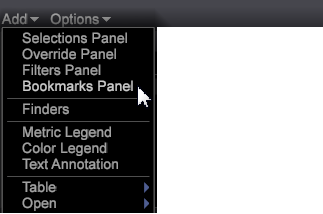

# Aggiungere un segnalibro{#add-a-bookmarks}

Puoi assegnare ai segnalibri aree di lavoro significative per spostarti rapidamente tra le visualizzazioni e i rapporti utilizzati nel flusso di lavoro.

1. Segnalibro un&#39;area di lavoro facendo clic sull&#39;icona Segnalibro  nell&#39;angolo superiore destro della barra degli strumenti.

   Prima di contrassegnare un’area di lavoro, questa icona viene visualizzata come un semplice libro. L’icona del segnalibro diventa un libro con una pagina contrassegnata una volta che un’area di lavoro è stata contrassegnata con un segnalibro.

1. Fare clic su **[!UICONTROL Add]** > **[!UICONTROL Bookmarks Panel]** nel riquadro a sinistra per aprire un elenco di segnalibri.

   

1. Per aprire un’area di lavoro con segnalibro, fate clic sul nome di un’area di lavoro nella **[!UICONTROL Bookmark Panel]**.

   

   Viene aperta l’area di lavoro selezionata. Quando si fa clic su un’altra area di lavoro con segnalibro, l’area di lavoro precedente viene chiusa e viene aperta la nuova area di lavoro selezionata, consentendo di spostarsi rapidamente nel flusso di lavoro.

**Per eliminare un segnalibro:**

* Nel pannello Segnalibri, fare clic con il pulsante destro del mouse e selezionare **[!UICONTROL Rimuovi<bookmark title>]**per eliminare un segnalibro selezionato o selezionare **[!UICONTROL Clear All Bookmarks]**per eliminare tutti i segnalibri.

* È inoltre possibile fare clic con il pulsante destro del mouse sull&#39;area di lavoro nella visualizzazione delle miniature all&#39;interno del piano di lavoro e selezionare **[!UICONTROL Clear Bookmark]**.

>[!IMPORTANT]
>
>* È possibile salvare 25 segnalibri.
>* Se aggiungete un segnalibro e quindi spostate la posizione dell&#39;area di lavoro, il segnalibro non sarà valido e deve essere eliminato dal pannello Segnalibri e reimpostato.
>

