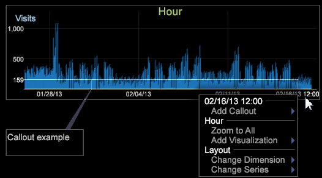

# Aggiunta di callout a un’area di lavoro{#adding-callouts-to-a-workspace}

{{eol}}

I callout sono finestre aggiunte a un’area di lavoro per attirare l’attenzione su un particolare elemento dimensionale creando una nuova visualizzazione con una selezione virtuale di tale elemento.

La Data Workbench viene fornita con un set standard di tipi di callout. Poiché l’implementazione può essere completamente personalizzata, i tipi di callout disponibili visualizzati nell’implementazione possono essere diversi da quelli documentati in questa guida.

Per impostazione predefinita, Data Workbench fornisce i callout seguenti:

* [Annotazione](../../../home/c-get-started/c-vis/c-call-wkspc.md#section-7b6742160b3f4aed872a09c8c023f90d)
* [Grafico a linee vuote](../../../home/c-get-started/c-vis/c-call-wkspc.md#section-5dcc0504bdb64ed4976f880e2f7b277f)
* [Scatter Plot vuoto](../../../home/c-get-started/c-vis/c-call-wkspc.md#section-5dcc0504bdb64ed4976f880e2f7b277f)
* [Tabella vuota](../../../home/c-get-started/c-vis/c-call-wkspc.md#section-5dcc0504bdb64ed4976f880e2f7b277f)
* [Legenda di affidabilità](../../../home/c-get-started/c-vis/c-call-wkspc.md#section-386d1293ddc24a0c9cccb332e20db791)
* [Metric Legend (Legenda della metrica)](../../../home/c-get-started/c-vis/c-call-wkspc.md#section-daa6d372c22246d9827880a9d6e804d8)

>[!NOTE]
>
>I callout non funzionano come selezioni, ovvero non influiscono su altre visualizzazioni all’interno dell’area di lavoro, a meno che non venga effettuata una selezione all’interno del callout.

È possibile aggiungere o modificare le definizioni dei callout configurando i file dei callout memorizzati nel *nome profilo*\Context\Callout cartella di [!DNL Server] cartella di installazione. Vedi [Configurazione dei callout](../../../home/c-get-started/c-intf-anlys-ftrs/c-config-callouts.md#concept-f6e91e172f5e4c009245c9c549beb76a).

## Per aggiungere un callout di annotazioni a una visualizzazione {#section-7b6742160b3f4aed872a09c8c023f90d}

1. Fare clic con il pulsante destro del mouse sull&#39;elemento per il quale si desidera creare un callout, quindi fare clic su **[!UICONTROL Add Callout]** > **[!UICONTROL Annotation]** > **[!UICONTROL Image]** o **[!UICONTROL Add Callout]** > **[!UICONTROL Annotation]** > **[!UICONTROL Text]**. Viene visualizzata una finestra vuota con una connessione visibile a tale elemento.

   

   Per aggiungere callout alle visualizzazioni Grafico, fai clic con il pulsante destro del mouse nella parte inferiore della visualizzazione (l’asse di base) per aprire un menu.

   

1. A seconda della selezione, completa il passaggio appropriato:

   * Per un&#39;annotazione di testo, digitare o incollare il testo desiderato nel callout, quindi formattare il testo come appropriato. Vedi [Utilizzo delle annotazioni di testo](../../../home/c-get-started/c-analysis-vis/c-annots/c-text-annots.md#concept-55b4aa3e0c58470b8e3c9d452e12a777).
   * Per un&#39;annotazione immagine, incollare l&#39;immagine desiderata nel callout copiando l&#39;immagine, quindi facendo clic con il pulsante destro del mouse all&#39;interno del callout. Fai clic su **[!UICONTROL Paste image]**. Vedi [Utilizzo delle annotazioni immagine](../../../home/c-get-started/c-analysis-vis/c-annots/c-image-annots.md#concept-02081ed7d91c4fdcb8fc863f2a51c962).

## Aggiunta di un callout vuoto di una tabella, di un grafico a linee o di un grafico a dispersione a una visualizzazione {#section-5dcc0504bdb64ed4976f880e2f7b277f}

1. Fare clic con il pulsante destro del mouse sull&#39;elemento per il quale si desidera creare un callout e fare clic su **[!UICONTROL Add Callout]** > *&lt;**[!UICONTROL callout type]**>*.

   Nell&#39;esempio seguente viene illustrato un callout di tabella vuota.

   

1. Per selezionare una dimensione, fai clic con il pulsante destro del mouse su **[!UICONTROL None]** e fai clic su **[!UICONTROL Change Dimension]** > *&lt;**[!UICONTROL dimension name]**>*.

   >[!NOTE]
   >
   >Se modifichi la dimensione all’interno di una visualizzazione con un callout, il callout viene modificato dal collegamento all’elemento della dimensione originale a quello collegato all’intera visualizzazione.

## Per aggiungere un callout con una legenda di affidabilità a una visualizzazione {#section-386d1293ddc24a0c9cccb332e20db791}

1. Fare clic con il pulsante destro del mouse sull&#39;elemento per il quale si desidera creare il callout, quindi fare clic su **[!UICONTROL Add Callout]** > **[!UICONTROL Confidence Legend]**.

   

1. Se lo desideri, modifica la [!DNL Metric or Formula] campo .

Per le regole di sintassi delle espressioni, consulta [Sintassi della lingua query](../../../home/c-get-started/c-qry-lang-syntx/c-qry-lang-syntx.md#concept-15d1d3f5164a47d49468c5acb7299d9f). Vedi [Legende di affidabilità](../../../home/c-get-started/c-analysis-vis/c-legends/c-conf-leg.md#concept-73db81c2c218427786c04068aa778efd).

## Per aggiungere un callout di legenda metrica a una visualizzazione {#section-daa6d372c22246d9827880a9d6e804d8}

1. Fare clic con il pulsante destro del mouse sull&#39;elemento per il quale si desidera creare il callout, quindi fare clic su **[!UICONTROL Add Callout]** > **[!UICONTROL Metric Legend]**.

   

1. Se lo desideri, aggiungi metriche alla legenda metrica o rimuovi metriche da essa.

Vedi [Legende della metrica](../../../home/c-get-started/c-analysis-vis/c-legends/c-metric-leg.md#concept-e7195bc8f7844ae295bda3a88b028d5b).
