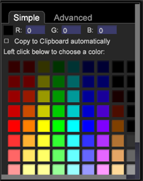

# Annotazione delle visualizzazioni{#annotating-visualizations}

{{eol}}

Livello presentazione consente di contrassegnare e annotare le visualizzazioni dell’area di lavoro e quindi pubblicarle con le chiamate e i commenti. Aggiungi descrizioni di testo, oggetti grafici, frecce di callout, codifica dei colori, immagini e altre funzioni in una sovrapposizione per aggiungere annotazioni e chiarire punti di dati importanti e condividerli con le parti interessate.

**Aggiungi annotazioni alle visualizzazioni:**

1. Apri un’area di lavoro.
1. Vai a **File** > **Livello presentazione**.
1. Fai clic su **Consenti livello presentazione**.

   Attiva o disattiva il comando in questo menu per consentire o disattivare la generazione di un livello di presentazione. Quando il livello di presentazione è consentito, viene visualizzato un segno di spunta.

   

   Quando si consente il livello di presentazione, viene visualizzata un’icona selezionabile sul lato destro della barra degli strumenti.

    Questa icona cliccabile mostra che sei nel **Nascondi livello presentazione** ma non è possibile visualizzare le annotazioni.

1. Fai clic sull’icona per passare a **Mostra livello presentazione**.

   Visualizzare le annotazioni nel livello della presentazione.

    Questa icona cliccabile mostra che sei nel **Mostra livello presentazione** ma non è possibile modificarla.

   >[!NOTE]
   >
   >È inoltre possibile fare clic con il pulsante destro del mouse nell&#39;area di lavoro per modificare le modalità utilizzando i comandi di menu.

   

1. **Modificare e aggiungere feature di callout.**

   Fai nuovamente clic sull’icona per acquisire una rappresentazione statica della visualizzazione dell’area di lavoro e aprire una sovrapposizione per aggiungere o modificare annotazioni.

    Questa icona cliccabile mostra che sei nel **Modifica livello presentazione** modalità per aggiungere e modificare annotazioni.

   In modalità di modifica viene visualizzata una sovrapposizione grigia.

1. **Aggiungi feature di callout**.

   Fai clic con il pulsante destro del mouse sulla visualizzazione per aggiungere una nuova casella di testo. frecce e altre feature di callout per evidenziare e annotare la presentazione.

   

1. **Imposta le caratteristiche grafiche**.

   Selezionare un oggetto grafico e fare clic con il pulsante destro del mouse per impostare le opzioni. È possibile impostare i colori di una casella o di un altro oggetto grafico, regolare le impostazioni del testo in una casella di testo e aggiungere frecce o impostare livelli per le linee.

   

1. **Aggiungere immagini all’area di lavoro**.

   Fai clic con il pulsante destro del mouse per aggiungere e ridimensionare le immagini .png e .jpg alla sovrapposizione.

1. **Assegnare colori agli oggetti grafici**.

   È possibile selezionare gli oggetti nel livello della presentazione e assegnare i colori utilizzando il selettore colore. 

1. **Esportare e condividere il livello di presentazione**.

   Dopo aver annotato le visualizzazioni dell&#39;area di lavoro, puoi esportare il livello di presentazione con visualizzazioni e condividerlo come file grafico .png.

   Fai clic su **Esporta** > **Esporta PNG**.
