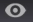

# Annotazione delle visualizzazioni{#annotating-visualizations}

Il Livello presentazione consente di contrassegnare e annotare le visualizzazioni dell’area di lavoro, quindi pubblicarle con le chiamate e i commenti. Aggiungete descrizioni di testo, oggetti grafici, frecce di callout, codifica dei colori, immagini e altre funzioni di una sovrapposizione per aggiungere annotazioni e chiarire punti dati importanti, quindi condividerli con gli interessati.

**Aggiungi annotazioni alle visualizzazioni:**

1. Aprite un’area di lavoro.
1. Vai a **File** > Livello **** presentazione.
1. Fate clic su **Consenti livello** presentazione.

   Attivate o disattivate il comando in questo menu per consentire o disattivare la generazione di un livello di presentazione. Quando il livello della presentazione è consentito, viene visualizzato un segno di spunta.

   

   Quando consentite il livello di presentazione, viene visualizzata un’icona selezionabile sul lato destro della barra degli strumenti.

    Questa icona selezionabile indica che siete in modalità **Nascondi livello** presentazione ma non potete visualizzare le annotazioni.

1. Fate clic sull&#39;icona per attivare o disattivare **Mostra livello** presentazione.

   Visualizzate le annotazioni nel livello della presentazione.

    Questa icona selezionabile indica che siete in modalità **Mostra livello** presentazione ma non potete modificarla.

   >[!NOTE]
   >
   >È inoltre possibile fare clic con il pulsante destro del mouse nell&#39;area di lavoro per modificare le modalità utilizzando i comandi di menu.

   

1. **Modificare e aggiungere le feature di callout.**

   Fate nuovamente clic sull’icona per acquisire una rappresentazione statica della visualizzazione dell’area di lavoro e aprire una sovrapposizione per aggiungere o modificare le annotazioni.

    Questa icona selezionabile indica che siete in modalità **Modifica livello** presentazione per aggiungere e modificare le annotazioni.

   In modalità di modifica viene visualizzata una sovrapposizione grigia.

1. **Aggiungere le funzioni** di callout.

   Fai clic con il pulsante destro del mouse sulla visualizzazione per aggiungere una nuova casella di testo. frecce e altre funzioni di callout per evidenziare e annotare la presentazione.

   

1. **Impostare le funzioni** grafiche.

   Selezionare un oggetto grafico e fare clic con il pulsante destro del mouse per impostare le opzioni. È possibile impostare i colori per una casella o un altro oggetto grafico, regolare le impostazioni di testo in una casella di testo e aggiungere frecce o impostare i livelli per le righe.

   

1. **Aggiungete immagini all’area di lavoro**.

   Fate clic con il pulsante destro del mouse per aggiungere e ridimensionare le immagini .png e .jpg alla sovrapposizione.

1. **Assegnare colori agli oggetti** grafici.

   Potete selezionare gli oggetti nel livello della presentazione e assegnare i colori mediante il selettore colore. 

1. **Esportate e condividete il livello** della presentazione.

   Dopo aver annotato le visualizzazioni dell’area di lavoro, potete esportare il livello di presentazione con le visualizzazioni e condividerlo come file grafico .png.

   Fate clic su **Esporta** > **Esporta PNG**.
