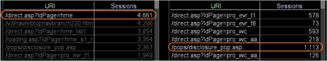

# Come una selezione influisce su altre visualizzazioni{#understanding-how-a-selection-affects-other-visualizations}

{{eol}}

All’interno di un’area di lavoro, una visualizzazione rappresenta un insieme di risultati della query.

Quando selezioni una selezione, Data Workbench filtra i risultati delle query utilizzate per produrre le visualizzazioni nell’area di lavoro. Il filtro specifico varia a seconda della visualizzazione.

Gli esempi seguenti illustrano come Data Workbench applica una selezione a tre diversi tipi di visualizzazioni. La revisione di questi esempi ti aiuta a comprendere l’effetto filtro sulle visualizzazioni. Inoltre, consentono di comprendere come interpretare i risultati visualizzati in una visualizzazione filtrata.

* [Filtraggio di una visualizzazione con una metrica sessioni](../../../../home/c-get-started/c-vis/c-sel-vis/c-sel-aff-vis.md#section-7cc06493ecb34cd4a696dbf0f0a7aaef)
* [Filtrare una visualizzazione con una metrica Visitatori](../../../../home/c-get-started/c-vis/c-sel-vis/c-sel-aff-vis.md#section-97d38c7f03e8457189a9c72d69514ed2)
* [Filtrare una visualizzazione con una metrica Visitatori per sessione](../../../../home/c-get-started/c-vis/c-sel-vis/c-sel-aff-vis.md#section-f746182311d648dcb98716b0fe846e25)

## Filtraggio di una visualizzazione con una metrica sessioni {#section-7cc06493ecb34cd4a696dbf0f0a7aaef}

In questo esempio, la [!DNL /direct.asp/?ldPage=hme] L’URI nella visualizzazione a sinistra filtra la metrica per Sessioni visualizzata nella visualizzazione a destra.



* **Effetto della selezione sulla query:** Data Workbench filtra le sessioni per l’URI selezionato. In questo esempio, la query che genera il valore per [!DNL /pops/disclosure_pop.asp] viene filtrato come segue:

   ```
   Sessions[ URI="/pops/disclosure_pop.asp" AND URI="/direct.asp
   /?ldPage=hme"] by Page View by Session
   ```

* **Interpretazione della visualizzazione:** La visualizzazione filtrata rappresenta il numero di sessioni che includono gli URI elencati nella visualizzazione e [!DNL /direct.asp/?ldPage=hme]. Questo esempio mostra che vi erano 1.113 sessioni durante le quali i visitatori hanno visualizzato entrambi [!DNL /pops/disclosure_pop.asp] pagina e [!DNL /direct.asp/?ldPage=hme] nella stessa sessione.

## Filtrare una visualizzazione con una metrica Visitatori {#section-97d38c7f03e8457189a9c72d69514ed2}

In questo esempio, la [!DNL /direct.asp/?ldPage=home] L’URI nella visualizzazione a sinistra filtra la metrica per Visitatori nella visualizzazione a destra.


* **Effetto della selezione sulla query:** Data Workbench filtra i visitatori per l’URI selezionato. In questo esempio, la query che genera il valore per [!DNL /pops/disclosure_pop.asp] L’URI viene filtrato come segue:

   ```
   Visitors[ URI="/pops/disclosure_pop.asp" by Page View by Visitor 
     AND URI="/direct.asp/?ldPage=hme" by Page View by Visitor ]
   ```

* **Interpretazione della visualizzazione:** La visualizzazione filtrata mostra i visitatori che hanno visualizzato gli URI elencati nella visualizzazione e [!DNL /direct.asp/?ldPage=hme] (anche se non necessariamente durante la stessa sessione). L’esempio precedente mostra che 2.041 visitatori hanno visualizzato entrambi [!DNL /pops/disclosure_pop.asp] e [!DNL /direct.asp/?ldPage=hme].

## Filtrare una visualizzazione con una metrica Visitatori per sessione {#section-f746182311d648dcb98716b0fe846e25}

In questo esempio, la [!DNL /direct.asp/?ldPage=hme] L’URI nella visualizzazione a sinistra filtra la metrica visitatore per sessione nella visualizzazione a destra.


* **Effetto della selezione sulla query:** Data Workbench filtra i visitatori per sessione per l’URI selezionato. Ad esempio, la query che genera il valore per [!DNL /pops/disclosure_pop.asp] L’URI viene filtrato come segue:

   ```
   Visitors[ ( URI="/pops/disclosure_pop.asp" by Page View 
     AND URI="/direct.asp/?ldPage=hme" by Page View ) by Session ]
   ```

* **Interpretazione della visualizzazione:** La visualizzazione filtrata mostra i visitatori che hanno visualizzato entrambi gli URI elencati nella visualizzazione e [!DNL /direct.asp/?ldPage=hme] durante la stessa sessione. Questo esempio mostra che 1.069 visitatori hanno visualizzato entrambi [!DNL /pops/disclosure_pop.asp] e [!DNL /direct.asp/?ldPage=hme] durante una singola sessione.
