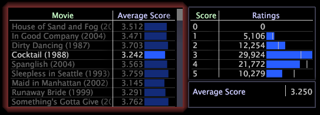

# Effettuare selezioni nelle visualizzazioni{#make-selections-in-visualizations}

La selezione degli elementi all’interno di una visualizzazione filtra dinamicamente il set di dati.

Quando effettui una selezione in una visualizzazione, tutte le altre visualizzazioni nell’area di lavoro vengono aggiornate automaticamente per riflettere i dati associati solo agli elementi selezionati.

L&#39;area di lavoro seguente mostra una tabella Filmato in cui è selezionato il filmato *Cocktail*. Nell’area di lavoro, la tabella Punteggio e la legenda metrica filtrano automaticamente le visualizzazioni per l’elemento selezionato (ovvero, le visualizzazioni riflettono i dati per il filmato *Cocktail*).

Come mostrato nell’esempio precedente, quando si effettua una selezione, intorno alla visualizzazione viene visualizzato un bagliore e gli elementi non selezionati all’interno di tale visualizzazione sono soggetti a un’attenuazione. Per facilitare i confronti con l’intero set di dati, nel grafico a barre compaiono linee bianche strette indicate come benchmark per contrassegnare la forma dei dati originali non filtrati. Per ulteriori informazioni sui benchmark, consulta [Informazioni sui benchmark](../../../../home/c-get-started/c-vis/c-ustd-benchmks.md#concept-c7b0f4102e92458096f8c4765cbe2914).

**Selezione**

È possibile effettuare selezioni in qualsiasi visualizzazione in cui sia visualizzata almeno una dimensione eccetto grafici a dispersione e legende.

Utilizza le seguenti sequenze di tasti e mouse per selezionare gli elementi desiderati:

| Su... | Usa questa sequenza... |
|---|---|
| Selezionare un singolo elemento | Fai clic su |
| Selezionare un intervallo di elementi | Fare clic e trascinare |
| Aggiungi un elemento alla selezione corrente | Ctrl+clic |
| Cancella una singola selezione | Maiusc+clic |
| Cancella tutte le selezioni (ovvero, seleziona nuovamente tutti gli elementi) | Fai clic con il pulsante destro del mouse su un valore della visualizzazione |

**Per cancellare una selezione**

Per cancellare una selezione, utilizzate le seguenti sequenze di tasti e mouse:

| Su | Usa questa sequenza... |
|---|---|
| Cancella una singola selezione | Maiusc+clic |
| Cancella tutte le selezioni (ovvero, seleziona nuovamente tutti gli elementi) | Fai clic con il pulsante destro del mouse su un valore della visualizzazione |
