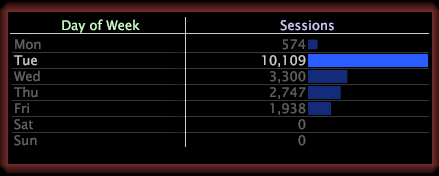

# Selezionare un livello{#select-a-level}

{{eol}}

Quando crei un sottoinsieme, devi specificare un livello.

Un livello è una qualsiasi dimensione conteggiata. Ad esempio, se lavori con i dati del sito web, se selezioni l’elemento Tonalità dalla dimensione Giorno della settimana e crei un sottoinsieme, devi selezionare il livello che desideri visualizzare: Visualizzazione pagina, Sessione o Visitatore.

* **Giorno della settimana=&quot;mar&quot; per visualizzazione pagina:** Il livello di visualizzazione della pagina mostra solo le visualizzazioni di pagina che si sono verificate in un martedì.

   

* **Giorno della settimana=&quot;mar&quot; per sessione:** Il livello di sessione mostra solo le sessioni che si sono svolte il martedì.

   

* **Day of Week=&quot;Tue&quot; by Visitor:** Il livello del visitatore mostra tutti i visitatori che sono venuti sul sito il martedì, ma mostra anche altri giorni in cui gli stessi visitatori sono arrivati sul sito.

   
