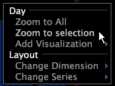

# Ingrandire o ridurre una visualizzazione{#zoom-in-or-out-in-a-visualization}

{{eol}}

È possibile ingrandire o ridurre i dati in grafici, globi, mappe del processo e grafici a dispersione.

## Zoom sugli oggetti nelle mappe del processo e nei globi {#section-be293f50337f49ee8f0f1ee3e613e4a1}

**Per ingrandire un&#39;area**

* Posizionare il puntatore sull&#39;area desiderata, tenere premuto entrambi i pulsanti del mouse, quindi spostare il mouse in avanti (lontano da voi).

**Per ingrandire un&#39;area**

* Posizionare il puntatore sull&#39;area desiderata, tenere premuto entrambi i pulsanti del mouse, quindi spostare il mouse indietro (verso di voi).

## Zoom sugli assi nei grafici e nei grafici a dispersione {#section-1438a5d637e84d68b69e269062dd3d7a}

Entrambi i grafici e i grafici a dispersione hanno assi su cui è possibile ingrandire o ridurre separatamente (in altre parole, è possibile ingrandire un asse e quindi ridurre l&#39;altro).

>[!NOTE]
>
>Per l’asse y in un grafico a linee e l’asse x o y in un grafico a dispersione, lo zoom viene reimpostato ogni volta che i dati sottostanti cambiano. Poiché questo accade molto spesso quando si lavora online, Adobe consiglia di lavorare offline quando è necessario ingrandire questi assi. Vedi [Utilizzo offline e online](../../../home/c-get-started/c-off-on.md#concept-cef8758ede044b18b3558376c5eb9f54).

**Ingrandire l’asse x o y di un grafico** Quando si esegue lo zoom in verticale (lungo l’asse y), l’asse x rimane fisso e i dati si estendono verso l’alto.

1. Posizionare il puntatore del mouse sull&#39;area della metrica o dell&#39;etichetta della dimensione dell&#39;asse x o y del grafico.
1. Premere entrambi i tasti del mouse e spostare il mouse in avanti (lontano da voi). Sull’asse vengono visualizzate delle frecce che indicano che più dati sono disponibili oltre la parte della visualizzazione attualmente visualizzata.

**Per ridurre l’asse x o y di un grafico**

1. Posizionare il puntatore del mouse sull&#39;area della metrica o dell&#39;etichetta della dimensione dell&#39;asse x o y del grafico.
1. Premere entrambi i tasti del mouse e spostare il mouse indietro (verso di voi).

**Ingrandimento di tutti i dati sull’asse x o y di un grafico** La [!DNL Zoom to All] il comando menu ritorna a una visualizzazione di tutti i dati sull&#39;asse selezionato.

* Fare clic con il pulsante destro del mouse sulle aree dei bordi dell’asse x o y (vicino alle etichette dei dati) e fare clic su **[!UICONTROL Zoom to All]**.

   

**Per ingrandire i dati selezionati nei grafici**

1. Fare clic e trascinare il puntatore del mouse sull&#39;intervallo di dati che si desidera selezionare.
1. Fai clic con il pulsante destro del mouse nell’area dell’etichetta della dimensione e fai clic su **[!UICONTROL Zoom to Selection]**.

Sull’asse vengono visualizzate delle frecce che indicano che più dati sono disponibili oltre la parte della visualizzazione attualmente visualizzata.
