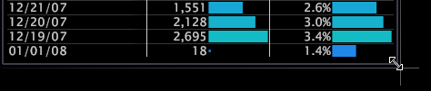

# Manipolare le finestre in un’area di lavoro{#manipulate-windows-in-a-workspace}

I tipi di finestre disponibili dipendono dal profilo e dall’applicazione con cui stai lavorando.

**Aggiunta di una finestra**

1. Fai clic con il pulsante destro del mouse nell’area di lavoro e scegli l’opzione di menu desiderata.
1. Dai menu visualizzati, selezionare il tipo di finestra che si desidera visualizzare.

**Per spostare una finestra**

Posizionare il puntatore del mouse sul bordo superiore della finestra finché non diventa una freccia a quattro punte, quindi fare clic e trascinarlo nella posizione desiderata nell&#39;area di lavoro.

**Ridimensionamento di una finestra**

Posizionare il puntatore del mouse su un lato o un angolo della finestra fino a quando non diventa una freccia a due punte, quindi fare clic e trascinare l&#39;angolo o il lato della finestra fino a raggiungere le dimensioni desiderate.

**Per copiare e incollare una finestra**

È possibile copiare e incollare le finestre all’interno e tra le aree di lavoro.

1. Fai clic con il pulsante destro del mouse sul bordo superiore della finestra e fai clic su **[!UICONTROL Copy]** > **[!UICONTROL Window]**.
1. Nell’area di lavoro desiderata, fai clic su **[!UICONTROL Open]** > **[!UICONTROL From Clipboard]**.

**Per copiare e incollare una finestra come callout per una visualizzazione**

1. Fai clic con il pulsante destro del mouse sul bordo superiore della finestra e fai clic su **[!UICONTROL Copy]** > **[!UICONTROL Window]**.
1. Nella visualizzazione desiderata, fai clic con il pulsante destro del mouse sull’elemento desiderato e fai clic su **[!UICONTROL Add Callout]** > **[!UICONTROL From Clipboard]**.
