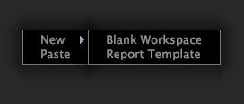

# Creare un’area di lavoro{#create-a-workspace}

Puoi personalizzare le aree di lavoro esistenti aggiungendo o modificando visualizzazioni esistenti o creando nuove aree di lavoro.

È quindi possibile salvare queste aree di lavoro per un utilizzo successivo. Consulta [Creazione di aree di lavoro](../../../home/c-get-started/c-work-worksp/c-create-worksp.md#concept-d8bc99d7739e4eaeab2a02b022394a31).

È possibile creare nuove aree di lavoro creando un’area di lavoro vuota, copiando e incollando un’area di lavoro esistente o salvando un’area di lavoro in un’altra posizione o utilizzando un altro nome.

Questa sezione descrive le seguenti attività:

* [Aggiunta di nuove aree di lavoro](../../../home/c-get-started/c-work-worksp/c-create-worksp.md#section-4236ae30e2884ea08f0885bf329f0778)
* [Copiare e incollare le aree di lavoro esistenti](../../../home/c-get-started/c-work-worksp/c-create-worksp.md#section-f91ae89b845640c9a4a52820a6110e65)
* [Modifica del nome di un’area di lavoro](../../../home/c-get-started/c-work-worksp/c-create-worksp.md#section-ca7edb913e4e4630a856f45a2536ffad)

## Aggiunta di nuove aree di lavoro {#section-4236ae30e2884ea08f0885bf329f0778}

Nella scheda [!DNL Worktop] desiderata, fai clic con il pulsante destro del mouse su un’area vuota nella scheda e fai clic su una delle opzioni seguenti:

* **[!UICONTROL New]** > **[!UICONTROL Blank Workspace]**. Questa opzione visualizza un&#39;area di lavoro vuota di dimensioni standard.

* **[!UICONTROL New]** >  **[!UICONTROL Report Template]**. Questa opzione visualizza un modello di dimensione standard che è possibile utilizzare per creare rapporti.

La miniatura del nuovo tipo di area di lavoro viene visualizzata nella scheda .

>[!NOTE]
>
>Dopo aver aperto una nuova area di lavoro, potrebbe essere necessario fare clic su **Aggiungi** > **Sblocca temporaneamente**.

## Copiare e incollare le aree di lavoro esistenti {#section-f91ae89b845640c9a4a52820a6110e65}

È possibile copiare e incollare un’area di lavoro esistente in qualsiasi altra area di lavoro. Se si incolla l’area di lavoro in una scheda che contiene una versione server di un’area di lavoro con lo stesso nome, l’area di lavoro viene incollata come versione locale di tale area di lavoro. Se si incolla l’area di lavoro in una scheda che contiene versioni server e locali di un’area di lavoro con lo stesso nome, l’area di lavoro viene incollata come versione utente dell’area di lavoro con lo stesso nome seguito da (Copia). Se si incolla l’area di lavoro in una scheda che non contiene un’area di lavoro con lo stesso nome, l’area di lavoro viene incollata come nuova area di lavoro utente.

**Per copiare e incollare un’area di lavoro esistente**

1. Nella scheda [!DNL Worktop] desiderata, fai clic con il pulsante destro del mouse sull’area di lavoro da copiare e fai clic su **[!UICONTROL Copy]**.

   

1. Passa alla scheda in cui desideri incollare l’area di lavoro, fai clic con il pulsante destro del mouse su un’area vuota nella scheda , quindi fai clic su **[!UICONTROL Paste]**.

   L’esempio seguente è un’area di lavoro incollata in una scheda dell’area di lavoro che contiene una versione del server:

   

L’esempio seguente è un’area di lavoro incollata in una scheda dell’area di lavoro che contiene già una versione server e locale. L’area di lavoro viene incollata come versione utente dell’area di lavoro con lo stesso nome seguito da (Copia):

## Modifica del nome di un&#39;area di lavoro {#section-ca7edb913e4e4630a856f45a2536ffad}

**Per modificare il nome di un’area di lavoro**

1. Nella scheda [!DNL Worktop] desiderata, fai clic sulla miniatura dell’area di lavoro da visualizzare.
1. Nell’area di lavoro, fai clic sul testo del titolo nella barra del titolo e digita il nuovo titolo, come illustrato nell’esempio seguente:

   

## Eliminazione di un&#39;area di lavoro {#section-fb04cc195e1a4a5491ff634f5f3ca972}

**Per modificare il nome di un’area di lavoro**
