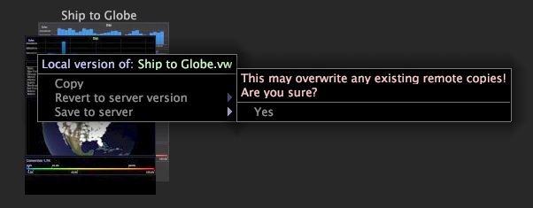

# Salvare un’area di lavoro{#save-a-workspace}

Per impostazione predefinita, la chiusura di un’area di lavoro sbloccata consente di salvare le modifiche apportate all’area di lavoro.

Se l&#39;area di lavoro è un&#39;area di lavoro server, le modifiche vengono salvate solo localmente, a meno che l&#39;area di lavoro aggiornata non venga salvata nel server Workbench dati. Per ulteriori informazioni sulle aree di lavoro bloccate, vedere [Sblocco di un’area di lavoro](../../../home/c-get-started/c-work-worksp/c-unlock-wksp.md#concept-18ada952aecf45c79a806b31b294023e).

## Salvare un’area di lavoro in locale {#section-3f331c880f1a490c96844103c2432d61}

Il percorso di salvataggio predefinito è la cartella **Utente\profilo name\Workspaces\tab name** all&#39;interno della directory di installazione di Workbench dati. Ad esempio, se si utilizza il profilo Filmati e si salva un&#39;area di lavoro localmente dalla [!UICONTROL Custom] scheda, l&#39;area di lavoro viene salvata nella cartella **User\Movies\Workspaces\Custom** nella directory di installazione di Workbench dati.

**Salvataggio delle modifiche in un&#39;area di lavoro**

* Nell’area di lavoro, fate clic su **[!UICONTROL File]**, quindi **[!UICONTROL Save]**.

**Salvataggio di un&#39;area di lavoro esistente come nuova area di lavoro**

1. Nella [!DNL Worktop] scheda desiderata, fate clic sulla miniatura dell’area di lavoro da visualizzare.
1. Nell’area di lavoro, fate clic **[!UICONTROL File]**, quindi fate clic su **[!UICONTROL Save Copy As]**.
1. Nella finestra di [!DNL Save Workspace As] dialogo, specificate il nome e il percorso in cui salvare l’area di lavoro copiata e fate clic su **[!UICONTROL Save]**.

## Salvataggio di un&#39;area di lavoro nel server Workbench dati {#section-65a23da852ee4186880e002f7c87ea81}

>[!NOTE]
>
>Solo gli utenti con le autorizzazioni appropriate possono salvare le aree di lavoro nel server Workbench dati. Per ulteriori informazioni, contattare l&#39;amministratore di sistema.

Il salvataggio delle aree di lavoro sul server Workbench dati connesso viene anche definito pubblicazione di un&#39;area di lavoro, in quanto rende l&#39;area di lavoro disponibile ad altri utenti. Per impostazione predefinita, le aree di lavoro vengono salvate nella cartella *\Workspaces\*tab name* del server Workbench dati con il nome* del profilo di lavoro. Ad esempio, se si utilizza il profilo Filmati e si salva un&#39;area di lavoro nel server Workbench dati connesso dalla [!DNL Custom] scheda, l&#39;area di lavoro viene salvata nella cartella Movies\Workspaces\Custom folder of the Data Workbench server.

**Salvataggio di un&#39;area di lavoro nel server Workbench dati**

* Nella [!DNL Worktop] scheda desiderata fare clic con il pulsante destro del mouse sulla miniatura dell&#39;area di lavoro che si desidera salvare nel server Workbench dati e fare clic su **[!UICONTROL Save to server]**.

