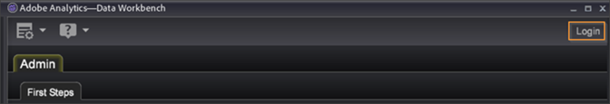

# Apertura di Data Workbench{#opening-data-workbench}

Dopo aver installato Data Workbench ed essere connesso al server, puoi utilizzarlo per analizzare i dati elaborati.

1. Passa alla directory di installazione di Data Workbench.
1. Fare doppio clic su [!DNL insight.exe] per avviare l&#39;applicazione.
1. Fai clic su **[!UICONTROL Login]**.

   

1. Immetti le tue credenziali.

   

   Al primo avvio, il sistema visualizza la pagina [!DNL Start] e inizia a scaricare i dati del profilo e la cache dei dati.

1. Una volta che la cache dei dati inizia a riempirsi, fai clic su **[!UICONTROL Start]**.

   Il sistema visualizza il simbolo [!DNL Worktop].

   

   Al successivo avvio di Data Workbench, il sistema salta la pagina [!DNL Start] e visualizza la pagina [!DNL Worktop], a meno che non sia stato aggiunto un nuovo profilo al server.

   Gli aggiornamenti del profilo e dei relativi dati vengono scaricati solo se si lavora online e si dispone di una connessione di rete al server Data Workbench. Per ulteriori informazioni sull&#39;utilizzo online, vedere [Modalità offline e online](../../home/c-get-started/c-off-on.md#concept-cef8758ede044b18b3558376c5eb9f54).

   >[!NOTE]
   >
   >Si sconsiglia a più utenti di condividere un singolo computer per l&#39;utilizzo della workstation.
