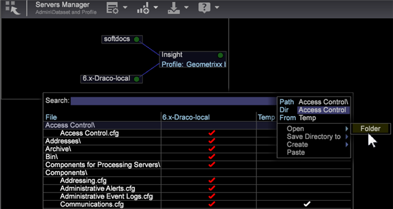

# Amministrazione utente dell’accesso dei membri del gruppo{#user-administration-of-group-member-access}

Gli amministratori possono concedere agli utenti della workstation la possibilità parziale di gestire il controllo degli accessi per i gruppi personalizzati.

**L&#39;amministrazione autonoma dei membri del gruppo** consente ai non amministratori di aggiungere ed eliminare membri in un gruppo personalizzato. L&#39;amministratore crea un file **User List** e imposta l&#39;accesso al gruppo nel file [Access Control.cfg](https://experienceleague.adobe.com/docs/data-workbench/using/server-admin-install/admin-dwb-server/access-control/c-config-acs-ctrl.html) per i nuovi membri del gruppo.

**Accesso a Server Manager**

L&#39;impostazione del file **[!DNL User List]** e la sincronizzazione con il file **[!DNL Communications.cfg]** viene eseguita nell&#39;area di lavoro **Server Manager**.

1. Sul piano di lavoro, fai clic sulla scheda **Amministratore** > **Set di dati e profilo** .

1. Apri l&#39;area di lavoro **Server Manager**.
1. Fai clic con il pulsante destro del mouse >*il nome del server*> nel diagramma e seleziona **File**.

   I file server si apriranno in una tabella con le colonne *File*, *`<server name>`* e *Temp*.

1. **Crea** locale facendo clic con il pulsante destro del mouse nella colonna server di un file server (per questa funzione  **[!DNL Access Control]** e  **[!DNL Components/Communications.cfg)]**.

   Nella colonna **Temp** viene visualizzato un segno di spunta bianco. È possibile modificare nella cartella Temp. Quindi fai clic con il pulsante destro del mouse sul segno di spunta e **Salva su** sul server. (diventa rosso quando sincronizzato con il server).

## Creare un file User List.cfg {#section-c25bcaf34f4546e6b8b65f5e7f69ac09}

L’amministratore deve creare un file **[!DNL User List.cfg]** nella cartella **[!DNL Access Control]** .

1. Fai clic con il pulsante destro del mouse** sulla riga Controllo accessi** nella colonna **Temp** e seleziona **Apri** > **Cartella**. 

   La cartella Controllo accessi nella cartella **Temp** verrà aperta elencando un singolo file **[!DNL Access Control.cfg]**.

1. Aggiungi un altro file di testo a questa cartella e denominalo **[!DNL User List.cfg]** (accanto a **[!DNL Access Control.cfg]**).

1. Aggiungi i seguenti parametri al file **[!DNL User List.cfg]** .

Il file Elenco utenti deve contenere un vettore di oggetti **AccessGroup** e ogni oggetto **AccessGroup** deve avere un nome e un vettore di stringhe denominati **Members**.

```
Access Control Groups = vector: 1 items 
  0 = AccessGroup:  
    Name = string: Group 1 
    Members = vector: 1 items 
      0 = string: CN:Joe User
```

Puoi quindi modificare e aggiungere gli utenti nella visualizzazione Workstation del file **[!DNL User List.cfg]**.


Ecco i parametri più semplici da aggiungere al file **[!DNL User List.cfg]**. I membri possono quindi essere aggiunti nella vista Workstation.

```
Access Control Groups = vector: 1 items 
  0 = AccessGroup:  
    Name = string:  
    Members = vector: 0 items
```

>[!IMPORTANT]
>
>Come per qualsiasi file **[!DNL .cfg]** che modifichi manualmente, assicurati di utilizzare spazi invece di tabulazioni e di prestare particolare attenzione allo spazio bianco e alla sintassi. Un errore in questo file farà ignorare il file dell&#39; *Adobe Insight Server* dell&#39;elenco utenti.

Al campo **Name** in ciascun **gruppo di accesso** verrà fatto riferimento all&#39;interno del file [!DNL Access Control.cfg].

>[!NOTE]
>
>Sono accettati solo i membri validi con prefissi del servizio directory, ad esempio **CN:** o **OU:**, che non possono contenere caratteri jolly (*).

## Imposta il file Communications.cfg {#section-9d6f05ba81c14f15be63e361533459e8}

Per abilitare questa funzione, un amministratore deve prima aprire il file **[!DNL Components]>[!DNL Communications.cfg]** e aggiungere una nuova chiave denominata **[!DNL Access Control User List File]**. Il valore stringa di questa chiave è il percorso in cui si troverà il nuovo file.

1. Dai file del server, fai clic su **Componenti** e fai clic con il pulsante destro del mouse sul segno di spunta nella colonna del server. Fare clic su **Rendi locale**.

   Nella colonna **Temp** viene visualizzato un segno di spunta bianco.

1. Fai clic con il pulsante destro del mouse sul segno di spunta nella colonna **Temp** e seleziona **Apri** > **in Workstation**.

1. Nel file **Communication.cfg**, fai clic con il pulsante destro del mouse su **componente** e seleziona **Aggiungi chiave personalizzata.** 

1. Digita **Name** come *Access Control User List File* e imposta **Of Type** come *String*.

   >[!NOTE]
   Non è possibile creare il nuovo file elenco come percorso. Per risolvere il problema, è necessario salvare il file, aprirlo in un editor (Blocco note) e modificare &quot;Stringa&quot; in &quot;Percorso&quot;:

   Prima:

   ```
   component = CommServer:  
     Access Control File = Path: Access Control\\Access Control.cfg 
     Access Control User List File =  
    <string>: Access Control\\User List.cfg
   ```

   Dopo:

   ```
   component = CommServer:  
     Access Control File = Path: Access Control\\Access Control.cfg 
     Access Control User List File =  
    <Path>: Access Control\\User List.cfg
   ```

1. Salva il file **[!DNL Communications.cfg]** e, se necessario, salvalo sul server. Questo riavvia i componenti nel server per assicurarti di non aver commesso errori che potrebbero impedire l&#39;analisi del file **[!DNL Communications.cfg]**.
1. Se il sistema include server di elaborazione, modifica il file di configurazione nel file **[!DNL Components for Processing Servers.cfg]**.
1. Fai clic con il pulsante destro del mouse su **[!DNL Communications.cfg]** e salva sul server.

L’amministratore di Data Workbench può ora confermare che gli utenti a cui è destinato l’accesso hanno accesso al file dell’elenco utenti e consentire agli utenti di gestire il gruppo. Gli utenti potranno aprire il file Elenco utenti, modificarlo e aggiungere e rimuovere i membri CN o OU in base alle esigenze.

## Sincronizzazione del file Access Control.cfg {#section-ca6da453dfb4432bb40b86ef15ede872}

L&#39;amministratore può quindi modificare il file **[!DNL Access Control.cfg]** e inserire i riferimenti al gruppo o ai gruppi definiti dal file *Elenco utenti*.

I riferimenti al gruppo o ai gruppi devono essere inseriti come qualsiasi altro membro, ma con la seguente sintassi:

```
$(Group Name)
```

Dove &quot;Nome gruppo&quot; corrisponde a ciò che è definito nel file elenco utenti, inclusi gli spazi bianchi. 

A questo punto, l’amministratore di Data Workbench può confermare che alcuni utenti del gruppo hanno accesso al file dell’elenco utenti. Gli utenti selezionati possono quindi aprire il file **[!DNL User List.cfg]**, modificarlo, aggiungere e rimuovere i membri CN o OU in base alle esigenze.
