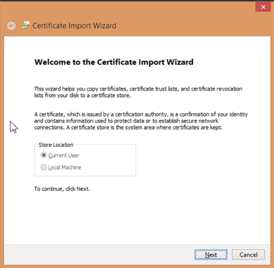

# Archivio certificati di Windows {#windows-certificate-store}

L’archivio certificati di Windows consente di memorizzare il certificato e la chiave privata del client nell’archivio certificati di Windows per la comunicazione SSL con i server.

L’archivio certificati di Windows per il client è una nuova funzione che consente di memorizzare il certificato e la chiave privata di comunicazione SSL nell’archivio certificati di Windows anziché nel file `Insight/Certificates/<CertName>.pem`. L’utilizzo dell’archivio certificati di Windows potrebbe essere preferibile se si utilizza l’archivio certificati per altre applicazioni e si desidera eseguire la gestione certificati in un’unica posizione oppure per gli utenti che apprezzano la registrazione di controllo di Windows aggiuntiva fornita dall’archivio certificati di Windows.

>[!NOTE]
>
>La concessione di licenze con il server licenze viene comunque mantenuta utilizzando il file esistente `<Common Name>.pem` e il certificato ottenuto dall’archivio certificati verrà utilizzato solo per la comunicazione ai server specificati.

## Prerequisiti {#section-69b18600052145ff8e5299b7123e69c5}

1. È necessario avere accesso al file [!DNL certmgr.msc] con la possibilità di importare un certificato e una chiave nell’archivio **Personali**. (dovrebbe essere così per impostazione predefinita per la maggior parte degli utenti Windows).

1. L’utente che esegue la configurazione deve disporre di una copia dello strumento della riga di comando **OpenSSL**.
1. Il server e il client devono già essere configurati per utilizzare un certificato SSL personalizzato, come descritto in [Utilizzo di certificati personalizzati](../../../../../home/c-inst-svr/c-install-ins-svr/t-install-proc-inst-svr-dpu/c-dnld-dgtl-cert/using-custom-certificates-dwb.md#concept-ee6a9b5015f84a0ba64a11428b0a72dd), fornendo istruzioni per archiviare il certificato client nell’archivio certificati di Windows anziché nella directory **Certificati**.

## Configurazione dell’archivio certificati di Windows {#section-3629802122e947d4b4f63e8b732cfe27}

L’archivio certificati di Windows per i client si attiva con la procedura seguente:

**Passaggio 1: importa il certificato SSL e la chiave privata dell’utente nell’archivio certificati di Windows.**

In [Utilizzo di certificati personalizzati](../../../../../home/c-inst-svr/c-install-ins-svr/t-install-proc-inst-svr-dpu/c-dnld-dgtl-cert/using-custom-certificates-dwb.md#concept-ee6a9b5015f84a0ba64a11428b0a72dd) ti viene indicato di inserire il certificato SSL e la chiave nella seguente directory:

```
< 
<filepath>
  DWB Install folder 
</filepath>>\Certificates\
```

Il nome del certificato è `<Common Name>.pem`, ad esempio [!DNL Analytics Server 1.pem] (non il file [!DNL trust_ca_cert.pem]).

Prima di importare il certificato e la chiave privata, è necessario convertirli dal formato . [!DNL pem] in un formato [!DNL .pfx], ad esempio [!DNL pkcs12.pfx].

1. Apri un prompt dei comandi o un terminale e vai alla directory:

   ```
   <CommonName>.pem c: cd \<DWB Install folder \Certificates
   ```

1. Esegui [!DNL openssl] con i seguenti argomenti (con il nome effettivo del file [!DNL .pem]):

   ```
   openssl pkcs12 -in "<Common Name>.pem" -export -out "<Common Name>.pfx"
   ```

   Se richiesto, fai clic su **Invio** per saltare l’immissione di una password di esportazione.

1. Esegui [!DNL certmgr.msc] dal prompt di esecuzione, dal menu Start o dalla riga di comando.
1. Apri l’archivio certificati **Personali** per l’utente corrente.

   

1. Fai clic con il pulsante destro del mouse su **Certificati** e scegli **Tutte le attività** > **Importa**.

   Accertati che l’opzione **Utente corrente** sia selezionata, quindi fai clic su **Avanti**.

   

1. Fai clic su **Sfoglia** e seleziona il file `<CommonName>.pfx` creato in precedenza. Per visualizzarlo dovrai modificare la casella a discesa dell’estensione del file da un certificato X.509 a **Personal Information Exchange** o a **Tutti i file**.

   Seleziona il file e fai clic su **Apri**, quindi su **Avanti**.

1. Non inserire una password e accertati che siano selezionate solo le opzioni **Contrassegna la chiave come esportabile** e **Includi tutte le proprietà estese**.

   

   Fai clic su **Avanti**.

1. Assicurati che l’opzione **Colloca tutti i certificati nel seguente archivio** sia selezionata e che l’archivio certificati elencato sia **Personali**. Se sei un utente avanzato, a questo punto puoi selezionare un altro archivio, ma dovrai cambiare la configurazione in un secondo momento.

1. Fai clic su **Avanti**, quindi su **Fine**. Dovresti visualizzare una finestra di dialogo in cui viene indicato che l’importazione è avvenuta correttamente e vedere il certificato nella cartella Certificati dell’archivio.

   >[!NOTE]
   >
   >Presta particolare attenzione ai campi **Rilasciati a** e **Rilasciati da**. Ne avrai bisogno nel prossimo passaggio.

**Passaggio 2: modifica il file Insight.cfg.**

È necessario modificare il file [!DNL Insight.cfg] per indirizzare Data Workbench all’utilizzo della funzione archivio certificati di Windows. Per ogni voce del server in questo file devono essere specificati alcuni parametri aggiuntivi. Se i parametri vengono omessi, per impostazione predefinita la workstation utilizzerà la configurazione del certificato esistente. Se i parametri sono specificati ma hanno valori errati, la workstation entrerà in uno stato di errore e dovrai fare riferimento al file di registro per le informazioni relative all’errore.

1. Apri il file **Insight.cfg** (che si trova nella directory di installazione di **Insight**).

1. Scorri verso il basso fino alla voce del server che desideri configurare. Se desideri utilizzare l’archivio certificati di Windows per ogni server, è necessario apportare queste modifiche a ogni voce nel vettore degli oggetti [!DNL serverInfo].
1. Aggiungi questi parametri al loro file [!DNL Insight.cfg]. È possibile eseguire questa operazione dalla workstation o manualmente aggiungendo i seguenti parametri all’oggetto [!DNL serverInfo]. Assicurati di utilizzare gli spazi invece dei caratteri di tabulazione e di non commettere altri errori tipografici o di sintassi in questo file.

   ```
   SSL Use CryptoAPI = bool: true  
   SSL CryptoAPI Cert Name = string: <Common Name>  
   SSL CryptoAPI Cert Issuer Name = string: Visual Sciences,LLC  
   SSL CryptoAPI Cert Store Name = string: My 
   ```

   Il valore booleano abilita o disabilita la funzione. Il nome del certificato corrisponde a **Rilasciato a** nel gestore certificati. Il nome dell’autorità di certificazione corrisponde a **Rilasciato da** e il **Nome archivio** deve corrispondere al nome dell’archivio certificati.

   >[!NOTE]
   >
   >Il nome “Personali” nel gestore certificati (certmgr.msc) in realtà fa riferimento all’archivio certificati denominato **My.** Di conseguenza, se importi il certificato di comunicazione e la chiave SSL (.PFX) nell’archivio certificati **Personali** come consigliato, devi impostare la stringa **SSL CryptoAPI Cert Store Name** su “My”. L’impostazione di questo parametro su “Personale” non funzionerà. Questa è una particolarità dell’archivio certificati di Windows.

   Un elenco completo degli archivi di sistema predefiniti è disponibile qui: [https://msdn.microsoft.com/en-us/library/windows/desktop/aa388136(v=vs.85).aspx](https://msdn.microsoft.com/en-us/library/windows/desktop/aa388136%28v=vs.85%29.aspx). Nel sistema potrebbero essere presenti ulteriori archivi di certificati. Se desideri utilizzare un archivio diverso da “Personali” (ad esempio **My**), è necessario ottenere il nome canonico dell’archivio certificati e fornirlo nel file [!DNL Insight.cfg]. Il nome dell’archivio di sistema “My” viene spesso indicato come “My” e “MY” nella documentazione di Windows. Il parametro sembra non fare distinzione tra maiuscole e minuscole.

1. Dopo aver aggiunto questi parametri e verificato che i valori corrispondano all’elenco nel gestore certificati di Windows, salva il file [!DNL Insight.cfg].

Ora puoi avviare la workstation (oppure disconnetterti/riconnetterti al server). Data Workbench dovrebbe caricare il certificato e la chiave dall’archivio certificati e connettersi normalmente.

## Output del registro {#section-a7ef8c9e90ef4bbabaa3cd51a2aca3ab}

Se un certificato non viene trovato o non è valido, il messaggio di errore viene inviato al file [!DNL HTTP.log].

```
ERROR Fatal error: the cert could not be found!
```

>[!NOTE]
>
>Il framework di registrazione L4 può essere attivato configurando il file [!DNL L4.cfg] (consulta il tuo account manager per configurarlo).
