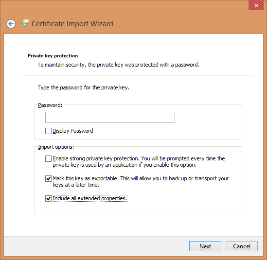

# Archivio certificati di Windows{#windows-certificate-store}

L&#39;archivio certificati di Windows consente di memorizzare il certificato del client e la chiave privata nell&#39;archivio certificati di Windows per la comunicazione SSL con i server.

L&#39;archivio certificati di Windows per il client è una nuova funzione che consente di memorizzare il certificato di comunicazione SSL e la chiave privata nell&#39;archivio certificati di Windows anziché nel `Insight/Certificates/<CertName>.pem` file. L&#39;utilizzo dell&#39;archivio certificati di Windows potrebbe essere preferibile se si utilizza l&#39;archivio certificati per altre applicazioni e si desidera eseguire la gestione certificati in un&#39;unica posizione, oppure per gli utenti che dispongono dell&#39;accesso al controllo di Windows aggiuntivo fornito dall&#39;archivio certificati di Windows.

>[!NOTE]
>
>La licenza con il server licenze viene mantenuta utilizzando il `<Common Name>.pem` file esistente e il certificato ottenuto dall&#39;archivio certificati verrà utilizzato solo per la comunicazione ai server specificati.

## Prerequisiti {#section-69b18600052145ff8e5299b7123e69c5}

1. È necessario avere accesso al [!DNL certmgr.msc] file con la possibilità di importare un certificato e una chiave nello store **Personale** . (Deve essere vero per impostazione predefinita per la maggior parte degli utenti Windows).

1. L&#39;utente che esegue la configurazione deve disporre di una copia dello strumento della riga di comando **OpenSSL** .
1. Il server e il client devono già essere configurati per utilizzare un certificato SSL personalizzato, come descritto in [Utilizzo di certificati](../../../../../home/c-inst-svr/c-install-ins-svr/t-install-proc-inst-svr-dpu/c-dnld-dgtl-cert/using-custom-certificates-dwb.md#concept-ee6a9b5015f84a0ba64a11428b0a72dd)personalizzati, fornendo istruzioni per memorizzare il certificato client nell&#39;archivio certificati di Windows anziché archiviarlo nella directory **Certificati** .

## Configurazione dell&#39;archivio certificati di Windows {#section-3629802122e947d4b4f63e8b732cfe27}

L&#39;archivio certificati di Windows per i client è attivato seguendo la procedura seguente:

**Passaggio 1: Importa il certificato SSL dell&#39;utente e la chiave privata nell&#39;archivio certificati di Windows.**

In [Utilizzo di certificati](../../../../../home/c-inst-svr/c-install-ins-svr/t-install-proc-inst-svr-dpu/c-dnld-dgtl-cert/using-custom-certificates-dwb.md#concept-ee6a9b5015f84a0ba64a11428b0a72dd) personalizzati si è invitati a inserire il certificato SSL e la chiave nella seguente directory:

```
< 
<filepath>
  DWB Install folder 
</filepath>>\Certificates\
```

Il nome del certificato è `<Common Name>.pem` (ad esempio [!DNL Analytics Server 1.pem] (non il [!DNL trust_ca_cert.pem] file).

Prima di importare il certificato e la chiave privata, è necessario convertirli da . [!DNL pem] in un [!DNL .pfx] formato, ad esempio [!DNL pkcs12.pfx] ).

1. Aprite un prompt dei comandi o un terminale e andate alla directory:

   ```
   <CommonName>.pem c: cd \<DWB Install folder \Certificates
   ```

1. Eseguire [!DNL openssl] con i seguenti argomenti (con il nome effettivo del [!DNL .pem] file):

   ```
   openssl pkcs12 -in "<Common Name>.pem" -export -out "<Common Name>.pfx"
   ```

   Se richiesto, fate clic su **Invio** per saltare l’immissione di una password di esportazione.

1. Eseguire [!DNL certmgr.msc] dalla riga di comando, dal menu Start o dal prompt di esecuzione.
1. Aprite l&#39;archivio certificati **personali** per l&#39;utente corrente.

   

1. Fare clic con il pulsante destro del mouse su **Certificati** e scegliere **Tutte le attività** > **Importa**.

   Accertatevi che l&#39;opzione Utente **** corrente sia selezionata, quindi fate clic su **Avanti**.

   

1. Fate clic su **Sfoglia** e selezionate il `<CommonName>.pfx` file creato in precedenza. Per visualizzarlo dovrete modificare la casella a discesa dell&#39;estensione del file da un certificato X.509 a **Personal Information Exchange** o a **Tutti i file** .

   Selezionate il file e fate clic su **Apri**, quindi su **Avanti**.

1. Non inserite una password e accertatevi che siano selezionate solo le opzioni **Contrassegna la chiave come esportabile** e **Includi tutte le proprietà** estese.

   

   Fai clic su **Avanti**.

1. Accertatevi che **Posizionate tutti i certificati nel seguente archivio** sia selezionato e che l&#39;archivio certificati elencato sia **Personale**. Se siete un utente avanzato, potete selezionare un altro store a questo punto, ma dovrete cambiare la configurazione in un secondo momento.

1. Fare clic su **Avanti** , quindi su **Fine**. Viene visualizzata una finestra di dialogo in cui viene indicato che l&#39;importazione è avvenuta correttamente e il certificato viene visualizzato nella cartella Certificati dello store.

   >[!NOTE]
   >
   >Prestare particolare attenzione ai **campi Rilasciati** e **Rilasciati da** . Ne avrete bisogno nel prossimo passo.

**Passaggio 2: Modificate il file Insight.cfg.**

È necessario modificare il [!DNL Insight.cfg] file per indirizzare l&#39;Data Workbench all&#39;utilizzo della funzione Archivio certificati di Windows. Per ogni voce del server in questo file devono essere specificati alcuni parametri aggiuntivi. Se i parametri vengono omessi, per impostazione predefinita la workstation utilizzerà la configurazione del certificato esistente. Se i parametri sono specificati ma hanno valori errati, la workstation immetterà uno stato di errore e dovrete fare riferimento al file di registro per le informazioni di errore.

1. Aprite il file **Insight.cfg** (che si trova nella directory di installazione di **Insight** ).

1. Scorrete verso il basso fino alla voce del server che desiderate configurare. Se si desidera utilizzare l&#39;archivio certificati di Windows per ogni server, è necessario apportare queste modifiche a ogni voce nel vettore di [!DNL serverInfo] oggetti.
1. Aggiungete questi parametri al [!DNL Insight.cfg] file. È possibile eseguire questa operazione dalla workstation o manualmente aggiungendo i seguenti parametri all&#39; [!DNL serverInfo] oggetto. Assicuratevi di utilizzare gli spazi invece dei caratteri di tabulazione e di non eseguire altri errori tipografici o di sintassi in questo file. )

   ```
   SSL Use CryptoAPI = bool: true  
   SSL CryptoAPI Cert Name = string: <Common Name>  
   SSL CryptoAPI Cert Issuer Name = string: Visual Sciences,LLC  
   SSL CryptoAPI Cert Store Name = string: My 
   ```

   Il valore booleano abilita o disabilita la funzione. Il nome del certificato corrisponde a **Emittente** nel gestore certificati. Il nome dell&#39;emittente del certificato corrisponde a **Emesso da** e il nome **** archivio deve corrispondere al nome dell&#39;archivio certificati.

   >[!NOTE]
   >
   >Il nome &quot;Personale&quot; nel Gestore dei certificati (certmgr.msc) in realtà fa riferimento all&#39;archivio certificati denominato **My.** Di conseguenza, se importate il certificato di comunicazione SSL e la chiave (.PFX) nell&#39;archivio certificati **personale** come consigliato, dovete impostare la stringa **SSL CryptoAPI Cert Name** su &quot;My&quot;. L&#39;impostazione di questo parametro su &quot;Personale&quot; non funzionerà. Questa è una particolarità dell&#39;archivio certificati di Windows.

   Un elenco completo degli store di sistema predefiniti può essere ottenuto qui: [https://msdn.microsoft.com/en-us/library/windows/desktop/aa388136(v=vs.85).aspx](https://msdn.microsoft.com/en-us/library/windows/desktop/aa388136%28v=vs.85%29.aspx). Nel sistema potrebbero essere presenti ulteriori archivi di certificati. Se si desidera utilizzare uno store diverso da &quot;Personale&quot; (ad esempio **My**), è necessario ottenere il nome canonico dell&#39;archivio certificati e fornirlo nel [!DNL Insight.cfg] file. (Il nome dell&#39;archivio di sistema &quot;My&quot; viene spesso indicato come &quot;My&quot; e &quot;MY&quot; dalla documentazione di Windows. Il parametro non fa distinzione tra maiuscole e minuscole.

1. Dopo aver aggiunto questi parametri e verificato che i valori corrispondano all&#39;elenco in Gestione certificati di Windows, salvare il [!DNL Insight.cfg] file.

È ora possibile avviare la workstation (oppure disconnettersi/riconnettersi al server). L&#39;Data Workbench deve caricare il certificato e la chiave dall&#39;archivio certificati e connettersi normalmente.

## Uscita log {#section-a7ef8c9e90ef4bbabaa3cd51a2aca3ab}

Se un certificato non viene trovato o non è valido, il messaggio di errore viene inviato al [!DNL HTTP.log] file.

```
ERROR Fatal error: the cert could not be found!
```

>[!NOTE]
>
>Il framework di registrazione L4 può essere attivato configurando il [!DNL L4.cfg] file (consultate il vostro account manager per configurare questa impostazione).
