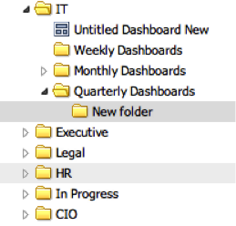

# Aggiunta di cartelle{#adding-folders}

1. Fate clic con il pulsante destro del mouse su una cartella esistente e selezionate **[!UICONTROL New subfolder]**.

   

1. Verrà creata una nuova sottocartella.

   

   Se l&#39;operazione ha avuto esito positivo, verrà visualizzato un messaggio che indica che la cartella è stata creata.
