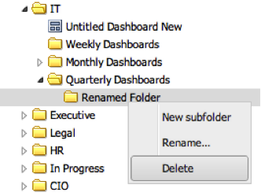

# Eliminazione delle cartelle{#deleting-folders}

1. Fai clic con il pulsante destro del mouse su una cartella da eliminare e seleziona **[!UICONTROL Delete]**.

   

   >[!NOTE]
   >
   >La cartella deve essere vuota prima di poterla eliminare.

1. Viene richiesto di eliminare la cartella.
1. Se l’operazione è riuscita, viene visualizzato anche un messaggio che indica che la cartella è stata eliminata.
