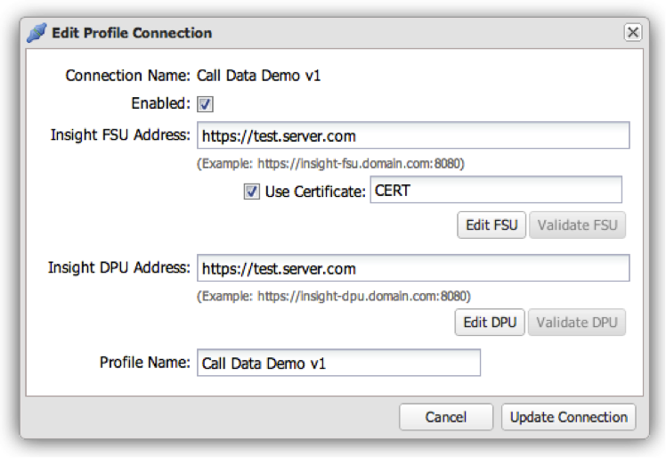

# Modifica di una connessione del profilo{#editing-a-profile-connection}

1. Fai clic sull’icona a forma di ingranaggio  alla fine della riga per la connessione del profilo da modificare.

   

1. Modifica le impostazioni della connessione del profilo e fai clic su **[!UICONTROL Update Connection]** per salvare.

   Se l’operazione ha avuto esito positivo, verrà visualizzato un messaggio che indica che la connessione del profilo è stata aggiornata correttamente.
