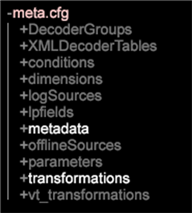

# Note sulla versione di Data Workbench 6.3{#data-workbench-release-notes}

Le note sulla versione di Data Workbench 6.3 includono nuove funzioni, requisiti per l&#39;aggiornamento, bug corretti e problemi noti.

## Nuove funzionalità {#section-1225066ea8f44cf68e42e019d0bca816}

La Data Workbench 6.3 include le seguenti nuove funzioni:

<table id="table_E28A6D31E7D941F7A0C2048F0F0F7838"> 
 <thead> 
  <tr> 
   <th colname="col1" class="entry"> Funzioni </th> 
   <th colname="col2" class="entry"> Descrizione </th> 
  </tr> 
 </thead>
 <tbody> 
  <tr> 
   <td colname="col1"> <a href="../../../home/c-get-started/c-attribution-profiles/c-attrib-algorithmic/c-attrib-algorithmic.md"> Attribuzione adattamento ottimale </a> </td> 
   <td colname="col2"> La funzione Attribuzione adattamento ottimale fornisce un approccio di apprendimento automatico per determinare i diversi livelli di influenza che le interazioni dei clienti esercitano su un evento di conversione di successo, quindi assegna il livello di attribuzione appropriato a ciascun evento. La funzione Attribuzione adattamento ottimale consente di valutare i tocchi in una finestra di tempo prima che si verifichi l'evento di conversione riuscito, quindi utilizza l'algoritmo di Data Workbench per creare un modello di attribuzione basato sui dati, con risultati specifici per le campagne di marketing e il flusso di lavoro interno. </td> 
  </tr> 
  <tr> 
   <td colname="col1"> <a href="../../../home/c-get-started/c-exp-data-seg-exp/c-mmp-integration.md"> Integrazione con profilo marketing principale </a> </td> 
   <td colname="col2"> Condivisione di segmenti di clienti avanzati creati in Data Workbench su Adobe Experience Cloud. Integrating with Profiles and Audiences enables the <a href="https://www.adobe.com/solutions/digital-marketing.html?promoid=KLXLZ" format="https" scope="external"> Adobe Experience Cloud </a> and other Adobe Analytic capabilities the opportunity to leverage rich audience segments created in Data Workbench. Questo richiede che il Experience Cloud  sia configurato e in esecuzione. <p>L'integrazione con il Experience Cloud di  Master consente di eseguire funzioni predittive come il clustering o il punteggio di propensione, quindi di inviare i segmenti al Adobe Experience Cloud più grande o ad altri prodotti come  Adobe Target e Adobe Experience Manager. </p> </td> 
  </tr> 
  <tr> 
   <td colname="col1"> <a href="../../../home/c-get-started/c-exp-data-seg-exp/c-segment-export.md#concept-ac18fdb34edc4b9592130ab98fabd05e"> Opzioni per formato di esportazione dei segmenti </a> </td> 
   <td colname="col2"> Added industry-standard format options for segments for direct integration with other capabilities, such as <b>R</b>, without additional file manipulation. Grazie a queste opzioni è possibile ottenere un flusso di lavoro continuo e analisi più rapide. </td> 
  </tr> 
  <tr> 
   <td colname="col1"> <a href="../../../home/c-get-started/c-analysis-vis/c-visitor-cluster/c-clustering-2.md"> Clustering 2.0 </a> </td> 
   <td colname="col2"> Includes a new <span class="filepath"> KMeans++ </span> algorithm ( <span class="filepath"> KMeans </span> is currently supported) that uses a faster approach to finding centers for an expedited cluster-generation process. </td> 
  </tr> 
  <tr> 
   <td colname="col1"> <a href="../../../home/c-get-started/c-analysis-vis/c-graphs/c-trend-lines.md#concept-2898b2ef97dc4762bda7df292713e9a2"> Linee di tendenza </a> </td> 
   <td colname="col2"> Presenta una descrizione dei dati molto visiva e di facile interpretazione. </td> 
  </tr> 
  <tr> 
   <td colname="col1"> <a href="../../../home/c-get-started/c-analysis-vis/c-graphs/c-regression-analysis.md#concept-58ec981ab50549488585a88295fa14b7"> Grafico analisi di regressione </a> </td> 
   <td colname="col2"> Consente di confrontare l'impatto di un fattore su un altro direttamente nel flusso di lavoro dell'analista. </td> 
  </tr> 
  <tr> 
   <td colname="col1"> <a href="../../../home/c-get-started/c-analysis-vis/c-chord-visualization.md#concept-ca600beb11674f3bb2696edf41f1dda9"> Visualizzazione accordi </a> </td> 
   <td colname="col2"> The Chord Visualization provides another view of the <a href="https://docs.adobe.com/content/help/en/data-workbench/using/client/analysis-visualizations/correlation-analysis/c-correlation-analysis.html" format="http" scope="external"> Correlation Matrix </a>. </td> 
  </tr> 
  <tr> 
   <td colname="col1"> <a href="../../../home/c-get-started/c-admin-intrf/c-query-que/c-query-string-grouping.md"> Raggruppamento stringhe di query </a> </td> 
   <td colname="col2"> Se si dispone di molti campi con variabili evar, prop e variabili personalizzate, durante l'elaborazione del registro è possibile creare una coppia di valori di nome per combinare i campi in un rapporto. </td> 
  </tr> 
  <tr> 
   <td colname="col1"> <a href="../../../home/c-get-started/c-analysis-vis/c-latency.md#concept-a18c23d45af0460ba531f94da0cdfe6a"> Analisi della latenza </a> </td> 
   <td colname="col2"> La visualizzazione Latenza consente di analizzare il comportamento latente dei clienti entro un determinato numero di giorni prima o dopo che si è verificato un evento dopo una campagna o un altro tipo di evento. </td> 
  </tr> 
  <tr> 
   <td colname="col1"> <b>Dimensioni temporali</b> </td> 
   <td colname="col2"> In the Finders panel, you can now right-click on the <span class="uicontrol"> Dimensions </span> tab and select <span class="uicontrol"> Dimension Type &gt; Time </span>. Nei risultati della ricerca viene visualizzato un elenco delle dimensioni temporali. <p>  </p> </td> 
  </tr> 
  <tr> 
   <td colname="col1"> <b>Funzione di blocco</b> </td> 
   <td colname="col2"> La nuova funzione <b>Blocca</b> visualizza un’icona nella barra degli strumenti quando un’area di lavoro è bloccata. Per sbloccare l’area di lavoro, fate clic sul menu <b>Aggiungi</b> e quindi su Sblocca <b></b>temporaneamente. </td> 
  </tr> 
  <tr> 
   <td colname="col1"> Operatori logici e nuove funzioni Metrica nel pannello <b>Filtro </b> </td> 
   <td colname="col2"> Gli operatori logici AND/OR sono stati aggiunti al pannello <b></b>Filtro e consentono di aggiungere o unire metriche durante il filtraggio dei dati. Modificando le metriche, la percentuale del filtro viene regolata e visualizzata di conseguenza. </td> 
  </tr> 
  <tr> 
   <td colname="col1"> Scelte rapide da tastiera </td> 
   <td colname="col2"> Le nuove scelte rapide da tastiera nella Data Workbench consentono di spostarsi tra il piano di lavoro principale e le singole aree di lavoro utilizzando i tasti freccia. Inoltre, la barra degli strumenti nell'area di lavoro adesso è visualizzata sulla finestra del piano di lavoro. </td> 
  </tr> 
  <tr> 
   <td colname="col1"> Supporto di Windows 8.1 </td> 
   <td colname="col2"> Microsoft Windows 8.1 a 64 bit è <a href="https://docs.adobe.com/content/help/it-IT/data-workbench/using/install/c-data-workbench-client-install.html" format="https" scope="external"> ora supportato </a> per l'installazione client. </td> 
  </tr> 
 </tbody> 
</table>

## Requisiti di aggiornamento e Recommendations {#section-8704a9ac358246cd81233dd0982d534f}

I nuovi profili di Data Workbench si trovano sul profilo **Software e Documenti** all&#39;indirizzo

```
Profiles - Current\DataWorkBench\ 
  English Translated\DataWorkBench_6.31-en-us\
```


**Server di aggiornamento:**

>[!NOTE]
>
>Se avete dei profili personalizzati che hanno la precedenza sui file predefiniti forniti nel [!DNL Base] pacchetto, dovrete aggiornare questi file personalizzati:

* **Aggiornare il file** Meta.cfg ( [!DNL E:\..\Profiles\<your custom profile>\Context\meta.cfg)]per impostare la crittografia aggiornata della password per l&#39;unità del file system (server FSU), e aggiungere voci per le trasformazioni Name Value Pair per sfruttare il raggruppamento [di stringhe di](../../../home/c-get-started/c-admin-intrf/c-query-que/c-query-string-grouping.md)query.

   1. Aprire il [!DNL meta.cfg] file sull&#39;FSU.
   1. Modificare il tipo di dati per **[!UICONTROL Proxy Password]** da &quot; [!DNL string"] a &quot; [!DNL EncryptedString]&quot; nella sezione Configurazione ** workstation.

      ```
      Proxy User Name = string: 
      Proxy Password = EncryptedString:   (from Proxy Password = String) 
      Use Address File = bool: true
      ```

   1. Aggiungete nuove voci per abilitare le nuove trasformazioni Nome coppia valore: *BuildNameValuePair* e *ExtractNameValuePair*.

      Aprite un’area di lavoro e fate clic con il pulsante destro del mouse su **Admin** (Amministratore) > **Profile Manager (Gestione** profili).

      In **Contesto**, fare clic sul file **meta.cfg** nella colonna **Base** , quindi fare clic su **Rendi locale**. Nella colonna della tabella Utente, fare clic con il pulsante destro del mouse e selezionare **Apri** > **in Workstation**.

      

      * Nella nuova finestra, fate clic su **metadati** e aggiungete modelli figlio validi.

      

      * Aprire **la trasformazione** e aggiungere nuovi modelli.

      


* **Aggiornamento per miglioramenti** di unione rapida. Aggiungete parametri o modificate valori ai seguenti file di configurazione per sfruttare i miglioramenti di velocità nell&#39;Data Workbench durante una trasformazione.

   * **Communications.cfg** ([!DNL E:\Server\Components\Communications.cfg])

      ```
      18 = SourceListServer:  
          URI = string: /SourceListServer/ 
          Listing Interval = int: 10 (new)
      ```

   * **Disk Files.cfg** (at [!DNL E:\Server\Components] e [!DNL E:\Server\Components for Processing Servers])

      ```
      Disk Cache Size (MB) = double: 1024 (from double: 256) 
      Disk Cache Read Limit (MB) = double: 768 (new)
      ```

   * **Elaborazione registro Mode.cfg** ( [!DNL E:\Server\Profiles\<your profile>\Dataset\Log Processing Mode.cfg])

      ```
      <i>(changed)</i> 
      Batch Bytes = int: 268435456 
      Cloud Bytes = int: 268435456 
      Real Time FIFO Bytes = int: 268435456
      ```

      ```
      (new) 
      Cache Bytes = int: 32000000 
      Fast Input Decision Ratio = double: 200 
      Fast Input FIFO Bytes = int: 268435456 
      FIFO Hash Mask = int: 16383 
      Fast Merge Buffer Bytes = int: 536870912 
      Slow Merge Buffer Bytes = int: 268435456 
      Fast Merge Fan In = int: 64 
      Key Cache Size Logarithm = int: 21 
      Max Seeks = int: 512 
      Output Old Buffer Bytes = int: 536870912 
      Overflow FIFO Bytes = int: 67108864 
      Paused = bool: false
      ```

      >[!NOTE]
      >
      >* Per sfruttare i miglioramenti apportati alla funzione Unione veloce, accertatevi di disporre di almeno 8 GB di RAM per unità di elaborazione dati.
      >* L&#39;intervallo di salvataggio, la durata tra i set di dati salvati, potrebbe dover essere ridotta se vengono applicati i nuovi parametri della modalità di elaborazione del log. Poiché la trasformazione sarà completata più velocemente, il file di stato del dataset conterrà più dati tra Intervalli di salvataggio e versioni precedenti.

      >
      >  **Si consiglia di ridurre l’impostazione Intervallo di salvataggio a 1800 secondi (30 minuti)**, mentre l’impostazione predefinita Intervallo di salvataggio è 3600 secondi (1 ora). (Se questa riga deve essere aggiunta al [!DNL Log Processing Mode.cfg], tenete presente che sono presenti due (2) spazi iniziali).
      >
      >  
      ```
      >      Save Interval (sec) = int: 1800
      >  ```
      >
      >  * Si consiglia di non applicare i nuovi parametri della modalità di elaborazione del registro a un dataset configurato con **CrossRows** utilizzando l&#39;operazione **All** . Con queste impostazioni, l&#39;utilizzo della memoria per questa operazione può diventare troppo grande per l&#39;ambiente.


* **Adobe Target con aggiornamento** dell&#39;integrazione DWB. Un nuovo file di esportazione [!DNL ExportIntegration.exe]sostituisce il [!DNL TnTSend.exe] file esistente in Insight Server ( [!DNL E:\Server\Scripts\TnTSend.exe]). Questo nuovo file di esportazione supporta sia &#39;integrazione Adobe Target che il coordinamento con il nuovo profilo marketing principale (MMP) e Adobe Audience Manager.

   Sarà necessario aggiornare i seguenti comandi per  esportazioni Adobe Target.

   `Command = string: TnTSend.exe`

   in

   ```
   <filepath>
   Command = string: ExportIntegration.exe 
   </filepath>
   ```

   >[!NOTE]
   >
   >Questo interesserà solo le esportazioni create prima della versione 6.3.
   >
   >
   >Per utilizzare il vecchio processo di esportazione, potete anche provare quanto segue:
   >    
   >* Crea una nuova esportazione Test e Target nella workstation.
   >* Modificate la vecchia esportazione Test e Target disponibile in Server/Profili/`<your profile>`/Export.


* **Aggiorna il profilo SC del Adobe .** Le modifiche apportate al [!DNL Exclude Hit.cfg] file richiedono la dichiarazione di un campo nel [!DNL Decoding Instructions.cfg] file associato.

   >[!NOTE]
   >
   >Se il profilo SC  Adobe include un [!DNL Decoding Instructions.cfg] file personalizzato, dovrete includere un [!DNL DelimitedDecoder] parametro nel file personalizzato.

   ```
   0 = DelimitedDecoder: 
      Delimiter = string: \t 
      Fields = vector: x items 
      …  
         5 = string: 
   Changed to: 
   
   5 = string: x-hit_source
   ```

   L&#39;aggiunta di questo [!DNL DelimitedDecoder] campo consente di sfruttare gli aggiornamenti delle funzioni e di evitare possibili problemi di elaborazione del registro derivanti da questi aggiornamenti.

**Client di aggiornamento:**

* **Aggiornate il client dal server**.

   Una volta aggiornato il server, il client può aggiornarsi automaticamente se il [!DNL Insight.cfg] file è configurato correttamente:

   1. Edit the [!DNL Insight.cfg] file.

      ```
      Update Software = bool: true
      ```

      Then **[!UICONTROL Save]**.

   1. Uscite e avviate il client.
   1. Collegarsi al profilo.

      Il client eseguirà automaticamente l&#39;aggiornamento alla Data Workbench 6.3.

   1. Uscire dal client.
   1. Modificare le [!DNL Insight.cfg]

      * Modifica [!DNL Proxy Password = string:]

         in [!DNL Proxy Password = EncryptedString:]

         Rimuovere il valore dell&#39;indirizzo proxy e della password proxy precedenti.

      * **[!UICONTROL Save]**.
   1. Avviate il client.
   1. Modificare le [!DNL Insight.cfg].

      * Immettete la password proxy per tutti i server e salvate.
      * Immettete l&#39;indirizzo proxy per tutti i server e salvate.

         >[!IMPORTANT]
         >
         >L&#39;indirizzo proxy e la password proxy devono essere inseriti e salvati dall&#39;interno del client.
   1. Collegarsi al profilo.
   >[!NOTE]
   >
   >
   >    
   >    
   >    * Seguite la sequenza di aggiornamento esatta per evitare il blocco di un account. Se l&#39;account è bloccato, eseguire tutte le modifiche richieste nella sequenza esatta elencata, salvare il lavoro e uscire dal client. Attendere il rilascio del blocco (circa 45 minuti), quindi riavviare il client.
   >    * La modifica della password deve essere eseguita nel client solo perché le password vengono salvate in Windows Credential Vault.


* **Raccomandazione**: **Nuovi temi Windows  Aero. ** Aggiornare l&#39;aspetto dell&#39;applicazione client utilizzando i temi di Aero di Windows .

* **Raccomandazione: Font per versioni** in cinese e giapponese:

   Cinese:

   * Arial
   * SimSun

   Giapponese:

   * MS Gothic
   * Meiryo
   * MS Mincho
   * Arial
   * SimSun

   >[!NOTE]
   >
   >*SimSun* può essere utilizzato per cinese e giapponese. Se si tenta di scrivere in caratteri a mezzo byte in giapponese, è necessario includere anche *MS Mincho*. Per abilitare questi font in [!DNL Insight.cfg], potete aggiungere questi parametri.

   ```
   0 = string: Arial 
   1 = string: SimSun 
   2 = string: MS Mincho
   ```

   Questi font devono essere elencati nel file di configurazione della workstation: [!DNL Insight.cfg.]

**Aggiornamento ad Adobe Analytics Premium**

Per eseguire l&#39;attribuzione **** Adattaottimale in Data Workbench, è necessario ricevere nuovi certificati da  ClientCare Adobe per Client, Server e Report Server (file .pem) per supportare Adobe Analytics Premium. Ogni nuovo certificato avrà il seguente parametro:

```
Product = Premium
```

Il pacchetto Premium è disponibile per il download **[!UICONTROL Software and Docs]** nella **[!UICONTROL Getting Started]** scheda dell&#39;area di lavoro **Profili e file di ricerca** . Passa a `Profiles - Current\DataWorkBench\<language>\Data WorkBench_6.30-en-us\Premium_6.30_en-us.zip`.  Una volta caricato il profilo **Premium** sul server, dovrete aggiungere un parametro *Premium* al [!DNL Profile.cfg] file personalizzato. Questo consente al profilo personalizzato di includere menu, visualizzazioni e aree di lavoro come parte di Adobe Analytics Premium.

## Bug fissi {#section-e1e3df3da3594987a325344cd5e8b855}

* Problema risolto: nella visualizzazione Mappa **** densità mancavano gli elementi più grandi.
* È stato risolto un problema in Mappa **** densità per cui l’area degli elementi non rappresentava la proporzione del valore della metrica.
* Problema risolto: trascinando la metrica dal **[!UICONTROL Finders]** pannello alla legenda della metrica all’esterno della colonna metrica, la legenda veniva eliminata dall’area di lavoro.
* Problema risolto: **[!UICONTROL Print Workspace]** l’uso **[!UICONTROL Sidebar]** e **[!UICONTROL Both]** le opzioni non includevano le informazioni sul copyright nella pagina stampata.

## Problemi noti {#section-751e8698e9f14b75a85f63253782be41}

* Gli utenti delle schede **grafiche** AMD Radeon™ devono eseguire l&#39;aggiornamento ai driver grafici più recenti. Alcune versioni precedenti del driver affermano che supportano openGL 3.2 ma non sono coerenti.
* L’output generato dalla configurazione **Segment Export** (Esportazionesegmento) senza una dichiarazione di intestazione può determinare la visualizzazione di un’intestazione errata all’inizio del file in conflitto con il primo set di righe.
* **L&#39;aggiunta di Dimension** mostra solo gli Dimension ** estesi. La soluzione consiste nell&#39;utilizzare lo strumento **Finder** per trascinare le dimensioni nelle tabelle.

* Quando la visualizzazione della mappa di dispersione 3D include i callout, lo zoom potrebbe visualizzare i grafici al di fuori del bordo della visualizzazione. Per risolvere il problema, ingrandire la mappa di dispersione 3D e quindi aggiungere i callout alla visualizzazione.
* L&#39;utilizzo di Workstation in sessione Desktop remoto si arresterà in modo anomalo durante la ridenominazione delle aree di lavoro.
* Voce di elenco
* **I file di esportazione Segmento legacy vengono generati con virgolette** doppie anche se il file di esportazione non contiene virgolette nel campo Formato output.

   *Soluzione*: Aggiungete queste tre righe al file .export. L&#39;impostazione di questi valori non attiverà un&#39;integrazione MMP (come sono richiesti altri campi di configurazione), ma bypasserà gli escape automatici indesiderati.

   ```
     MMP Configuration = MMPConfiguration: 
       MMP Segment Name = string: UNESCAPE DUMMY 
       MMP Visitor ID Field = string: [Specify a Dimension from the output of 
                                       the current export]
   ```

   (La prima riga ha due (2) spazi iniziali e le righe successive quattro (4). È necessario fare riferimento al Dimension proveniente dall’output dell’esportazione corrente nel [!DNL MMP Visitor ID Field].)
