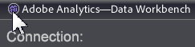

# Aggiornamento Workbench dati 6.51{#data-workbench-update}

Le note sulla versione di Workbench dati 6.51 includono nuove funzioni, requisiti di aggiornamento, bug corretti e problemi noti.

Per visualizzare le funzioni e le correzioni precedenti per le versioni precedenti, consulta l’archivio [delle note sulla](https://docs.adobe.com/content/help/en/data-workbench/using/release-notes/release-notes.html)versione.

[Nuove funzionalità](../../home/c-release-notes-insight/c-6-51.md#section-e844b52c18484e99bdda5c361402247d)

[Requisiti per l&#39;aggiornamento](../../home/c-release-notes-insight/c-6-51.md#section-e1aa5adcf5f24a3da795574364ea196b)

[Aggiornamenti del sistema](../../home/c-release-notes-insight/c-6-51.md#section-84f8f38e9c424d7788c79146fce5a6fe)

[Bug fissi](../../home/c-release-notes-insight/c-6-51.md#section-3c47f9177e9d40d8938a5710399dc88f)

[Problemi noti](../../home/c-release-notes-insight/c-6-51.md#section-49ab5451d0c74f36a69ca12621251674)

## Nuove funzionalità {#section-e844b52c18484e99bdda5c361402247d}

Workbench dati 6.51 include le seguenti nuove funzioni:

<table id="table_9305F30AEF5D49B2B052D1E7C9570D2C"> 
 <thead> 
  <tr> 
   <th colname="col1" class="entry"><b>Caratteristiche di DWB 6.51 </b> </th> 
   <th colname="col2" class="entry"> Descrizione </th> 
  </tr>
 </thead>
 <tbody> 
  <tr> 
   <td colname="col1"><b>Rollout feed</b> dati Avro </td> 
   <td colname="col2">I dati di hit della suite di rapporti verranno inviati in un nuovo formato di origine dati Apache Avro che fornisce funzionalità aggiornate e nuovi tipi di variabili per Adobe Analytics Premium (comprese evar aggiuntive, eventi personalizzati e variabili della soluzione). Consulta Feed di dati avro. </td> 
  </tr> 
  <tr> 
   <td colname="col1"><b>Grafico a barre migliora la visualizzazione</b> con le sfumature di colore sovrapposte </td> 
   <td colname="col2"> 
Per migliorare il contrasto degli elementi nella visualizzazione Grafico, è possibile applicare una sfumatura di colori per evidenziare singole barre mediante l’effetto Cilindro o sfumature di sfondo a sinistra e a destra. 
 
    <ul id="ul_04C17524FE904F1CA6AE9B18F50551A9"> 
     <li id="li_D5F3B808F6BD4413A985EAC72EB89D5D"><b>Nessuna sovrapposizione</b>sfumatura. Selezionate questa opzione per visualizzare le barre senza applicare una sovrapposizione sfumatura. </li> 
     <li id="li_EF26B82D206643419948BD83ACF8A115"><b>Sfondo da sinistra</b>. Selezionare questa opzione per visualizzare la gradazione dei colori tra tutte le barre da sinistra a destra. </li> 
     <li id="li_3D5BE49CEC1748F68944AD2ABEFD7B23"><b>Sfondo da destra</b>. Selezionare questa opzione per visualizzare la gradazione dei colori tra tutte le barre da destra a sinistra. </li> 
     <li id="li_2CA78F34D2F44A29BE8FD53334E0DB24"><b>Cilindro</b>. Selezionate questa opzione per visualizzare la gradazione dei colori dal centro di ciascuna barra al bordo di ciascuna barra. </li> 
    </ul> </td> 
  </tr> 
  <tr> 
   <td colname="col1">Aggiornamenti alla struttura di modifica <b>Insight.cfg</b> </td> 
   <td colname="col2"> 
La vista Nuovo layout è ora l’impostazione predefinita per <a href="https://docs.adobe.com/content/help/en/data-workbench/using/client/c-insght-config-param.html" format="https" scope="external"> modificare il file</a>di configurazione Insight.cfg. 
 
Inoltre, 
     <ul id="ul_9484D81C1F5A48CCBFC77204B60E3650"> 
      <li id="li_574CA325411C4482B759E60F453C15BC">Nella struttura di configurazione è disponibile una funzione <b>Annulla</b> (Ctrl+Z) per tutti i valori di livello superiore, tranne quelli richiesti. </li> 
      <li id="li_91B8F8F12FA847FDACBB9690B9F97793">Quando si rimuovono gli elementi ora viene visualizzata una finestra di dialogo per confermare le azioni da eseguire per evitare modifiche errate. </li> 
     </ul> 
 </td> 
  </tr> 
  <tr> 
   <td colname="col1"> Fare doppio clic per chiudere la workstation </td> 
   <td colname="col2">Chiudi rapidamente la workstation (applicazione client) facendo doppio clic sull'angolo superiore sinistro della barra del titolo. 
 
 </td> 
  </tr> 
  <tr> 
   <td colname="col1"> Miglioramenti decoder XML </td> 
   <td colname="col2">You now have the ability to use <i>#value</i> tag in XML Paths to pull the value of an XML element. </td> 
  </tr> 
 </tbody> 
</table>

## Requisiti per l&#39;aggiornamento {#section-e1aa5adcf5f24a3da795574364ea196b}

**Requisiti per l&#39;aggiornamento della workstation (client):**

Per aggiornare la workstation client per la versione 6.51 dalla versione 6.50, è necessario eseguire la procedura guidata di installazione Workstation per installare i file eseguibili e di supporto della workstation (utilizzando la modalità** Aggiornamento o riparazione**) oppure copiare o modificare i file manualmente sul server. Solo per questo aggiornamento, la funzione di aggiornamento automatico presente nella workstation dal profilo *Software e Docs* è disattivata (anche se [!DNL Update software = true] è impostata nel [!DNL Insight.cfg] file sul server).

**Requisiti per l&#39;aggiornamento del server:**

Aggiorna al **[!DNL Adobe SC meta.cfg]** file:

* Il `server\Profiles\Adobe SC\Context\meta.cfg` file è stato rinominato in `server\Profiles\Adobe SC\Context\]Adobe SC meta.cfg`.

* File `Base\Context\meta.cfg` aggiornato.

Sostituite la build del server con i file aggiornati.

## Aggiornamenti del sistema {#section-84f8f38e9c424d7788c79146fce5a6fe}

Queste funzioni sono state rinominate, eliminate oppure i file oppure le cartelle di installazione sono stati ristrutturati in questa versione:

* **Modifica** connettività SSL. La generazione del certificato per l&#39;aggiornamento della lunghezza della chiave è stata modificata a 2048 bit e utilizza SHA256. In questo modo, i cifratori RC4 vengono eliminati utilizzando gli algoritmi di cifratura moderni.
* File modificati in sola lettura.

   * base\context\serverdetails\detailed status.vw
   * base\menu\admin\detailed status for master.vw
   * base\menu\admin\detailed status for query.vw
   * base\workspaces\admin\dataset and profile\detailed status.vw

* **Segnalibri alfabetizzati**. Fare clic con il pulsante destro del mouse nel pannello Segnalibri e selezionare **Alfabeto**. I segnalibri verranno allineati in base ai caratteri alfabetici, senza distinzione tra maiuscole e minuscole per ciascuna lingua.

## Bug fissi {#section-3c47f9177e9d40d8938a5710399dc88f}

Di seguito sono riportate importanti correzioni apportate in Workbench dati 6.51 (dal rilascio di Workbench dati 6.5).

* Precedentemente, i coefficienti di attribuzione **** algoritmica visualizzati come tutti gli zeri quando si utilizza SGD per la convergenza. Questo problema è stato adesso risolto.

## Problemi noti {#section-49ab5451d0c74f36a69ca12621251674}

* Se si esporta una tabella di associazione da una visualizzazione [Associated Chord](/help/home/c-get-started/c-analysis-vis/associations-chord.md) che contiene *almeno una metrica* , vengono creati elementi duplicati nelle righe/colonne della tabella di associazione. Per evitare elementi duplicati, create una nuova tabella di associazione e aggiungete gli elementi desiderati, anziché esportare gli elementi da un accordo di associazione.

* Se create un decodificatore Avro, il pulsante campo predefinito non funziona. Consulta il tuo account manager per ottenere la configurazione appropriata per la tua implementazione.
* L&#39;aggiornamento della workstation (client) da DWB 6.50 deve essere eseguito manualmente tramite la Configurazione guidata client in modalità di aggiornamento. Inoltre, l&#39;aggiornamento automatico non si verifica (vedere Requisiti per l&#39;aggiornamento per il client).
* L&#39;utilizzo dei pacchetti di installazione cinesi e giapponesi per Adobe SC AVRO come supporto autonomo potrebbe causare un errore `Undefined Metric: "$Default Metric$"`. Nessun mapping attualmente definito per `$Default Metric$`. Tuttavia, se utilizzate il pacchetto AVRO di Adobe SC insieme ad altri pacchetti, come il pacchetto Attribution-Premium, l&#39;errore non si verificherà.
