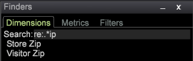

# Finder{#finders}

Utilizza i pannelli Finder nella Data Workbench per selezionare metriche, dimensioni e filtri. Questi pannelli forniscono supporto per la ricerca, opzioni di ordinamento e funzionalità di trascinamento e rilascio.

Un pannello Finder può essere aperto nella barra laterale sinistra o all’interno di un’area di lavoro.

<table id="table_3E43DBA0646842898F14F31374F9E39C"> 
 <thead> 
  <tr> 
   <th colname="col1" class="entry"> Finder Dimension </th> 
   <th colname="col2" class="entry"> Finder metriche </th> 
   <th colname="col3" class="entry"> Finder filtri </th> 
  </tr>
 </thead>
 <tbody> 
  <tr> 
   <td colname="col1"> 
Un elenco di tutte le dimensioni nel modello di query. 
 </td> 
   <td colname="col2"> 
Un elenco di tutte le metriche nel modello di query. 
 </td> 
   <td colname="col3"> 
Elenco di tutti i filtri creati per la tua organizzazione. 
 </td> 
  </tr> 
 </tbody> 
</table>

**Per aprire un Finder:**

* Fai clic con il pulsante destro del mouse in un’area di lavoro e seleziona **[!UICONTROL Tools]** > **[!UICONTROL Finder]**.

   Il riquadro Finder con schede per Metriche, Dimension e Filtri si aprirà nell’area di lavoro.

* Fai clic con il pulsante destro del mouse nella barra laterale sinistra e seleziona **[!UICONTROL Add]** > **[!UICONTROL Finder]**.

   Il riquadro Finder si apre nel pannello a sinistra.

Il **Finder** include le seguenti funzionalità:

<table id="table_072047E919204577AE85789BAE0F4EE8"> 
 <thead> 
  <tr> 
   <th colname="col1" class="entry"> Funzioni del Finder </th> 
   <th colname="col2" class="entry"> Dettagli </th> 
  </tr>
 </thead>
 <tbody> 
  <tr> 
   <td colname="col1"><b>Trascinamento della selezione</b> </td> 
   <td colname="col2"> 
 Puoi trascinare dimensioni o metriche dal pannello a una visualizzazione nell’area di lavoro per modificarle o aggiungerne di nuove. 
 
    <ol id="ol_612DC76EC04C4FCE938B20B388C43CE8"> 
     <li id="li_7F73B781141E4B8CAE9800F580F62E44">Tieni premuto i tasti  &lt;Ctrl&gt; e  &lt;Alt&gt; e seleziona la dimensione o la metrica dal pannello del Finder. </li> 
     <li id="li_631D57976F71415AA61F33EBBFDD128A">Trascina una nuova dimensione dal riquadro e rilasciala nella visualizzazione per modificare o aggiungere dimensioni. </li> 
     <li id="li_5329FB82225F46EBBE3A996A641058DE">Per aggiungere metriche, trascina una nuova metrica dal riquadro e rilasciala sull’intestazione della metrica della visualizzazione selezionata. </li> 
    </ol> 
Questo funziona per tutte le visualizzazioni rilevanti, compresi tabelle, cluster di visitatori, matrice di correlazione, grafici a dispersione e grafico a barre 2D (a seconda dell’asse). 
 </td> 
  </tr> 
  <tr> 
   <td colname="col1"><b>Ricerca</b> </td> 
   <td colname="col2">Una casella  Search nei pannelli del Finder consente di filtrare i nomi per Dimension, metriche e filtri. 
    <ul id="ul_0F6F377E9906472E99008EBE7483F689"> 
     <li id="li_75857895EDB045C8B2960393854B257D"> 
Corrispondenza pattern (ricerca glob semplice). Inizia a digitare il nome di un’entità dimensione, metrica o filtro obbligatoria nel campo Ricerca e solo le stringhe corrispondenti contenute in un punto qualsiasi del nome verranno filtrate e visualizzate nel riquadro Finder. 
 
Ad esempio, immetti: 
 <code><b>Search:</b>click</code> 
È possibile ottenere i seguenti risultati nel Finder dei Dimension: 
 
 
 
La corrispondenza dei pattern standard consente di utilizzare i caratteri jolly, ad esempio . (punto), "?" e "*" (stella). 
 </li> 
     <li id="li_044F9EC1399B44CD81E1852F85137704"> 
Espressioni regolari. Sono supportate anche espressioni regolari più complesse per l’aggiunta di funzionalità di ricerca. Aggiungi il prefisso "re:" prima del termine di ricerca (senza spazi) da interpretare come espressione regolare. 
 
Ad esempio, immetti: 
 <code><b>Search:</b>re.*ip</code> 
È possibile ottenere i seguenti risultati nel Finder dei Dimension: 
 
 
 </li> 
    </ul> 
Per informazioni sulla ricerca approfondita, consulta <a href="https://experienceleague.adobe.com/docs/data-workbench/using/dataset/c-reg-exp.html" format="http" scope="external"> espressioni regolari</a>. 
 </td> 
  </tr> 
  <tr> 
   <td colname="col1"><b>Tipo di Dimension</b> </td> 
   <td colname="col2">Nella scheda Dimension, puoi fare clic con il pulsante destro del mouse sull’intestazione della scheda per ordinare in base al tipo di dimensione. 
 
     <ul id="ul_D36B8474730F4859BC7AA015CC1B8EF0"> 
      <li id="li_4AE1D5699D0E45AF880A134F886B8B19">Attributi: Dimension basati sulle caratteristiche del visitatore, dei prodotti, dell’area geografica, del tempo, del video e di altri attributi. </li> 
      <li id="li_0B2A08F8CBE94356AC506F95DC268C47">Cluster: Dimension generati nel generatore di cluster. </li> 
      <li id="li_4BC3396A680B49A4B6BDAAD066826864">Punteggi: Dimension generati nel punteggio di propensione. </li> 
     </ul> 
 </td> 
  </tr> 
  <tr> 
   <td colname="col1"><b>Etichetta</b> </td> 
   <td colname="col2">In ogni scheda, puoi fare clic con il pulsante destro del mouse e selezionare  Etichetta per rinominare il riquadro Finder. 
 
 
Le etichette Dimension, metriche e filtri predefinite possono essere modificate in un nome di scheda che soddisfi le convenzioni della tua organizzazione. 
 </td> 
  </tr> 
  <tr> 
   <td colname="col1"><b>Aggiungi elemento</b> </td> 
   <td colname="col2">In ciascuna scheda, puoi fare clic con il pulsante destro del mouse e selezionare  Aggiungi elemento per aprire una tabella e aggiungere manualmente Dimension, metriche e filtri. </td> 
  </tr> 
  <tr> 
   <td colname="col1"><b>Barra dei Finder</b> </td> 
   <td colname="col2">Fai clic con il pulsante destro del mouse sulla barra  Finder nella barra laterale sinistra per aprire un menu per ulteriori funzioni. 
 
 </td> 
  </tr> 
  <tr> 
   <td colname="col1"><b>Close</b> </td> 
   <td colname="col2">Fare clic con il pulsante destro del mouse sulla barra  Finder e selezionare  Chiudi per chiudere un riquadro Finder. </td> 
  </tr> 
  <tr> 
   <td colname="col1"><b>Salva</b> </td> 
   <td colname="col2">Salva l'elenco localmente facendo clic con il pulsante destro del mouse sulla barra dell'intestazione e selezionando l'opzione  Save (Salva). </td> 
  </tr> 
  <tr> 
   <td colname="col1"><b>Esporta</b> </td> 
   <td colname="col2">Per esportare un elenco di dimensioni, metriche o filtri selezionati dal pannello del Finder, fai clic con il pulsante destro del mouse nella barra dei Finder e seleziona  Esporta dal menu. 
 Aggiungi un nome ed esporta in Microsoft Excel. 
 </td> 
  </tr> 
  <tr> 
   <td colname="col1"><b>Copia</b> </td> 
   <td colname="col2"> Copia un elenco di Dimension, metriche o filtri. È possibile copiare come file o come immagine in Sfondo scuro, Sfondo chiaro o Monocromatico. </td> 
  </tr> 
  <tr> 
   <td colname="col1"><b>Riduci a icona</b> </td> 
   <td colname="col2"> Riduci a icona il riquadro Finder. Viene visualizzata solo la barra dei Finder. </td> 
  </tr> 
  <tr> 
   <td colname="col1"><b>Senza confini</b> </td> 
   <td colname="col2"> Visualizza un riquadro senza linee dei bordi per i Finder nell’area di lavoro (ma non nella barra laterale sinistra). </td> 
  </tr> 
 </tbody> 
</table>

