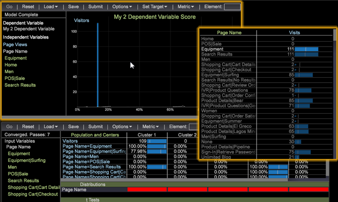

# Note sulla versione di Data Workbench 6.0

Nuove funzioni introdotte in Data Workbench 6.0.4, incluse correzioni di bug e problemi noti.

## Nuove funzionalità {#section-1225066ea8f44cf68e42e019d0bca816}

Data Workbench (Insight 6.0) include queste nuove funzioni e visualizzazioni per nuove funzionalità di reporting e strumenti di analisi predittiva.

| Funzioni Data Workbench | Descrizione |
|---|---|
| [Visualizzazione funnel](../../../home/c-get-started/c-analysis-vis/c-funnel-visualization/c-funnel-visualization.md#concept-79a0854325324bb9a60906cf79ef66da) | La visualizzazione funnel consente di definire il flusso sequenziale del processo dei clienti e fornisce visibilità sull’abbandono dei visitatori in ogni fase del processo. |
| [Clustering visitatore](../../../home/c-get-started/c-analysis-vis/c-visitor-cluster/c-visitor-cluster.md#concept-1c2406ef7b284a56a02daa38eaa2e73d) | Il clustering consente di sfruttare le caratteristiche dei clienti per categorizzare dinamicamente i visitatori e generare set di cluster in base a input di dati selezionati per l’analisi e il targeting dei clienti. |
| [Analisi di correlazione](../../../home/c-get-started/c-analysis-vis/c-correlation-analysis/c-correlation-analysis.md#concept-a7c8766b40be43aaa4084612689b630c) | L’analisi della correlazione ti consente di identificare rapidamente le relazioni rilevanti tra i dati per estendere e migliorare la tua analisi. |
| [Distribuzione aggiornata di DeviceAtlas](../../../home/c-inst-svr/c-upgrd-uninst-sftwr/c-upgrd-sftwr/c-6-0-to-6-1-upgrade/c-deviceatlas-update.md#concept-28b7bd5c0d854e73834261c431bed1e0) | Il file JSON DeviceAtlas verrà ora distribuito in un file .bundle (a rinominato .tar.gz) insieme a DeviceAtlas.dll e DeviceAtlas64.dll. |

## Requisiti di aggiornamento client {#section-f316103b48374b6eac77e8feb5c47ecf}

Completa queste attività di aggiornamento per le funzionalità client di Data Workbench (Insight 6.0):

**Aggiornamento del file .zbin per il client**

Data Workbench ora supporta un IME (Input Method Editor) come processo di immissione di testo secondario che consente di immettere caratteri internazionali dalla tastiera utilizzando una casella di testo mobile. Data Workbench supporterà l’inglese per impostazione predefinita, ma consente anche di caricare altri file per supportare le lingue internazionali, ad esempio una tastiera cinese virtuale (Pinyin IME).

L&#39;applicazione client richiede un nuovo file dizionario (un file .zbin) prima di eseguire l&#39;aggiornamento alla versione 6.0. È possibile ottenere il file .zbin necessario dal profilo Software e Documenti (Softdocs).

Prerequisiti:

* Prima di eseguire l’aggiornamento al client Insight 6.0 e a Report Server 6.0, l’amministratore di Insight deve prima eseguire l’aggiornamento a Insight Server 6.0.
* L’amministratore di Insight dovrà scegliere un file zbin basato sulla lingua (en-us.zbin, zh-cn.zbin), copiare il file della lingua, rinominarlo in insight.zbin e inserire il file rinominato nella directory principale del server di rapporto in cui si trova l’eseguibile. Quindi riavvia il server di rapporto di Insight.

Per ulteriori informazioni sull&#39;aggiornamento lato server, consulta [Requisiti per l&#39;aggiornamento del server](../../../home/c-release-notes-insight/release-notes.md) .

**Per aggiornare il file zbin per il client (dalla versione 5.x alla versione 6.0)**

1. Per assicurarti che il client non venga aggiornato da Insight Server durante questo aggiornamento, imposta l’argomento Insight.cfg su false.

   ```
   Update Software = bool: false
   ```

1. Riavvia il client Insight.
1. Passa al profilo Software e Documenti (profilo SoftDocs) e scarica il file **[!UICONTROL Insight.zbin]** richiesto: [!DNL Software\Insight Client\v6.00\Insight_6.00.zip]

1. Copiare il file Insight.zbin nella stessa cartella del file Insight.exe.
1. Per fare in modo che il client Insight venga aggiornato da Insight Server, modifica l’argomento del file Insight.cfg in true:

   ```
   Update Software = bool: true
   ```

1. Riavvia il client.

   Il client si sincronizzerà con il server e verrà visualizzato un messaggio che indica che il client sta eseguendo il download. Al termine del download, riceverai un messaggio per chiedere se desideri riavviare il client Insight.
1. Fare clic su **OK** per riavviare il client.

   Il client verrà avviato e aggiornato alla versione 6.0.

1. Riavvia il client per rendere effettiva la sincronizzazione del client Insight.zbin.

   Se si riceve il seguente messaggio, significa che lo zbin non è stato posizionato nella posizione corretta della cartella accanto al file Insight.exe.

   ```
   Insight Terminated: The backup dictionary file insight.zbin 
   is missing.
   ```

   Per risolvere il problema, eliminare Insight.exe e rinominare la versione più recente di Insight.exe.old in Insight.exe, quindi riavviare il sistema con il passaggio 1 precedente.

## Requisiti di aggiornamento del server {#section-d6edba8b36234957ba8d06b555667a5a}

Completa queste attività di aggiornamento per le funzionalità del server Insight 6.0:

**Aggiorna tutti i pacchetti** Insight Server 6.0. Insight 6.0 include i pacchetti server che devono essere aggiornati, incluso il nuovo profilo Predictive Analytics.

>[!IMPORTANT]
>
>È consigliabile che gli utenti aggiornino i cluster di server con nuove installazioni di Insight Server 6.0 durante l’aggiornamento.

Si consiglia inoltre al client di aggiornare i cluster di server con una nuova installazione di Insight Server 6.0.

## Aggiorna cluster server

**Prepara il file della lingua (file .zbin).** L’amministratore di Insight seleziona il  `<language>.zbin` file per la lingua richiesta (ad esempio: en-us.zbin , zh-cn.zbin) che si trova nella  `/localization/<language>.zbin` cartella . L’amministratore copia quindi il file della lingua e lo rinomina in &quot;insight.zbin&quot;.

Dopo aver preparato il file della lingua (.zbin), è necessario aggiornare sia Insight Client che Report Server. Insight Client viene aggiornato durante il [processo di aggiornamento del client](../../../home/c-release-notes-insight/release-notes.md), ma nella maggior parte dei casi l’amministratore di Insight aggiorna il server di rapporto.

**Aggiorna il server di rapporto con un file della lingua (file .zbin)**.

Per tutte le lingue, il server di rapporto 6.0 richiede il file &quot;insight.zbin&quot; copiato nella cartella principale del server di rapporto.

Aggiornare i file della lingua del server di rapporto:

1. Aggiungi il file &quot;insight.zbin&quot; rinominato alla directory principale ReportServer.
1. Il file di configurazione del server di rapporto (reportserver.cfg) richiede le impostazioni dei font per le lingue a doppio byte. Ad esempio, il cinese richiede l’aggiunta di font utilizzando SimSun:

   ```
   Report Server.cfg - Add Fonts 
   
   Fonts = vector: 2 items 
     0 = string: SimSun 
     1 = string: Arial
   ```

1. Un parametro per Report Server 6.0 deve essere trasmesso nella riga di comando per la localizzazione, ad esempio:

   ```
   ReportServer.exe -Locale -zh-cn 
   ReportServer.exe -Locale -en-us
   ```

   >[!NOTE]
   >
   >Se non vengono specificate le impostazioni internazionali, il server di rapporto utilizza per impostazione predefinita la lingua selezionata nel file insight.zbin.

   Segui i passaggi per avviare ReportServer come servizio con i parametri internazionali:

   1. Avviare un prompt dei comandi come amministratore.
   1. Passare alla cartella di installazione di ReportServer.
   1. Digita il seguente comando per avviare il servizio:

      * Per inglese: [!DNL ReportServer.exe -RegServer -Locale -en-us]
      * Per cinese: [!DNL ReportServer.exe -RegServer -Locale -zh-cn]

1. Per verificare se ReportServer è in esecuzione con i parametri corretti:

   1. Apri Gestione servizi Windows.
   1. Fare clic con il pulsante destro del mouse su [!DNL Adobe Insight Report Server - Properties].

   Il percorso dell&#39;eseguibile conterrà i parametri seguenti:

   ```
   ReportServer.exe -Service ReportServer -Locale -en-us
   ```

**Modifica il file di configurazione del profilo per Predictive Analytics**. L’amministratore di Insight dovrà modificare il file profile.cfg personalizzato per includere il profilo Predictive Analytics disponibile in Insight.

Esempio della voce profile.cfg:

```
Example ("profile.cfg"): 
Profile = profileInfo:  
  Active = bool: true 
  Directories = vector: 5 items 
    0 = string: Base\\  
    1 = string: Predictive Analytics\\ 
    2 = string: Geography\\ 
    3 = string: Adobe SC\\ 
    4 = string: Custom Profile\\ 
```

**Aggiorna il file** PAServer.cfg . Se desideri inviare i lavori di clustering Predictive Analytics a Insight Server, dovrai configurare il file PAServer.cfg per la gestione degli invii di clustering lato server.

Il profilo personalizzato deve ereditare il PAServer.cfg dal profilo Predictive Analytics (Server\Profiles\Predictive Analytics\Dataset). Configura e salva il file PAServer.cfg per il sito di implementazione.

>[!NOTE]
>
>Una volta configurato e salvato il file PAServer.cfg nel profilo personalizzato, è necessario riavviare Insight Server in tutto il sito.

**Aggiornare il server di rapporto.** Sarà necessario aggiornare i font e i parametri di avvio per Report Server.

Prerequisiti:

* Prima di aggiornare Report Server 6.0, l&#39;amministratore di Insight deve prima eseguire l&#39;aggiornamento a Insight Server 6.0.
* Per tutte le lingue, Report Server 6.0 richiede l&#39;aggiunta di Insight.zbin alla cartella principale del server di rapporto. Assicurati che `base/localization/<language>.zbin` sia copiato e rinominato in &quot;insight.zbin&quot;. Copialo nella directory principale della directory del server di rapporto.

Aggiorna i parametri Font e Start-up:

1. Il server di rapporto richiede l&#39;impostazione del font per il doppio byte per l&#39;output in lingue diverse,

   ad esempio:

   Report Server.cfg - Aggiungi font

   ```
   Fonts = vector: 2 items 
   0 = string: SimSun 
   1 = string: Arial
   ```

1. Il parametro per Report Server 6.0 deve essere passato nella riga di comando a scopo di localizzazione.

   Per avviare il server di rapporto come servizio con i parametri internazionali:

   1. Arrestare il servizio server di rapporto.
   1. Avviare un prompt dei comandi come amministratore.
   1. Passa alla cartella di installazione del server di rapporto.
   1. Digita il seguente comando per avviare il servizio:

      ```
      ReportServer.exe -RegServer -Locale -en-us
      ```

Per verificare se il server di rapporto è in esecuzione con i parametri corretti:

1. Apri Windows Service Manager
1. Fare clic con il pulsante destro del mouse su [!DNL Adobe Insight Report Server - Properties].
1. Il percorso dell&#39;eseguibile conterrà i parametri seguenti:

   ```
   ReportServer.exe -Service ReportServer -Locale -en-us
   ```

**Aggiornare il feed di dati di SiteCatalyst per Insight 6.0**. Il formato del nome del file del feed di dati di SiteCatalyst per Insight 6.0 è stato modificato.

Formato del nome file corrente:

```
 RSID_YYYYMMDD_HH0000.tsv.gz
```

Nuovo formato del nome file:

```
YYYYMMDD-RSID_HH0000.tsv.gz
```

>[!NOTE]
>
>Questa modifica non interessa gli utenti attualmente distribuiti con la versione *wbench/ecom* del feed di dati di SiteCatalyst.

La modifica del formato del nome del file consentirà l’uso completo delle dichiarazioni di inizio e fine di Insight durante l’elaborazione del registro. Questo consente al processo di valutare se il contenuto del file deve essere letto, anziché filtrare tutti i file di origine utilizzando una ricerca riga per riga.

Nella maggior parte dei casi, al momento della ricezione del file è stato implementato un processo di ridenominazione per fornire il pieno utilizzo di questa funzionalità. Questa modifica fornisce la convenzione di denominazione richiesta per impostazione predefinita senza la necessità e il sovraccarico di un processo secondario.

Per utilizzare il nuovo feed di dati di SiteCatalyst:

1. Determinare in che modo il processo ricevente gestirà il nuovo formato del nome del file.

   Gli script standard di ridenominazione/spostamento implementati durante l&#39;implementazione spostano i file con estensione &quot;.gz&quot; ed eseguono una ridenominazione solo se il nome del file corrisponde al formato del nome del file con l&#39;RSID precedente.

   Il nuovo formato del nome file:

   ```
    YYYYMMDD-RSID_HH0000.tsv.gz
   ```

1. Valutare i percorsi di origine del registro definiti per confermare che tutti i file saranno letti.

   Se hai già implementato uno script di ridenominazione, stai già definendo le origini di registro per leggere questo nuovo formato di nome file.

## Correzioni {#section-203f917dd6224114a1f801309c4c2cee}

* A questo punto, la combinazione di tasti per uscire da un’area di lavoro senza salvare le modifiche è stata aggiornata a **[!UICONTROL `<Ctrl>`+`<Backspace>`]**. In precedenza, per annullare le modifiche e chiudere un’area di lavoro, premere `<Ctrl>` + `<Delete>`.

## Note sulla versione di Data Workbench 6.0.4{#data-workbench-release-notes}

Nuove funzioni introdotte in Data Workbench 6.0.4, incluse correzioni di bug e problemi noti.

Per visualizzare le funzioni e le correzioni precedenti in base a ogni versione precedente, consulta la sezione [archivio delle note di rilascio](https://docs.adobe.com/content/help/it-IT/data-workbench/using/release-notes/release-notes.html).

## Nuove funzionalità {#section-2-1225066ea8f44cf68e42e019d0bca816}

Data Workbench 6.0.4 include queste nuove funzioni e visualizzazioni per funzionalità di reporting e strumenti di analisi predittiva aggiunti.

**Visualizzazione Punteggio tendenza**. Data Workbench calcola i punteggi per ogni visitatore come probabilità stimata che possa verificarsi un evento specifico. La visualizzazione Punteggio visitatori consente di creare una dimensione punteggio che fornisce una probabilità di uno specifico evento per ogni visitatore di interesse in base alle variabili di input.



Per ulteriori informazioni su questa funzione, consulta [Punteggio tendenza](../../../home/c-get-started/c-analysis-vis/c-visitor-propensity/c-visitor-propensity.md#concept-2958f4640dd44b9d86ad51c4f6165f40) .

## Requisiti di aggiornamento {#section-08bd6fe3da8740fcb19688e8cac6f223}

**È necessario definire** l’ID della sorgente del registro. A partire dalla versione 6.04, se l’ID sorgente di registro non è definito, viene visualizzato il seguente errore:

```
Missing Log Souce ID in log processing.cfg. Log Source ID must be  
defined for all log sources.
```

La registrazione di righe per origine registro è stata aggiunta in Data Workbench 6.0 e può essere definita nel profilo personalizzato Log Processing.cfg aggiungendo un ID sorgente registro denominato in modo univoco. Se disponi di un ID origine registro vuoto, potresti vedere problemi di elaborazione del registro come la lettura incompleta dei dati dell’origine del registro e altre discrepanze.

```
Log Processing.cfg 
Log Sources = vector: 2 items 
  0 = VisualSensor: 
    Compressed = bool: false 
    Log Paths = vector: 1 items 
      0 = Path: \some path\ 
    Log Server = serverInfo:  
      Address = string:  
      Name = string:  
      Port = int: 80 
      Proxy Address = string:  
      Proxy Password = string:  
      Proxy Port = int: 8080 
      Proxy User Name = string:  
      SSL Client Certificate = string: Certificates\\server_cert.pem 
      SSL Server Common Name = string:  
      Use SSL = bool: false 
     
Log Source ID = string: <Name your ID Here>
    Name = string:  
    Recursive = bool: false
```

**Possibilità di delegare le risorse FSU**

In [!DNL Profiles/`<profilename>`/dataset/Cluster.cfg] è ora possibile specificare unità file server (FSU) separate per i server di elenco normalizzato e sorgente. Questi servizi non sono più legati alla FSU principale.

>[!NOTE]
>
>Se il server di elenco non è specificato, il server di elenco erediterà le impostazioni di configurazione del server di normalizzazione.

Esempio nel file [!DNL cluster.cfg] .

```
Cluster = ClusterConfig: 
  Normalize Server = serverInfo: 
    Address = string: normalizeserver.domain.com 
    Port = int: 80 
    Use SSL = bool: false 
  List Server = serverInfo: 
    Address = string: sourcelistserver.domain.com 
    Port = int: 80 
    Use SSL = bool: false
```

## Bug fissi {#section-3b4b85a35f534288adf8a5246ef028cc}

* In Data Workbench 6.0, la matrice di correlazione e il Generatore di cluster non supportano Compute in background. Questo problema è stato risolto nella versione 6.0.4 di .
* Precedentemente, se si selezionava un passaggio nell’funnel e si rimuoveva un passaggio, si poteva verificare una violazione dell’accesso. Questo problema è stato risolto.
* È stata corretta una potenziale condizione di blocco in Segment Export (Esportazione segmento) che poteva causare problemi in condizioni di carico elevato.
