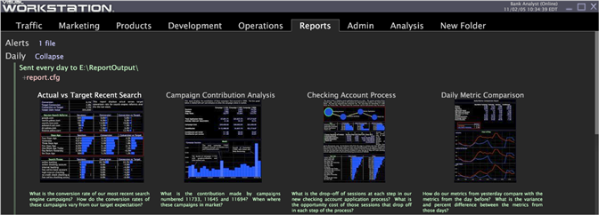

# Verifica dello stato del rapporto{#reviewing-report-status}

Informazioni sullo stato del server di rapporto e del set di rapporti.

* [Stato del server di rapporto](../../../home/c-rpt-oview/c-admin-rpt/c-rev-rpt-st.md#section-1a84f22439ee4a4ba2b3434e51e82ce0)
* [Stato del set di rapporti](../../../home/c-rpt-oview/c-admin-rpt/c-rev-rpt-st.md#section-8569b94266b74a1f85d2a85106a2aaef)

## Stato del server di rapporto {#section-1a84f22439ee4a4ba2b3434e51e82ce0}

**Frequenza consigliata:** solo se necessario

[!DNL Report] invia al server di Data Workbench informazioni sullo stato del  [!DNL Report] server ogni due minuti. Queste informazioni sono visibili sotto il nodo [!DNL Report Server Status] nell&#39;interfaccia [!DNL Detailed Status].

**Apertura della  [!DNL Detailed Status] visualizzazione**

1. All’interno di Data Workbench, fai clic con il pulsante destro del mouse in un’area di lavoro e fai clic su **[!UICONTROL Admin]** > **[!UICONTROL Servers]**.

1. Nell’interfaccia [!DNL Servers] fare clic con il pulsante destro del mouse sull’icona del server di Data Workbench a cui il computer si connette e fare clic su **[!UICONTROL Detailed Status.]**[!DNL Report]

1. Fai clic su **[!UICONTROL Report Server Status]**.

Se al server di Data Workbench sono connessi più [!DNL Report], viene visualizzata una voce per ogni elemento [!DNL Report Server] nel vettore Stato. È possibile ignorare l’intervallo di due minuti specificando un valore nel parametro Intervallo di stato (secondi) nel nodo [!DNL Reporting] del file [!DNL ReportServer.cfg].

Per informazioni sul file [!DNL ReportServer.cfg], consulta [Configurare il set di rapporti](../../../home/c-rpt-oview/c-work-rpt-sets/t-create-rpt-set/t-config-rpt-set/t-config-rpt-set.md#task-cfb2fd0c28bc48c2acdd582fe0d670d0). Per informazioni sulla configurazione di [!DNL Report], vedere [Installazione di report](../../../home/c-rpt-oview/c-inst-rpt/c-inst-rpt.md#concept-3b8696a5b7f04ebfaafec7ff55890d91).

Per ulteriori informazioni su [!DNL Detailed Status], vedere il capitolo relativo alle interfacce amministrative della *Guida utente alla Data Workbench*.

## Stato del set di rapporti {#section-8569b94266b74a1f85d2a85106a2aaef}

**Frequenza consigliata:** solo se necessario

[!DNL Report] trasmette le informazioni sullo stato di ciascun set di rapporti al server Data Workbench. Le informazioni di base, ad esempio quando un set di rapporti viene generato e dove viene distribuito, vengono visualizzate in workbench dati sopra il set di rapporti in testo verde. Durante l&#39;esecuzione dei rapporti, [!DNL Report] Il server invia un messaggio ogni due minuti indicando la percentuale di completamento delle query correnti. È possibile ignorare questo intervallo di due minuti specificando un valore nel parametro Intervallo messaggi di completamento (secondi) nel nodo [!DNL Reporting] del file [!DNL ReportServer.cfg].

>[!NOTE]
>
>Se si è verificato un errore durante l&#39;esecuzione di un report, l&#39;errore è indicato in rosso sotto la miniatura del report. Per visualizzare il messaggio di errore completo, fai clic con il pulsante destro del mouse sull’area di lavoro.
