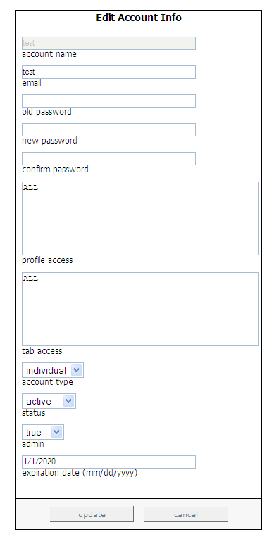

# Modifica di utenti esistenti{#editing-existing-users}

Passaggi per modificare gli account utente esistenti.

1. In [!DNL Report Portal], fai clic sulla scheda **[!UICONTROL Admin]** . Viene visualizzata la pagina [!DNL Admin] .

   

1. Fare clic sulla lettera che rappresenta la prima lettera del nome dell&#39;account che si desidera modificare. Ad esempio, se desideri modificare l’account &quot;Marketing&quot;, fai clic sulla lettera &quot;M&quot;.

   Viene visualizzato un elenco dei nomi di account che iniziano con tale lettera.

1. Seleziona il nome dell&#39;account da modificare, quindi fai clic sul pulsante **[!UICONTROL select]** . Viene visualizzata la pagina [!DNL Edit Account Info] .

   

1. Modificare solo i campi di questa pagina che devono essere aggiornati. La tabella seguente fornisce una descrizione di ciascuno di questi campi:

   | In questo campo . . . | Specifica . . . |
   |---|---|
   | e-mail | Indirizzo e-mail dell’utente. |
   | vecchia password | La password corrente, necessaria per procedere durante la modifica di un account amministratore o durante il ripristino della password per un account non amministratore. |
   | nuova password | La nuova password che l&#39;utente deve fornire al momento dell&#39;accesso a [!DNL Report Portal]. |
   | conferma password | La nuova password che l&#39;utente deve fornire al momento dell&#39;accesso a [!DNL Report Portal]. |
   | accesso profilo | I profili a cui questo utente può accedere (ad esempio, ProductSales). Per consentire l’accesso a più profili, separa i nomi con virgole. Se l’utente può accedere a tutti i profili associati a [!DNL Report Portal], digita &quot;ALL&quot;. |
   | accesso a schede | Schede a cui l’utente può accedere (ad esempio, [!DNL Admin]). Per consentire l’accesso a più schede, separa i nomi con virgole. Se l&#39;utente può accedere a tutte le schede del [!DNL Report Portal], digitare &quot;ALL&quot;. Questo campo, insieme al campo del tipo di account, è molto utile per definire i diritti di accesso al gruppo. |
   | tipo di account | Che si tratti di un singolo o di un gruppo. I singoli account consentono agli utenti di reimpostare le proprie password, mentre i gruppi no. Un amministratore è l’unica persona in grado di reimpostare la password per un account di gruppo. |
   | status | Se l&#39;account è attivo o inattivo. Il valore predefinito è attivo. Per disattivare un account utente, selezionare **[!UICONTROL inactive]**. |
   | admin | Consente di creare, aggiornare ed eliminare gli account utente e di modificare le note associate a ciascun rapporto. L&#39;impostazione predefinita è false. Per renderlo un utente amministratore, seleziona true. |
   | data di scadenza | La data, in formato MM/GG/AAAA, fino alla quale l’utente può utilizzare [!DNL Report Portal]. |

1. Fai clic su **[!UICONTROL update]**.
