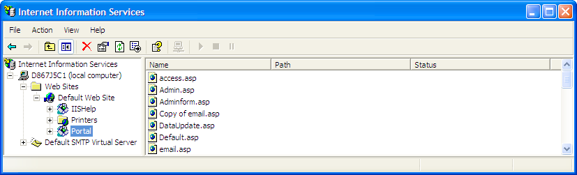

# Mappatura del Report Portal (Portale dei rapporti) su una directory virtuale (IIS 5.0){#mapping-report-portal-to-a-virtual-directory-iis}

Passaggi per mappare il Report Portal (Portale dei rapporti) in una directory virtuale (IIS 5.0).

1. Sul computer in cui è installato [!DNL Report Portal], avviare IIS Manager utilizzando **[!UICONTROL Start]** > **[!UICONTROL Control Panel]** > **[!UICONTROL Administrative Tools]** > **[!UICONTROL Internet Information Services]** o **[!UICONTROL Start]** > **[!UICONTROL Administrative Tools]** > **[!UICONTROL Internet Information Services]**.

1. Seleziona **[!UICONTROL Local Machine]** > **[!UICONTROL Web Sites]** > **[!UICONTROL Default Web Site]**.

1. Fai clic con il pulsante destro del mouse su **[!UICONTROL Default Web Site]** e seleziona **[!UICONTROL New]** > **[!UICONTROL Virtual Directory]**.

1. Quando si apre il [!DNL Virtual Directory Wizard], fai clic su **[!UICONTROL Next]**.

1. Completa i seguenti passaggi per definire la directory virtuale principale per [!DNL Report Portal]:

   1. Quando viene richiesto un alias, digitare il nome del [!DNL Report Portal], quindi fare clic su **[!UICONTROL Next]**. Ad esempio, se desideri utilizzare &quot;Portal&quot; come nome del [!DNL Report Portal], assegna l’alias &quot;Portal&quot; alla directory virtuale. Al termine fai clic su **[!UICONTROL Next]** (Continua).

   1. Quando viene richiesto il percorso fisico, cerca e seleziona la directory *&lt;**[!UICONTROL PortalName]**>* **[!UICONTROL \PortalASP]**, quindi fai clic su **[!UICONTROL Next]**.

      Esempio: [!DNL C:\Inetpub\wwwroot\Portal\PortalASP]

   1. Quando viene richiesta l’autorizzazione, verifica che le seguenti opzioni siano abilitate:

      * **[!UICONTROL Read]**
      * **[!UICONTROL Run scripts (such as ASP)]**
   1. Fai clic su **[!UICONTROL Next]**, quindi su **[!UICONTROL Finish]**. La directory virtuale creata viene visualizzata sotto il sito Web predefinito, come illustrato nell&#39;esempio seguente.

   

1. Fare clic con il pulsante destro del mouse sulla directory virtuale appena creata e selezionare **[!UICONTROL New]** > **[!UICONTROL Virtual Directory]**.

1. Utilizza la procedura guidata [!DNL Virtual Directory] per creare un alias per ciascuna delle seguenti directory fisiche. In questo modo si crea una directory virtuale con nome appropriato per ciascuna di queste risorse fisiche.

<table id="table_B2E04423C20F40CAA8EDA3FCBA210AA2"> 
 <thead> 
  <tr> 
   <th colname="col1" class="entry"> Crea questo alias . . . </th> 
   <th colname="col2" class="entry"> Per questa risorsa fisica . . . </th> 
  </tr>
 </thead>
 <tbody> 
  <tr> 
   <td colname="col1"> Core </td> 
   <td colname="col2"> 
\<i>NomePortale</i>\PortalFiles\Core 
 
Esempio:  C:\Inetpub\wwwroot\Portal\PortalFiles\Core 
 </td> 
  </tr> 
  <tr> 
   <td colname="col1"> CSS </td> 
   <td colname="col2"> 
\<i>NomePortale</i>\PortalFiles\CSS 
 
Esempio:  C:\Inetpub\wwwroot\Portal\PortalFiles\CSS 
 </td> 
  </tr> 
  <tr> 
   <td colname="col1"> HTC </td> 
   <td colname="col2"> 
\<i>NomePortale</i>\PortalFiles\HTC 
 
Esempio:  C:\Inetpub\wwwroot\Portal\PortalFiles\HTC 
 </td> 
  </tr> 
  <tr> 
   <td colname="col1"> Immagini </td> 
   <td colname="col2"> 
\<i>NomePortale</i>\PortalFiles\Images 
 
Esempio:  C:\Inetpub\wwwroot\Portal\PortalFiles\Images 
 </td> 
  </tr> 
  <tr> 
   <td colname="col1"> Uscita </td> 
   <td colname="col2"> 
Posizione fisica della directory in cui  Report Server salva l'output per i set di rapporti. La cartella di output può trovarsi ovunque, può essere denominata qualsiasi cosa e contiene una sottocartella per ogni set di rapporti. 
 
Deve essere la stessa directory specificata nel parametro Output Root nel file  Report.cfg per un set di rapporti. Per ulteriori informazioni, consulta <a href="../../../../home/c-rpt-oview/c-admin-rpt/c-config-rpt-files.md#concept-cf4b95344fcb4c8c877db91e5f1d345d"> Configurazione dei file Report.cfg</a>. 
 
Il percorso predefinito è \<i>NomePortale</i>\PortalFiles\Output. 
 
Esempio:  C:\Inetpub\wwwroot\Portal\PortalFiles\Output 
 
Il file <i>PortalName</i>\PortalFiles\Output directory contains the  profiles.xml che deve essere spostato nella directory di output specificata per questo alias. 
 
È fondamentale che l'attributo  Path sia impostato correttamente. 
 </td> 
  </tr> 
 </tbody> 
</table>

1. Al termine, verifica che IIS visualizzi sei nuove directory virtuali. Assicurati che la struttura della directory abbia una cartella principale (con lo stesso nome del portale) e cinque sottocartelle come mostrato di seguito.

   

1. Al termine, vai su [Modifica il file di configurazione della sessione](../../../../home/c-rpt-oview/c-install-rpt-port/t-edit-sess-config-file.md#task-cf11c3a780bd4936afd3f64a6b30afc7) per continuare il processo di installazione.
