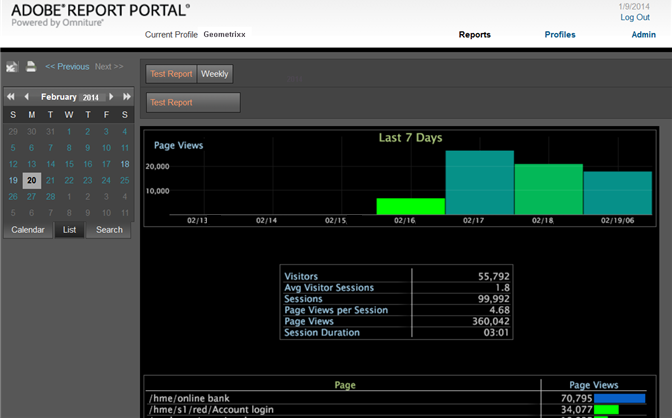

# Utilizzo del Report Portal (Portale dei rapporti){#using-the-report-portal}

Il Report Portal (Portale dei rapporti) consente di visualizzare i report generati da Report Server tramite il browser Web.

[!DNL Report Portal] è un&#39;applicazione basata su Web che viene eseguita su un server Web Microsoft Internet Information Services (IIS).

