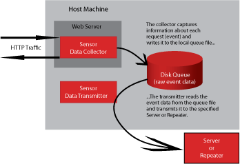

# Componenti di base{#what-are-basic-components}

Il sensore è costituito da tre componenti principali: Agente di raccolta dati, Coda disco e Trasmettitore dati.

## Agente di raccolta dati {#section-f970eaff30364a3c8106d5ec9c1b5caa}

Il raccoglitore di dati (raccoglitore) è un modulo NSAPI, ISAPI, servlet di filtro J2EE o Apache eseguito all’interno del processo del server Web.

Acquisisce i dati dell’evento non elaborati relativi a ogni richiesta HTTP elaborata e depositata dal server Web nella coda del disco. Se si eseguono più istanze di un server Web sullo stesso computer, ogni istanza carica la propria istanza del modulo di raccolta; tuttavia, tutte le istanze del raccoglitore scrivono i dati dell&#39;evento nella stessa coda del disco.

## Coda disco {#section-41aac77ab30e48478d1b31eac288df05}

La coda del disco (coda) è un file di coda con mappatura della memoria FIFO (primo in, primo out) che memorizza in buffer i dati dell&#39;evento non elaborati raccolti da Sensor, fornendo la memorizzazione temporanea per i dati dell&#39;evento raccolti sul server Web in cui è installato.

Per evitare che la coda si espanda senza vincoli (e quindi consumando tutto lo spazio disponibile su disco), la coda viene mantenuta in un file a dimensione fissa, il che significa che contiene solo la quantità di dati dell&#39;evento che gli è stata assegnata la capacità di contenere. La dimensione del file di coda è configurata nel parametro QueueSize del file di configurazione Sensor, txlogd.conf, quando è installato Sensor. Per informazioni sui parametri txlogd.conf, consultate Parametri del file Sensor Txlogd.conf.

Una volta stabilita, la lunghezza fisica del file non aumenta o si riduce. Il raccoglitore semplicemente deposita i nuovi dati dell&#39;evento nella coda e il trasmettitore estrae gli eventi da esso. Se il raccoglitore raggiunge la fine del file, interrompe la scrittura nel file della coda.

Generalmente, il trasmettitore estrae gli eventi dalla coda il più rapidamente possibile quando il collettore li deposita. Tuttavia, se la connessione tra il trasmettitore e Insight Server è lenta o non è disponibile, la coda può riempire con eventi non trasmessi. In questo caso, il raccoglitore interrompe la raccolta dei dati fino a quando il trasmettitore non disegna la coda. Le informazioni sulle richieste che il server Web elabora durante questo periodo vengono perse definitivamente.

**Determinazione delle dimensioni della coda**

Prima di installare Sensor, dovete determinare l&#39;ampiezza della coda. Per evitare la perdita permanente di dati, è importante creare una coda di dimensioni tali da contenere il numero di eventi che potrebbero accumularsi durante l&#39;interruzione più lunga probabile della connessione a Insight Server (ovvero, spazio di archiviazione sufficiente per diversi giorni di attività di picco). La coda deve essere configurata in modo da contenere un numero sufficiente di dati dell&#39;evento in modo che gli amministratori di sistema abbiano tempo per ripristinare l&#39;accessibilità di rete al server Insight di destinazione oppure per ripristinare o sostituire il server Insight senza perdere alcun dato. Se il sensore non è riuscito e non è disponibile un file di coda valido e accessibile per contenere i dati dell&#39;evento, i dati successivi vengono persi.

>[!NOTE]
>
>È importante che gli amministratori di ogni computer su cui viene eseguito Sensor comprendano la natura unica del file di coda locale per assicurarsi che non lo tratti come un normale file di registro che può essere eliminato, archiviato o compresso.

Adobe consiglia di configurare la coda in modo da contenere almeno dieci (10) giorni di picco di dati evento prodotti dal server in cui è installato il sensore. Ovvero, prendete la quantità di dati evento da qualsiasi giorno di picco nell&#39;ultimo anno e moltiplicatelo per dieci.

Questa raccomandazione prevede quanto segue:

* Il team IT della società sta monitorando ogni sensore nel modo descritto in Sensore di amministrazione di questa guida e lo sta facendo almeno una volta al giorno. In caso contrario, tale periodo dovrebbe essere prorogato in modo appropriato.
* Il team IT della società è in grado di ripristinare l’accessibilità della rete o sostituire o riparare i server Insight installati entro 72 ore. In caso contrario, tale periodo dovrebbe essere prorogato in modo appropriato.
* La configurazione del sensore rimane la stessa.
* Nessun evento esterno (ad esempio, una campagna di marketing di grandi dimensioni) causerà un aumento significativo della quantità di dati evento generati dai server Web.

La scelta della dimensione della coda dipende in gran parte dal livello desiderato di monitoraggio del sistema, alla luce delle pratiche e delle politiche aziendali in materia di tempi di risposta e amministrazione del sistema weekend/ferie. Poiché le dimensioni delle code sono migliori, Adobe consiglia alla società di ingrandire il più possibile la coda.

>[!NOTE]
>
>Dimensioni file di coda più grandi non hanno alcun impatto sulle prestazioni.

Per ulteriori raccomandazioni sul ridimensionamento della coda, contattate i servizi di consulenza Adobe.

## Trasmettitore dati {#section-2dc03d37d73b4cc6bdd5af6b346350d4}

Il trasmettitore è un processo indipendente (ad esempio, un demone su un computer basato su UNIX o un servizio su un computer Windows) che viene eseguito sullo stesso computer del server Web.

Il trasmettitore legge i dati dell&#39;evento dalla coda del disco, li comprime e li invia via HTTP/S al server Insight specificato, dove viene elaborato e memorizzato nei file **.vsl** .
