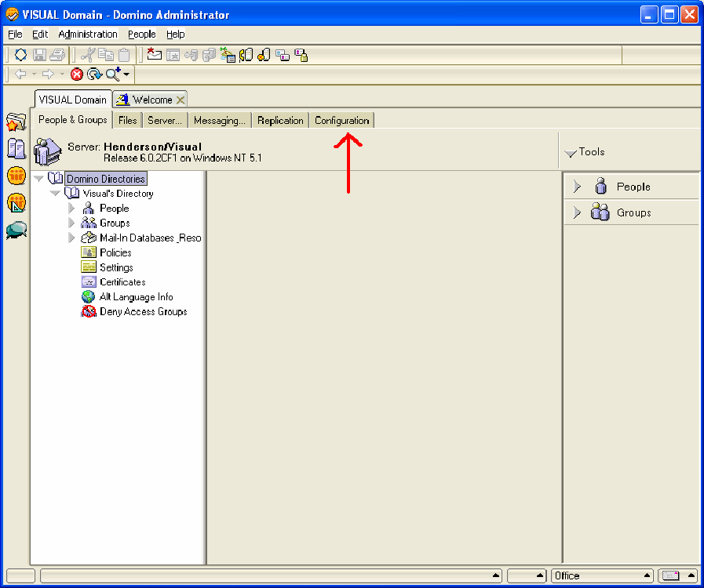

# Lotus Domino Server su Windows Server 2000 o versione successiva{#lotus-domino-server-on-windows-server-or-later}

Istruzioni su come installare e configurare Sensor per Lotus Domino Server 6 per Windows 3.1 o versione successiva in esecuzione in Microsoft Windows Server 2000 o versione successiva.

I file di programma per Sensor vengono assemblati in un file di installazione ottenuto dal sito di download di Adobe. Se non disponete già del file di installazione Sensor per il vostro particolare server Web, scaricatelo (o ottenetelo dal rappresentante Adobe) prima di iniziare le seguenti procedure.

Per installare e configurare Sensor, devi eseguire le seguenti operazioni:

## Installare i file del programma {#section-2f3e85083b4f4aa989a85997330e86ae}

1. Sul computer Lotus Domino, creare una directory per installare i file del programma Sensor. Tenere presente che la coda del disco risiede anche in questa directory, quindi assicurarsi che il dispositivo scelto disponga di spazio sufficiente per contenere una coda delle dimensioni necessarie.

   ```
   C:\VisualSensor
   ```

1. Estrarre il contenuto del file di installazione nella directory Lotus Domino. Durante questo passaggio, Sensor installa i file seguenti:

<table id="table_ABFF5F92271B4F3CB0AC68DAB6A5709F"> 
 <thead> 
  <tr> 
   <th colname="col1" class="entry"> File </th> 
   <th colname="col2" class="entry"> Descrizione </th> 
  </tr> 
 </thead>
 <tbody> 
  <tr> 
   <td colname="col1"> EventMessages.dll </td> 
   <td colname="col2"> Messaggi Visualizzatore eventi </td> 
  </tr> 
  <tr> 
   <td colname="col1"> stchatlog.dll </td> 
   <td colname="col2"> Modulo di raccolta </td> 
  </tr> 
  <tr> 
   <td colname="col1"> <p>TestExperiment.xls </p> </td> 
   <td colname="col2"> <p>Un file foglio di calcolo Excel che gli architetti possono utilizzare per configurare un esperimento controllato </p> <p>Il sensore non utilizza questo file. </p> </td> 
  </tr> 
  <tr> 
   <td colname="col1"> trust_ca_cert.pem </td> 
   <td colname="col2"> Certificato utilizzato per convalidare il certificato digitale presentato da Insight Server durante il processo di connessione </td> 
  </tr> 
  <tr> 
   <td colname="col1"> TXLog.exe </td> 
   <td colname="col2"> Il programma del trasmettitore </td> 
  </tr> 
  <tr> 
   <td colname="col1"> <p>txlogd.conf </p> </td> 
   <td colname="col2"> Il file di configurazione Sensor </td> 
  </tr> 
 </tbody> 
</table>

>[!NOTE]
>
>Il pacchetto di installazione contiene un foglio di calcolo denominato TestExperiment.xls. Questo foglio di calcolo è uno strumento che gli architetti usano per configurare un esperimento controllato. Il sensore stesso non utilizza questo file, quindi non è necessario installare il file sul computer in cui è in esecuzione Sensor (anche se potete scegliere di farlo). Potreste desiderare, invece, copiare il file in una posizione in cui gli architetti possano accedervi o semplicemente estrarre il file dal pacchetto di installazione in base alle esigenze. Per ulteriori informazioni sulla sperimentazione controllata, consulta la Guida agli esperimenti controllati di Insight.

## Configurare il server Lotus Domino {#section-2e2f1875a5304cdfa2cbcd0680683cfd}

Procedura per configurare il server Lotus Domino.

1. Accedete all&#39;amministratore di Lotus Domino e fate clic su **[!UICONTROL Domain]**.

   

1. In Amministrazione Lotus Domino fare clic su **[!UICONTROL Configuration]**.

   

1. Espandete il nodo Server e fate clic su **[!UICONTROL Current Server Document]**.

   

1. Fai clic su **[!UICONTROL Current Server Document]**, quindi su **[!UICONTROL Internet Protocols]**.

   

1. Nella scheda HTTP, nella sezione DSAPI, fare doppio clic dopo la parola [!DNL ndolextn].

   

1. Premere **[!UICONTROL Enter]** e digitare il percorso del [!DNL dominosensor.dll] file.

   

1. Fai clic su **[!UICONTROL Save & Close]** (Fine).

   

## Modificare il file di configurazione Sensor {#section-de0eb4a646394b61abb6cd5a2b706de0}

Il file txlogd.conf contiene i parametri di configurazione per Sensor.

È necessario modificare questo file per specificare, tra le altre cose, le dimensioni e la posizione del file della coda del disco, l&#39;indirizzo del server di Insight e l&#39;ID che verrà allegato ai dati dell&#39;evento prodotti da questo sensore.

Il file di configurazione contiene i parametri obbligatori e i parametri facoltativi.

* **I parametri** richiesti sono impostazioni che dovete specificare quando installate Sensor. Senza queste impostazioni, il sensore non viene eseguito correttamente.
* **I parametri** facoltativi sono impostazioni predefinite per valori predefiniti (che è possibile modificare) o per abilitare funzioni facoltative.

**Per modificare il file di configurazione Sensor**

* Aprite il `<Sensor directory>/txlogd.conf` file in un editor di testo e impostate i parametri richiesti, nonché eventuali parametri opzionali desiderati.
* Salvate e chiudete il file.

## Avviare il trasmettitore e creare la coda del disco {#section-55630de65f264274aefd771da2002852}

Dopo aver configurato il file txlogd.conf, potete avviare il programma di trasmettitore, registrarlo come servizio Windows e creare la coda del disco.

1. Dal menu Start in Windows, selezionate **Accessori** > Prompt dei **comandi**.

1. Nella finestra del prompt dei comandi, andate alla directory in cui avete installato Sensor ed eseguite il seguente comando:

   ```
   txlog /regserver
   ```

   Questo comando avvia il trasmettitore, crea la coda del disco e registra Sensor come servizio Windows.

1. Per confermare che il trasmettitore funziona correttamente, fate clic su **Start > Pannello di controllo > Strumenti di amministrazione > Servizi**.

   >[!NOTE]
   >
   >Questa sequenza di comandi può variare a seconda della versione di Windows in uso.

   1. Nell&#39;elenco dei servizi, individuare la voce per Sensor e confermare che il suo stato è Avviato e il suo tipo di avvio è Automatico.
   1. Chiudere il pannello di controllo Servizi.

1. Per verificare se il trasmettitore ha riscontrato degli errori durante l’avvio, fate clic su Start > Pannello di controllo > Strumenti di amministrazione > Visualizzatore eventi per aprire il visualizzatore eventi.

   >[!NOTE]
   >
   >Questa sequenza di comandi può variare a seconda della versione di Windows in uso.

   1. Nel riquadro a sinistra della finestra Visualizzatore eventi, selezionate il registro Applicazioni.
   1. Nel riquadro a destra, cercate gli eventi con &quot;Adobe&quot; nella colonna Sorgente.
   1. Se si verifica un errore in &quot;Adobe&quot;, fare doppio clic sull&#39;errore per visualizzare la finestra Proprietà evento. Questa finestra fornisce informazioni dettagliate sull&#39;errore.

1. Al termine dell&#39;esame del registro Applicazioni, chiudete il visualizzatore eventi.
1. Verificare che il trasmettitore abbia creato la coda del disco ( [!DNL Diskq2000.log]) nella directory in cui sono stati installati i file del programma Sensor e che sia la dimensione specificata nel [!DNL QueueSize] parametro nel [!DNL txlogd.conf] file.

   Se la coda non è stata creata correttamente:

   1. Esaminate il file txtlogd.conf e verificate che il parametro QueueSize sia impostato correttamente.
   1. Verificare che il dispositivo su cui è installato Sensor disponga di spazio sufficiente per contenere un file delle dimensioni specificate nel parametro QueueSize.
   1. Con il pannello di controllo Servizi in Windows, arrestare il trasmettitore.
   1. Eliminare il file della coda.
   1. Registrare nuovamente il sensore come servizio Windows: dal menu Start in Windows, selezionate Accessori > Prompt dei comandi. Nella finestra del prompt dei comandi, andate alla directory in cui avete installato Sensor ed eseguite il seguente comando:

      ```
      txlog /regserver
      ```

      Il trasmettitore è progettato per funzionare in modo continuo. Se si riavvia il computer, il trasmettitore si riavvia automaticamente. Se è necessario avviare e arrestare manualmente il trasmettitore, è possibile farlo utilizzando il pannello di controllo Servizi in Windows.

