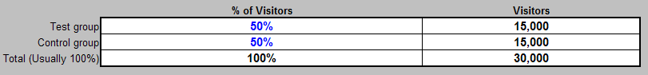

# Foglio di calcolo di progettazione di esperimenti{#experiment-design-spreadsheet}

Questo file funziona non solo come foglio di lavoro ma anche come record delle tue decisioni sull&#39;esperimento.

Se hai bisogno di aiuto nella progettazione dell’esperimento, puoi utilizzare il foglio di calcolo della progettazione dell’esperimento (denominato VS Controlled Experiment Design.xls per impostazione predefinita) fornito dall’Adobe.

Il foglio di calcolo della progettazione dell’esperimento può fornire utili inferenze statistiche solo quando la metrica in questione è definita come percentuale di visitatori che soddisfano alcuni criteri. In altre parole, è utile solo quando si verifica un’ipotesi metrica basata su visitatore.

**Per progettare l&#39;esperimento utilizzando il file di progettazione dell&#39;esperimento**

1. Se disponi dell&#39;accesso dell&#39;amministratore ai server Web o applicazioni, passa alla cartella di installazione [!DNL Sensor] in qualsiasi computer [!DNL Sensor] del cluster Web. Se non disponi dell&#39;accesso di amministratore, contatta il tuo account manager Adobe per richiedere il file.
1. Apri il file VS Controlled Experiment Design.xls . Se lo desideri, puoi rinominare il file.

   Il foglio di calcolo nella pagina seguente è un esempio di come si completa il foglio di calcolo quando si prepara a testare l’ipotesi di esempio utilizzata in questa guida.

   

   

   

1. Immettere testo o valori per tutti i campi in blu in questo file, descritti nella tabella seguente. I campi calcolati sono definiti nella seconda tabella.

<table id="table_C343F7A4BF3D4E0E9A5E9739EC7C2E10"> 
 <thead> 
  <tr> 
   <th colname="col1" class="entry"> In questo campo.. </th> 
   <th colname="col2" class="entry"> Specifica </th> 
  </tr> 
 </thead>
 <tbody> 
  <tr> 
   <td colname="col1"> Titolo esperimento </td> 
   <td colname="col2"> Un nome descrittivo per l'esperimento. </td> 
  </tr> 
  <tr> 
   <td colname="col1"> Descrizione dell’esperimento </td> 
   <td colname="col2"> Una descrizione testuale dell’esperimento. </td> 
  </tr> 
  <tr> 
   <td colname="col1"> In corso di studio della metrica </td> 
   <td colname="col2"> 
Nome della metrica su cui si basa l’esperimento. 
 
Esempio: Conversione visitatori 
 </td> 
  </tr> 
  <tr> 
   <td colname="col1"> Definizione della metrica </td> 
   <td colname="col2"> 
Definizione della metrica su cui si basa l’esperimento. 
 
Formato: Visitatori[X]/Visitatori 
 
Esempio:  Visitatori[URI='conversionpage.asp']/Visitatori
 </td> 
  </tr> 
  <tr> 
   <td colname="col1"> Ora di inizio prevista </td> 
   <td colname="col2"> Data e ora in cui vuoi che inizi l'esperimento. </td> 
  </tr> 
  <tr> 
   <td colname="col1"> Ora di fine prevista </td> 
   <td colname="col2"> Data e ora in cui si desidera terminare l'esperimento. </td> 
  </tr> 
  <tr> 
   <td colname="col1"> Selezioni applicabili </td> 
   <td colname="col2"> (Facoltativo) Il nome della dimensione e il set di elementi o l’intervallo in base ai quali desideri segmentare ulteriormente il set di dati. </td> 
  </tr> 
  <tr> 
   <td colname="col1"> URI di esperimento </td> 
   <td colname="col2"> Gli URI coinvolti nell'ipotesi. Definite gli URI correnti per il gruppo di controllo e gli URI alternativi creati o creati per il gruppo o i gruppi di test. </td> 
  </tr> 
  <tr> 
   <td colname="col1"> Metriche previste per le selezioni delle applicazioni </td> 
   <td colname="col2"> Intestazione dei valori di metrica previsti per il sito web. </td> 
  </tr> 
  <tr> 
   <td colname="col1"> Visitatori medi al giorno </td> 
   <td colname="col2"> Numero medio di visitatori del sito web al giorno. </td> 
  </tr> 
  <tr> 
   <td colname="col1"> Conversione visitatori </td> 
   <td colname="col2"> Il tasso medio di conversione del visitatore per il sito web. </td> 
  </tr> 
  <tr> 
   <td colname="col1"> L’esperimento determinerà se il nome della metrica per i gruppi di test è ... </td> 
   <td colname="col2"> Intestazione per il confronto dei valori delle metriche. </td> 
  </tr> 
  <tr> 
   <td colname="col1"> Maggiore del valore del gruppo di controllo? </td> 
   <td colname="col2"> Imposta questo campo su True se desideri che la metrica del gruppo di test sia aumentata durante l'esperimento. Imposta questo campo su False per ridurre il numero di visitatori necessari per trarre conclusioni. L'Adobe consiglia di impostarlo su True. </td> 
  </tr> 
  <tr> 
   <td colname="col1"> Minore del valore del gruppo di controllo? </td> 
   <td colname="col2"> Imposta questo campo su True se desideri che la metrica del gruppo di test sia diminuita durante l'esperimento. L'Adobe consiglia di impostarlo su True. </td> 
  </tr> 
  <tr> 
   <td colname="col1"> Almeno per (livello di rilevamento) </td> 
   <td colname="col2"> La percentuale in base alla quale si desidera che la metrica per il gruppo di test sia maggiore o minore di quella per il gruppo di controllo. </td> 
  </tr> 
  <tr> 
   <td colname="col1"> Con un livello di affidabilità almeno pari a </td> 
   <td colname="col2"> Livello di affidabilità desiderato per i valori del gruppo di test. Il livello di affidabilità determina il numero di falsi positivi per misurare la probabilità che l’aspettativa dichiarata sia vera. </td> 
  </tr> 
  <tr> 
   <td colname="col1"> e un livello di potenza di </td> 
   <td colname="col2"> Livello di potenza desiderato per i valori del gruppo di prova. Il livello di alimentazione determina il numero di falsi negativi. </td> 
  </tr> 
  <tr> 
   <td colname="col1"> % dei visitatori </td> 
   <td colname="col2"> Intestazione per i valori della percentuale di visitatori. </td> 
  </tr> 
  <tr> 
   <td colname="col1"> Gruppo di test </td> 
   <td colname="col2"> Percentuale di visitatori che desideri includere nel gruppo di test. È possibile riprodurre con questo numero finché il valore nel campo Totale (solitamente 100%) della sezione Visitatori non è uguale o superiore al valore nel campo Minimo visitatori richiesti (Test+Gruppi di controllo), entrambi descritti nella tabella seguente. </td> 
  </tr> 
  <tr> 
   <td colname="col1"> Gruppo di controllo </td> 
   <td colname="col2"> Percentuale di visitatori che si desidera includere nel gruppo di controllo. </td> 
  </tr> 
  <tr> 
   <td colname="col1"> Altre note di progettazione </td> 
   <td colname="col2"> Tutte le note che si desidera salvare per riferimento futuro. </td> 
  </tr> 
 </tbody> 
</table>

I campi rimanenti vengono calcolati in base ai valori immessi e sono descritti nella tabella seguente.

| Campo | Descrizione |
|---|---|
| Metriche previste per le selezioni delle applicazioni | Intestazione dei valori di metrica previsti per il sito web. |
| Visitatori previsti per periodo | Questo campo viene normalmente calcolato automaticamente dal foglio di calcolo. Si basa sul presupposto che nella maggior parte dei giorni il sito web riceva molti più nuovi visitatori rispetto ai visitatori di ritorno. In caso contrario, il calcolo di questa cella deve essere sovrascritto con il numero effettivo di visitatori previsto durante l’esperimento. |
| Punteggio Z calcolato per errore di tipo I | Il punteggio Z per un risultato falso positivo. Questo è un calcolo statistico intermedio. |
| Punteggio Z calcolato per errore di tipo II | Il punteggio Z per un risultato negativo falso. Questo è un calcolo statistico intermedio. |
| Visitatori minimi richiesti (Test+Gruppi di controllo) | Numero minimo di visitatori necessari nell’esperimento per soddisfare il livello di affidabilità, il livello di potenza e il punteggio Z specificati, espresso in percentuale del valore nel campo Visitatori previsti per periodo . |
| Visitatori minimi richiesti (Test+Gruppi di controllo) | Numero minimo di visitatori necessari nell’esperimento per soddisfare il livello di affidabilità, il livello di potenza e il punteggio Z specificati. Questo valore deve essere minore o uguale al valore nel campo Totale (solitamente 100%) della sezione Visitatori . |
| Tempo minimo dell’esperimento (giorni) | Numero minimo di giorni necessari per eseguire l&#39;esperimento per soddisfare il livello di affidabilità, il livello di potenza e il punteggio Z specificati. Questo numero calcolato è soggetto agli stessi problemi descritti nel campo Visitatori previsti per periodo . Nel caso di un sito web con molti visitatori di ritorno, il campo Ora esperimento minimo (giorni) corrisponde al numero previsto di giorni necessari per visualizzare un numero di visitatori univoci uguale al valore nel campo Visitatori minimi richiesti . |
| Visitatori | Intestazione per i valori dei visitatori. |
| Gruppo di test | Numero di visitatori necessari nel gruppo di test. |
| Gruppo di controllo | Numero di visitatori necessari nel gruppo di controllo. |
| Totale (Di Solito 100%) | Numero totale di visitatori necessari per l’esperimento. Questo valore deve essere uguale o maggiore del valore nel campo Visitatori minimi richiesti (Test+Gruppi di controllo) . |
| Precisione del gruppo di test (a livello di affidabilità di Target) | Percentuale che indica che esiste una possibilità pari al livello di affidabilità specificato che il valore misurato della metrica calcolata per il gruppo di test sarà compreso in questa percentuale del suo valore reale. |
| Precisione del gruppo di controllo (a livello di affidabilità di Target) | Percentuale che indica che esiste una possibilità pari al livello di affidabilità specificato che il valore misurato della metrica calcolata per il gruppo di controllo sarà compreso in questa percentuale del suo valore reale. |
| Punteggio Z (con precisione Target) | Numero di deviazioni standard un dato valore è dalla media della prova. |
| Livello di affidabilità effettivo (a intervallo di Target) | Livello di affidabilità raggiunto per l&#39;esperimento. Il livello di affidabilità misura la probabilità che l’aspettativa dichiarata sia vera. |
| Intervallo effettivo (a livello di affidabilità di Target) | L’intervallo di affidabilità raggiunto per l’esperimento, che fornisce un intervallo stimato di valori che probabilmente includerà un parametro di popolazione sconosciuto. Questo intervallo viene calcolato a partire da un dato insieme di dati campione. |

È necessario esaminare il valore nel campo Visitatori minimi richiesti (Test+Gruppi di controllo) . . .

e confrontalo con il valore nel campo Totale della colonna [!DNL Visitors] .

Affinché l’esperimento sia statisticamente valido, il valore nel campo Totale (solitamente 100%) deve essere uguale o maggiore del valore nel campo Visitatori minimi richiesti (Test+Gruppi di controllo).

Dati gli input forniti, ciò che il foglio di lavoro di esempio mostra è che 10.475 visitatori devono partecipare a questo esperimento per raggiungere il tasso di affidabilità del 95% immesso (che è la confidenza minima suggerita per qualsiasi esperimento controllato, anche se è possibile aumentare questo numero). L’esperimento attualmente progettato include 30.000 visitatori, che superano di gran lunga il numero minimo di visitatori richiesto.

Se mantieni lo stesso numero di giorni, puoi aumentare il livello di affidabilità purché il numero totale di visitatori continui a soddisfare o superare il minimo richiesto.

1. Salva il file per i record e quindi utilizza le informazioni del file per configurare l’esperimento utilizzando il foglio di calcolo per la configurazione dell’esperimento. Per ulteriori informazioni su questo foglio di calcolo, consulta [Configurazione e distribuzione dell&#39;esperimento](../../home/c-undst-ctrld-exp/t-crt-ctrld-exp/c-cnfg-dply-exp.md#concept-50f1de0242904698937bb72b3ea1b429).
