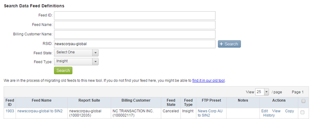

# Convalida dei feed di dati storici{#validating-historical-data-feeds}

Una guida rapida per i passaggi minimi necessari per convalidare e impostare feed di dati storici.

## Procedura di convalida per la coerenza dei feed di dati {#section-777b2c627a354627a02feb9461e23038}

1. Accesso ai *denti* (https://oasis.omniture.com/drteeth/)
1. Vai ad Amministratore SiteCatalyst -> Definizione feed dati (nuova)
1. Passare alla posizione del server (ad es. Dallas, Londra...) A seconda della posizione dell’organizzazione.
1. Fornisci RSID e seleziona il tipo di feed Insight e fai clic su *search*.

   

1. Identificate il nome del feed effettivo per il cliente.
1. Fare clic su Cronologia nella sezione Azioni. 

   Controllate che nel campo di stato siano presenti degli errori e che nel caso in cui alcuni feed siano in stato di errore, selezionate il feed e fate clic su Rielabora. Se l&#39;errore si è verificato per più richieste, inviate un&#39;e-mail a *`dataworkbench@adobe.com`* con l&#39;ID feed e i dettagli della suite di rapporti per rielaborarla.

1. Post-convalida controlla i registri nella cartella raw del percorso NAS.

