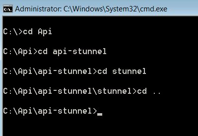

# Impostazione API query{#query-api-setup}

{{eol}}

Guida rapida per l’impostazione di un’API di query.

Per impostare l’API di query, effettua le seguenti operazioni:

1. Acquisizione certificato API query

   Invia un&#39;e-mail al team Tech Ops di Adobe - `Dataworkbench@adobe.com`.

   Fornisci il nome NC che desideri utilizzare per l’API di query( fornisci un nome generico come `<Client>` API di query).

   >[!NOTE]
   >
   >Tech Ops genera il certificato e lo carica in un URL. Dopo aver ricevuto la notifica da Tech Ops relativa alla generazione di successo del ticket, fai sapere ai Consulenti Adobi in modo che il ticket ti venga inviato di nuovo.

1. Download ed estrazione dello stunnel API. Ricevi il file api-stunnel dal tuo consulente.

   Assicurarsi che Perl sia installato sul computer.

   Nella cartella estratta (il percorso della cartella in cui si copia il file), copia il certificato API di query all’interno del *stordimento* cartella.

1. Configurare Stunnel.conf

   Deve essere presente un file denominato *stunnel.conf* all&#39;interno del *Stunnel* (in cui è stato copiato il certificato).

   Modifica il file in Blocco note.

   

   Modificate i parametri come segue: 

   È necessario modificare due parametri in questo file.

   * *Cert* = Nome sul certificato. In questo esempio è Aadhithiya Ramani QAPI Client.pem.
   * *Connetti* =Il nome del server per la DPU principale.

1. Copia del *Query.pm*.

   La *Query.pm* Il file sarà disponibile nella cartella delle API di Insight.

   Copia il *Query.pm* archivialo e incollalo nella cartella Perl Library (in genere sarà *C:\Perl64\lib *, ma controlla dove è installato Perl nel computer).

1. Modifica la *api-http.pl* file

   Il file api-http.pl sarà disponibile nella cartella api-stunnel.

   Solo un parametro da modificare

   *My $profile* = Nome del profilo per il quale stai configurando l’API query.

1. Installa l’API di query.

   Apri il prompt dei comandi nel sistema come &quot;Amministratore&quot; e passa alla directory in cui è stato estratto il *stordimento* come mostrato: 

   Esegui il comando seguente *.\stunnel -install*. 

   Dopo aver eseguito il comando, viene visualizzata una finestra in cui viene indicato che la *stordimento* è installato.

   >[!NOTE]
   >
   >Dopo aver eseguito il comando, viene visualizzata una finestra in cui viene indicato che la *stordimento* è installato.

1. Verifica della configurazione dello stunnel dell’API query

   L’ultimo passaggio di questo processo consiste nel testare la configurazione dell’API di query. Nel prompt dei comandi utilizzato per installare la directory api-stunnel. 

   Esegui lo script Perl disponibile in quella cartella utilizzando il seguente comando* perl api-http.pl*. 

   Dopo aver eseguito lo script i risultati dovrebbero essere come la schermata sottostante (l’ora e i valori della data nel risultato variano a seconda del tempo e degli altri parametri nel profilo in cui hai configurato l’API query (al passaggio 6). 
