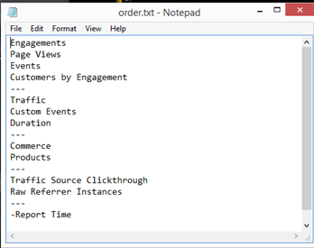

# Modifiche alla configurazione per il nuovo schema{#configuration-changes-for-new-schema}

{{eol}}

In questo documento viene illustrato come modificare tutte le configurazioni di Data Workbench predefinite dopo l&#39;implementazione del nuovo schema.

## Informazioni sullo schema del set di dati {#section-2ffac5170c894781bc943565af7ad479}

La base dello schema del set di dati è costituita da un set chiave di relazioni che costituiscono la spina dorsale dello schema Data Workbench Web Analytics. Nell’esempio seguente, lo schema analitico web tipico fornisce un’idea delle relazioni tra un visitatore, una visita e una visualizzazione di pagina. 

* Ogni visitatore può avere una o più visite.
* Ogni visita specificata viene generata da un solo visitatore.
* Una determinata visita può includere una o più visualizzazioni di pagina.
* Ogni visualizzazione di pagina specificata appartiene a una sola visita. `<discoiqbr>`

Con l&#39;evolversi del mondo del web e degli affari nel corso degli anni, sono cambiate anche le esigenze del web e dell&#39;analisi dei dati. I siti web sono iniziati come luoghi in cui guardare il contenuto. Ora potete guardare il contenuto; corrispondono interattivamente attraverso chat, video o presentazioni; prodotti d&#39;acquisto; e molto altro. Inoltre, le aziende ora desiderano integrare i propri dati web con altri canali di dati nella propria azienda per ottenere una visione migliore della propria attività nel suo complesso. Ad esempio, un&#39;azienda potrebbe voler integrare i propri dati web, call center, e-mail, social e store e clienti insieme. Con questa integrazione dei canali offline e online gli schemi di set di dati si sono evoluti nel corso degli anni in cui non sono più uguali due schemi di set di dati.

`<discoiqbr>`Quando si integrano i dati online e offline, il termine &quot;visitatore&quot; non sembra sempre appropriato. Di conseguenza, a volte viene utilizzato il termine &quot;cliente&quot; al posto del visitatore.  

Il livello &quot;Coinvolgimento&quot; viene utilizzato per abilitare una singola visualizzazione del tempo, quando si dispone di dati provenienti da più origini dati. Ad esempio, supponiamo di avere una sola origine dati: Dati di e-commerce raccolti dall’attività del visitatore sul sito web. In tal caso, il livello Visita indica le visite al sito da parte di tali visitatori. Tieni presente che le dimensioni temporali sono &quot;Giorno&quot;, &quot;Settimana&quot;, &quot;Mese&quot;, ecc. - vengono generalmente acquisiti a livello di &quot;Visita&quot;.

Analogamente, il livello &quot;Evento&quot; porta tutti gli eventi (visualizzazione pagina, chiamata al call center, ecc.) che si sono verificati durante un coinvolgimento. Combina tutti gli eventi online e offline per un cliente durante un coinvolgimento.

## Nuova struttura conteggiata in DWB {#section-b77638ec04e4441cb51c56fd3d4abeb6}

La nuova struttura dello schema sostituisce Visitatore per Cliente, Visita per Coinvolgimento e Hit per Evento. 

## Modifiche alla configurazione in base al nuovo schema del set di dati {#section-27135515be5c471ba2ee879d1ef4771f}

Per modificare lo schema del set di dati da visitatore a cliente, è necessario modificare i seguenti file di configurazione:

1. Tutti i file di configurazione nella cartella Dataset in cui sono definite dimensioni conteggiate ed estese. 

1. File di configurazione nella cartella Dimension, in cui &quot;visitatore&quot;, &quot;visita&quot; o &quot;evento&quot; sono utilizzati come livello.

   Esempio: File Campaign.cfg. Nel profilo Adobe SC, Campaign è definito a livello di visita. 

   L&#39;esempio seguente fornisce un&#39;idea della modifica dello schema padre da Visita a Coinvolgimento: 

1. Poiché alcune delle metriche sono derivate o create da numertables, i file di configurazione nella cartella Metriche devono essere modificati o creati.

   Ad esempio: creare una nuova metrica [!DNL Customers.metric with formula = sum(one,customer)] o come visualizzazioni di pagina.metric a *definire* a livello di hit. Modifica la metrica, quindi modifica il livello in Evento anziché Hit.

   Adobe SC Page Views Metirc definito a livello di hit: 

   `<discoiqbr>` `<discoiqbr>`Di seguito è riportata la metrica Visualizzazioni pagina in base al nuovo schema: 

1. Modificare la *order.txt* nella cartella delle metriche in modo che rifletta le metriche nuove o modificate relative al cliente, al coinvolgimento e all’evento.

   Adobe *SC order.txt* file. 

   *Order.txt* file con nuove modifiche dello schema: 

1. Tutti i file di configurazione (.vw) nella cartella Visualizzazione devono essere modificati in modo da fare riferimento a nuovi livelli : Cliente, Coinvolgimento ed Evento. Ad esempio: Mappa del processo 2D, Mappa del processo 3D, ecc.

   Adobe SC default URI.vw per 2D process Map è definito a livello di Hit e Visit Group come mostrato di seguito: 

   Modifiche da apportare in URI.vw per il nuovo schema: 
