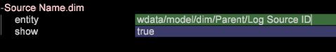

# Impostazione dimensioni derivate{#derived-dimensions-setup}

I diversi tipi di dimensioni derivate (lato client) e come impostare quelle in Workbench dati.

## Tipi di dimensioni derivate {#section-33e6dcc9ab9745de9b830cecb2427ca3}

**Dimensioni della metrica**

Dimensione metrica consente di raggruppare i conteggi delle metriche per un livello specifico. Consente inoltre di raggruppare i conteggi delle metriche per un livello specifico. Una volta creata una dimensione metrica, puoi segmentare i dati in base al valore della metrica.

Esempio 1: Sei una società di viaggi e vuoi capire la differenza di attività comportamentali sul sito web tra i tuoi frequenti volantini e clienti che hanno prenotato un volo meno di 5 volte - come faresti?

Tutto quello che hai è il conteggio delle prenotazioni come una metrica, come segmenterai i clienti sulla base di una metrica - qui, prenotazione - per capire il loro comportamento sul sito web?

Esempio 2: Sei una Financial Bank e vuoi raggruppare i tuoi clienti in base al numero di CD in cui hanno investito. Desiderate segmentare i vostri clienti in 3 livelli. Livello 1 - Clienti con oltre 10 CD, livello 2 - Clienti con CD >5 e &lt;10 e Tier 3 - Clienti con >0 e &lt;5 CD

Le informazioni disponibili sono metriche che forniscono i conteggi degli investimenti nei CD. In che modo creerete i segmenti cliente stanchi per la vostra analisi?

*Creazione di una dimensione metrica tramite Workstation*

Contrassegna una delle dimensioni della metrica OOB come locale e Rinomina tale dimensione con un nome personalizzato / Crea una copia locale dell’esempio RinominaDim.example e rinominala come nome di dimensione corretto con estensione .dim

Apri la nuova dimensione creata nella workstation per apportare modifiche. Modifica i seguenti parametri della dimensione metrica in base ai requisiti: 

Metrica - Metrica da raggruppare

Livello a cui verranno raggruppate le metriche

Inizio intervallo - Elemento iniziale della dimensione metrica. Immettete lo stesso valore in offset.

Dimensione intervallo: dimensione del raggruppamento della metrica. Immettete lo stesso valore in scala

Conteggio intervalli - Numero massimo di elementi da visualizzare nella dimensione

Salvate la dimensione appena creata sul server se desiderate condividerla con altri utenti.

**Dimensioni prefisso**

Lo scopo principale della dimensione Prefisso è di raggruppare gli elementi della dimensione originale e fornire nomi descrittivi agli elementi raggruppati.

Ad esempio, possedete un sito di vendita al dettaglio e il vostro sito dispone di varie sezioni del sito come l&#39;abbigliamento femminile, l&#39;abbigliamento maschile, i giocattoli e i giochi, l&#39;arredamento della casa, ecc e ognuna di queste sezioni del sito ha diverse pagine associate ad esso. Desiderate eseguire analisi dei percorsi e ottenere informazioni sul traffico che va da una sezione del sito all&#39;altra e così via. Se si utilizza la dimensione URI, sarà necessario estrarre ogni pagina di ciascuna sezione del sito nel browser percorso o nella mappa di processo e continuare l&#39;analisi.

La stessa analisi può essere eseguita facilmente se esiste una dimensione Prefisso con pagine di una sezione del sito raggruppate come un singolo elemento.

Creazione della dimensione del prefisso:

Apri una mappa di processo 2D dal menu Visualizzazione.

Modificate i seguenti parametri della dimensione del prefisso in base ai requisiti.

Cambia dimensione mappa - La dimensione da usare per la mappa di processo 2D (ad es.: SMS (Typologia)

Cambia dimensione livello mappa - Livello della dimensione citata

Modifica dimensione clip mappa - Il livello numerabile al quale si desidera visualizzare i dati.

Cambia metrica mappa - La metrica da esaminare.

Una volta impostata la mappa di processo 2D, apri la dimensione indicata nel parametro Modifica dimensione mappa.

Selezionate gli elementi da raggruppare. Utilizza CTRL+ALT e trascina e rilascia gli elementi per elaborare la mappa.

Fate clic con il pulsante destro del mouse sul punto visualizzato e rinominate il nome del gruppo. Se avete selezionato 3 elementi da raggruppare, il nome predefinito sarà 3 Selezionato.

Fai clic con il pulsante destro del mouse sul contorno della visualizzazione e salva la dimensione dal menu visualizzato.

**Rinomina dimensioni**

Rinomina dimensioni viene creata con una dimensione preesistente. Lo scopo principale della dimensione rinominata è quello di fornire nomi descrittivi agli elementi della dimensione. La dimensione Rinomina è la dimensione Pagina creata al di fuori della dimensione URI. La dimensione URI può confondere una persona che non conosce i nomi tecnici delle pagine e per questo motivo la dimensione Pagina consente di rinominare gli elementi della dimensione URI.

CREAZIONE DI DIMENSIONI DI RINOMINAZIONE PERSONALIZZATE:

Gli elementi della dimensione rinominata presentano una mappatura uno-uno con gli elementi della dimensione di base originale. Per verificarlo, aprire il file .dim della Rinomina dimensione nella workstation o nel riquadro Nota. Noterete che ogni elemento della dimensione originale ha un solo valore (Rinomina stringa) rispetto a esso nel file.

Se sono presenti meno elementi per la funzione di ridenominazione, potete creare un file .dim nella workstation e rinominare ogni singolo elemento in base ai passaggi descritti di seguito.

Passaggi per creare un file .dim per una Rinomina dimensione - Utilizzo della workstation

Utilizzate questa opzione se il numero di elementi da rinominare è minore.

1. Aprire un&#39;area di lavoro vuota e Gestione dimensioni. Fare clic con il pulsante destro del mouse su Admin (Amministratore)>Profile (Profilo)>Profile Manager (Gestione profili).
1. Espandete la cartella Dimensioni nella colonna File.
1. Espandete la cartella di pagina nella colonna File e fate clic con il pulsante destro del mouse sul file Page.dim nella colonna Second to Last (Questa colonna in genere rappresenta il Nome profilo) e fate clic sull&#39;opzione &quot;Make Local&quot; (Rendi locale).
1. Fare clic con il pulsante destro del mouse sul file Page.dim nella colonna &quot;User&quot; e fare clic sull&#39;opzione Copia e incollare il file .dim copiato nella cartella desiderata sotto la directory Dimensions.
1. Fare clic su OK sul messaggio di errore.
1. Ora noterete che nella cartella Dimensions sono presenti due file Page.dim. Uno è il file originale nella directory Dimensions\Page e il secondo è quello che si copia incollato al punto 4.
1. Fare clic con il pulsante destro del mouse sul file Page.dim incollato di recente sotto la colonna Utente e fare clic sulla casella di input blu/grigio che riporta Page.dim. La casella di input diventa verde con il cursore lampeggiante, a indicare che può essere modificato. Digitare il nome della dimensione Rinomina che si desidera creare.
1. Noterete che il file Page.dim nella Colonna File è stato modificato nel nuovo nome file che avete dato nel passaggio 7. Fare clic con il pulsante destro del mouse sul file new.dim nella colonna Utente (Ultima colonna) e selezionare Apri > In workstation.
1. Una volta aperto il file .dim nella workstation; fate clic sul segno più (+) accanto all&#39;entità ed espandetela. Osservate il valore presente nel campo &quot;Parent&quot; e riflette la dimensione &quot;URI&quot;. Mostra &quot;wdata/model/dim/URI&quot; Fare clic sulla casella di input blu/grigio per modificare l’URI in modo che il nome della dimensione di cui si desidera rinominare gli elementi.
1. Verificare che la dimensione da rinominare sia presente nel set di dati. I nomi delle dimensioni seguono la distinzione tra maiuscole e minuscole e mantengono quindi le lettere maiuscole e minuscole della dimensione originale.
1. Osservate la voce &quot;modificato&quot; accanto al nome della dimensione. Indica che la dimensione originale è stata modificata. Sostenere le modifiche apportate al punto 9; Fare clic con il pulsante destro del mouse su new.dim (modificato) e fare clic sull&#39;opzione &quot;Salva con nome&quot;.
1. Una volta salvata la dimensione per il passaggio 10, la nuova dimensione di ridenominazione per le campagne è ora disponibile per la ridenominazione. È disponibile solo localmente.
1. Affinché altri possano vedere la dimensione creata da voi, è necessario salvarla sul profilo. Fare clic con il pulsante destro del mouse sul file .dim della nuova dimensione nella colonna &quot;Utente&quot; (Ultima colonna) e fare clic su &quot;Salva in>Nome profilo&quot; in cui si desidera salvare la dimensione.
1. Dopo aver salvato il file nel profilo, tutti gli utenti Workstation che hanno accesso a questo profilo potranno visualizzare la dimensione di ridenominazione per le campagne.

Strumento per la creazione di prefissi e ridenominazione di immagini fioca

Adobe dispone di uno strumento Excel per generare il prefisso e rinominare le dimensioni.

Di seguito sono riportati i passaggi per generare le dimensioni Prefisso/Rinomina utilizzando lo strumento:

1. Salvate lo strumento Excel *Adobe_DWB_Dimension_Generator.xlsm* in una cartella. Contatta l’Assistenza clienti Adobe per scaricare lo strumento.
1. Aprire lo strumento e attivare le macro: 

1. Compilare il foglio dati con i valori da utilizzare.

   Ad esempio, stiamo creando una dimensione Prefisso marchio prodotto basata su Dimensione prodotto. Nel Data Sheet vengono acquisite le seguenti informazioni: 

   Ciascun prodotto è assegnato a un marchio nel foglio dati.

1. Nella scheda Configurazione, compila le informazioni relative alla dimensione da creare. Per i dati di esempio sopra riportati sono inserite le informazioni seguenti: 

   Nome: Nome della dimensione Prefisso/Rinomina

   Tipo: Prefisso/Rinomina

   Dim origine: Dimensione originale

   Corrispondenza colonna: Colonna da associare

   Colonna Risultato: Valore da utilizzare per la nuova dimensione.

1. Fare clic sul pulsante *Fare clic qui*. 

1. Il file dim verrà generato nella stessa cartella in cui è stato salvato lo strumento. 

   Utilizzando Profile Manager (Gestione profili), salva il file dim nella cartella Dimension.

**Sposta dimensioni**

Le dimensioni di spostamento consentono di osservare il n° di qualsiasi dimensione all’interno di una particolare dimensione Contabile.

Inoltre, consentono di guardare indietro -Nth elemento di qualsiasi dimensione all&#39;interno di una particolare dimensione Contabile

Esempio 1:

* Nth page within a session - Next Page Dimension (Dimensione pagina successiva)
* Nth page for a visitor -Next Page for Visitor (Ennesima pagina per un visitatore -Next Page for Visitor) in tutte le sessioni
* Nth call for a user

Perché è importante conoscere Nth element della dimensione numerabile?

* Conoscere la 5a pagina visualizzata in una sessione.
* Desiderate seguire il percorso Campagne per capire quale campagna è stata visualizzata dopo la visualizzazione della campagna &quot;Free Check Account&quot;?
* Desiderate capire su quale collegamento ha fatto clic il visitatore prima di fare clic sul collegamento &quot;Chat with an Agent&quot;? 

L’URI successivo è una delle dimensioni OOB Shift utilizzabili come modello. L&#39;esempio precedente fornisce l&#39;elemento 2nd(Offset = 1) della campagna (Dim = Campaign) nell&#39;evento di coinvolgimento (Clip = Evento di coinvolgimento)

Qui l&#39;offset 1 significa guardare verso destra in avanti nell&#39;evento

Altre dimensioni OOB Shift

*Pagina successiva:*

La pagina successiva visualizzata in una sessione dopo l’opzione Pagina nella dimensione Pagina

Qui l&#39;offset è 1, il livello è la visualizzazione di pagina, il Dim è la pagina e il clip è la sessione

*Pagina precedente:*

La pagina precedente visualizzata in una sessione prima della selezione corrente Pagina nella dimensione Pagina

Qui l&#39;offset è -1, il livello è la visualizzazione di pagina, il Dim è la pagina e il Clip è la sessione

Quale sarà la campagna precedente visualizzata prima della campagna attualmente selezionata da un visitatore?

Qui l&#39;offset è -1, il livello è la risposta della campagna, il Dim è il valore attributo della risposta della campagna e il Clip è il visitatore

*Creazione della dimensione Maiusc - Tramite Workstation*

* Contrassegna una dimensione di spostamento OOB come locale
* Rinominare tale dimensione con un nome personalizzato
* Apri la nuova dimensione creata nella workstation per apportare modifiche
* Modificate i seguenti parametri della dimensione metrica in base ai requisiti.

   * Dimensioni contigue
   * Offset-Si desidera guardare avanti rispetto al passato
   * Dim -Dimension di cui si desidera analizzare gli elementi
   * Clip-Countable nella visualizzazione.

* Salvate la dimensione appena creata sul server se desiderate condividerla con altri utenti.

**Ultima dimensione N**

Ultima N Dimensioni funziona solo sulla Dimensione tempo e sulla A del tempo del sistema. Le dimensioni orario OOB sono Giorno, Settimana, Ora e Mese. Puoi creare, Ultima dimensione N per ciascuna di queste dimensioni base come Ultimi 10 giorni, Ultime 72 ore, Ultime 8 settimane, Ultimi 6 mesi, ecc. Ultima dimensione N calcola l&#39;ultima N in base alla metrica del tempo del rapporto corrente o a quanto tempo del sistema. 

Conteggio - Numero totale di elementi da visualizzare nella dimensione

Offset intervallo - Valore offset per indicare il punto iniziale (Giorno/Settimana) per calcolare l&#39;ultimo giorno/settimana N.

**None.dim**

None.dim è una dimensione Alias. Viene utilizzato per creare alias dalle dimensioni estese.

Esempio:

In None.dim l&#39;entità è definita come &quot;wdata/model/dim/Parent/+name&quot; (può essere modificata), il che significa creare la dimensione in base al nome del file della dimensione. Pertanto, se creiamo una copia del file None.dim nella cartella Dimension (ad esempio, copiando e rinominando il file None.dim nella cartella Visitor Profile) e lo rinominiamo in &quot;Log Source ID.dim&quot;, nel menu sotto Visitor Profile (Profilo visitatore) verrà visualizzata una nuova dimensione derivata con Log Source ID (ID origine registro) come illustrato di seguito:

Prima delle modifiche: 

Dopo la modifica di None.dim: 

L&#39;entità può essere modificata con il nome della dimensione estesa, in questo caso un&#39;altra dimensione con un altro nome che punta alla stessa dimensione come mostrato di seguito:

In questo esempio, &quot;Source Name.dim&quot; ha il contenuto seguente: 

Verrà quindi visualizzato un altro Nome origine dimensione che punta all&#39;ID origine registro. 

**Nascondere le dimensioni derivate**

Per nascondere la Dimensione derivata, impostare la proprietà *Show* su &quot;false&quot;. 

