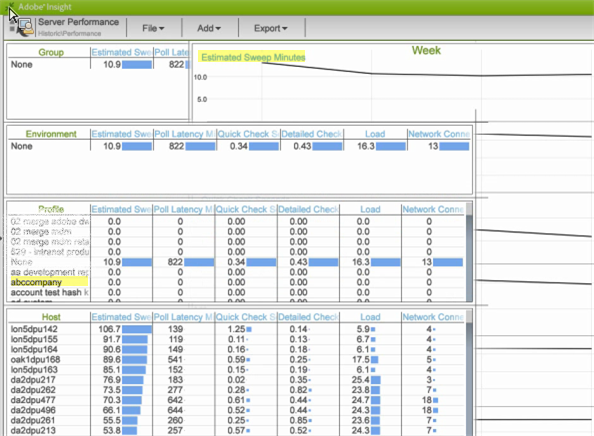

# Workbench dati Area di lavoro Storica{#data-workbench-historic-workspace}

Utilizzare il profilo storico workbench dati per vedere in che modo la configurazione, l&#39;hardware e altre modifiche influiscono sulle prestazioni, la stabilità e la capacità del server nel tempo.

Il profilo Historic include un set di dati di prestazioni [del](../../../home/monitoring-installation/monitoring-profiles/monitoring-historical-using.md#section-184a86f9de054970bf68515bb9dea85d) profilo basato su profilo e il set di dati di prestazioni [del](../../../home/monitoring-installation/monitoring-profiles/monitoring-historical-using.md#section-5dad5870384b40e094d50173fcd90a09) server basato su server nella **[!UICONTROL Performance]** scheda. Si tratta dei set di dati più comunemente utilizzati visualizzati per una prospettiva passata delle prestazioni del server workbench dati. Inoltre, è possibile visualizzare i [componenti](../../../home/monitoring-installation/monitoring-profiles/monitoring-historical-using.md#section-5be7223abb384784bafe7b37c764ea66) e la modalità [di](../../../home/monitoring-installation/monitoring-profiles/monitoring-historical-using.md#section-5be7223abb384784bafe7b37c764ea66) elaborazione selezionando la **[!UICONTROL Up Time]** scheda.

Inoltre, è possibile visualizzare i [componenti](../../../home/monitoring-installation/monitoring-profiles/monitoring-historical-using.md#section-5be7223abb384784bafe7b37c764ea66) e la modalità [di](../../../home/monitoring-installation/monitoring-profiles/monitoring-historical-using.md#section-5be7223abb384784bafe7b37c764ea66) elaborazione selezionando la **[!UICONTROL Up Time]** scheda.

Per ulteriori informazioni di riferimento sulle dimensioni utilizzate nel profilo storico workbench dati, vedere [Dimensioni nel profilo storico di Insight.](../../../home/monitoring-installation/monitoring-appendix/monitoring-historical.md#concept-a42837c9c9274f83ad5bc5a6720f02b0)

## Area di lavoro Prestazioni profilo {#section-184a86f9de054970bf68515bb9dea85d}

Questo set di dati include le seguenti metriche rilevanti per il monitoraggio dei workbench dati.

* MegaByte per minuto di input rapido: metriche che mostrano dati di input pesanti durante l&#39;elaborazione del registro iniziale.
* MegaByteUnione veloce per minuto: metriche che mostrano la trasformazione.

>[!NOTE]
>
>Per eseguire una valutazione reale delle prestazioni del profilo, controlla il tasso anziché il tempo di calendario trascorso. La frequenza viene misurata come valori modificati tra il polling ogni dieci minuti.

## Area di lavoro Prestazioni server {#section-5dad5870384b40e094d50173fcd90a09}

Questo set di dati monitora le metriche del server oltre l&#39;ambito dei profili inclusi e include le seguenti metriche del server rilevanti per il monitoraggio dei workbench dati.

* Minuti di sweep stimati — Tempo stimato per la risoluzione delle query.
* Latenza sondaggio millisecondi — Indicatore di quanto è occupato il software misurando quanto tempo ci vuole per ottenere un ciclo completo di manutenzione di ogni componente.

## Area di lavoro Componenti {#section-5be7223abb384784bafe7b37c764ea66}

Questo set di dati si trova nella scheda Tempo di attività.

Il set di dati dei componenti include due aspetti per l’integrità dei componenti:

* Metrica di comunicazione — Il processo del server workbench dati ha risposto?
* Metrica Tutti i componenti — Nella parte superiore della pagina Stato dettagliato è riportato un elenco dei componenti che l’host sta gestendo all’interno dei processi del server workbench dati. Se un componente si trova in uno stato di errore, viene elencato nella tabella Componenti in Errore.

## Area di lavoro Modalità di elaborazione {#section-3e1dedb9474e4b4ba513240943e76817}

L’area di lavoro si trova nella scheda Tempo di attività. Questa area di lavoro consente di osservare quanto tempo viene impiegato nelle modalità di input rapido, unione rapida e tempo reale.

Questo set di dati fornisce importanti caratteristiche di caricamento del server, come l&#39;identificazione del carico di dati per

* Giorno della settimana (ad esempio un tasso di ingresso rapido il martedì e il mercoledì),
* Ora del giorno (quale percentuale del giorno è in modalità Fast Input?)

