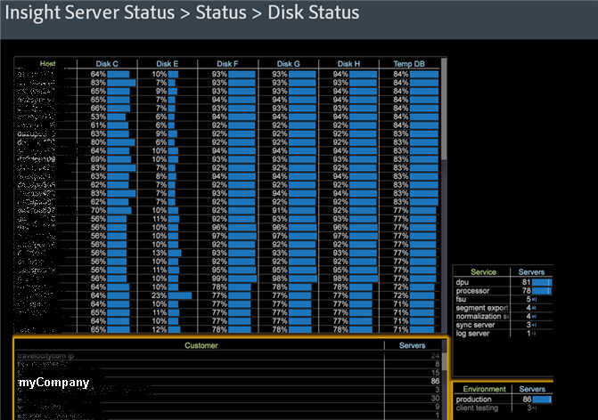

# Area di lavoro di stato del server di Data Workbench{#data-workbench-server-status-workspace}

{{eol}}

Il profilo Stato server di Data Workbench fornisce informazioni correnti sullo stato del server di Data Workbench in base al server, anziché alle metriche di profilo o ai dati storici.

## Stato generale {#section-65d1fa393cfd450cbacef3cba823fcc1}

Apri la visualizzazione del set di dati Stato generale all’interno del profilo di stato del server di Data Workbench.

Per ulteriori informazioni di riferimento sulle dimensioni utilizzate nel profilo dello stato del server di Data Workbench, consulta la sezione [Dimension nel profilo dello stato di Insight Server](../../../home/monitoring-installation/monitoring-appendix/monitoring-servers-profile.md#concept-8cbeb91e99bc42e2b52b22d551423f8a) profilo.

## Stato del disco {#section-36406f5f1262457e89ff13ad917f621f}

Visualizza l&#39;utilizzo corrente del disco, incluso l&#39;utilizzo interno di temp.db.

